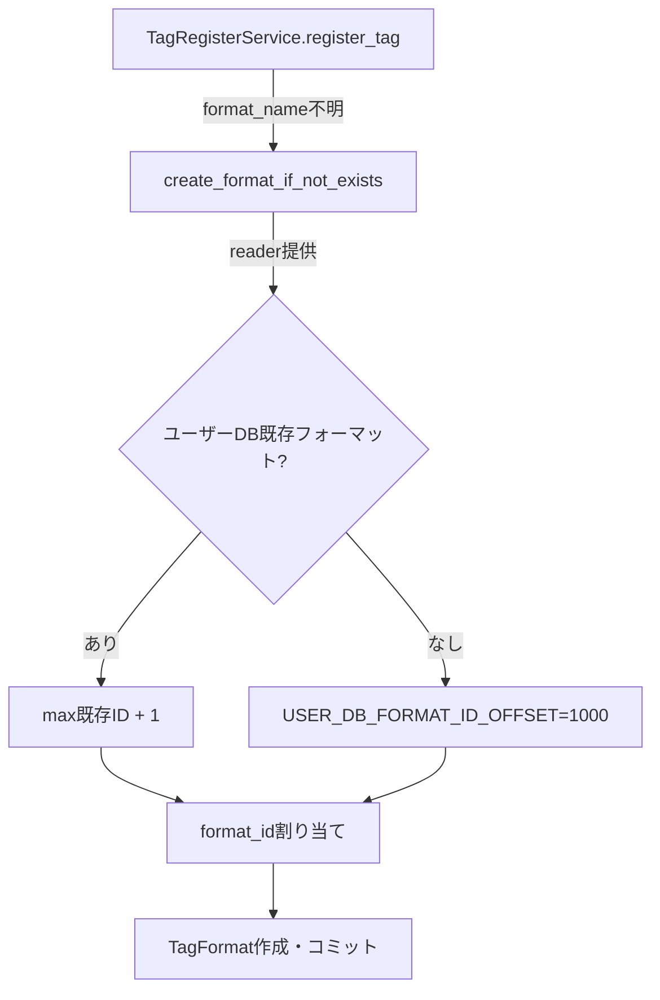

# genai-tag-db-tools format_id 1000+ Reservation Implementation Completion (2025-12-30)

## 概要

ユーザーDB の format_id を1000番台以降に予約することで、ベースDB（HuggingFaceからダウンロード、1-999）とのID衝突を回避する実装が完了しました。

## 実装内容

### 1. 定数追加 (`repository.py:34`)

```python
# Reserve format_id range 1-999 for base DBs, 1000+ for user DBs
USER_DB_FORMAT_ID_OFFSET = 1000
```

### 2. `create_format_if_not_exists()` 修正 (`repository.py:606-656`)

**変更前のロジック**:
- `reader` が提供されている場合、ベースDB の全 format_id をクエリ
- `max_base_format_id + 1` を次の format_id として割り当て
- **問題**: ベースDB未取得時やベースDB更新時に衝突リスク

**変更後のロジック**:
```python
# Determine next format_id for user DB
next_format_id = None
if reader is not None:
    # User DB uses 1000+ range to avoid collision with base DB (1-999)
    # Query existing formats in user DB to find next available ID
    existing_formats = session.query(TagFormat.format_id).all()
    if existing_formats:
        existing_format_ids = [f.format_id for f in existing_formats]
        next_format_id = max(existing_format_ids) + 1
    else:
        # First user format starts at 1000
        next_format_id = USER_DB_FORMAT_ID_OFFSET
```

**特徴**:
- ユーザーDB自身の既存フォーマットのみクエリ（ベースDBは見ない）
- 最初のユーザーフォーマットは常に1000
- 2番目以降は `max(existing_user_format_ids) + 1`

### 3. テスト更新

#### `test_format_id_collision_avoidance.py`

**単一ベースDB シナリオ** (line 82-99):
```python
# 変更前: assert 2 in user_formats
# 変更後: assert 1000 in user_formats
assert user_formats[1000] == "Lorairo"
assert reader.get_format_id("Lorairo") == 1000
```

**複数ベースDB シナリオ** (line 144-153):
```python
# 変更前: assert 6 in user_formats (max_base_id + 1)
# 変更後: assert 1000 in user_formats (固定1000スタート)
assert merged_formats[1000] == "Lorairo"
```

#### `test_gui_tag_register_service.py` (line 125-143)

**廃止テスト**: `test_register_tag_error_emits_signal`
- 旧動作: 不明なフォーマット名で ValueError を期待
- 新動作: 自動作成機能により "invalid_format" が成功

**新規テスト**: `test_register_tag_auto_creates_unknown_format`
- 不明なフォーマット名 "new_custom_format" が自動作成される
- format_id >= 1000 で作成されることを確認
- エラーシグナルが発生しないことを確認

## テスト結果

### genai-tag-db-tools 全テスト
```bash
$ uv run pytest local_packages/genai-tag-db-tools/tests/ -v
============================== 232 passed ==============================
```

### LoRAIro タグ登録テスト
```bash
$ uv run pytest tests/unit/database/test_db_repository_tag_registration.py -v
============================== 6 passed ===============================
```

## 技術的詳細

### ID衝突シナリオと解決策

| シナリオ | 旧実装の問題 | 新実装の解決 |
|---------|-------------|-------------|
| ベースDB未取得時 | format_id=1から開始 → 後でベースDB取得時に衝突 | 常に1000から開始 → 衝突なし |
| ベースDB更新時 | 新フォーマット追加でIDが増加 → 既存ユーザーDBと衝突 | ユーザーDB=1000+固定 → 更新影響なし |
| 複数ベースDB | 最大ID依存で可変 → 環境依存動作 | 1000固定 → 環境独立動作 |

### データフロー



## コミット情報

**リポジトリ**: `local_packages/genai-tag-db-tools`
**コミットハッシュ**: 20b0127
**コミットメッセージ**: feat: Reserve format_id 1000+ for user DB to avoid base DB collision

**変更ファイル**:
- `src/genai_tag_db_tools/db/repository.py` (定数追加 + ロジック変更)
- `tests/unit/test_format_id_collision_avoidance.py` (期待値更新: 2→1000, 6→1000)
- `tests/gui/unit/test_gui_tag_register_service.py` (廃止テスト削除 + 新規テスト追加)

## 設計判断

### なぜ1000番台予約？

**選択肢1: 動的オフセット管理** (不採用)
- メタデータテーブルでオフセット値を保存
- 複雑な処理が必要（初期化、更新、同期）

**選択肢2: 1000番台固定予約** (採用) ✅
- シンプルな定数1個で実装可能
- ベースDB依存なし（環境独立）
- 999個のベースフォーマットで十分（実際は数十個）

**選択肢3: 現在実装維持** (不採用)
- ベースDB未取得時の衝突リスク解決不可

## 参考資料

### 関連メモリ
- `plan_parallel_humming_garden_2025_12_28.md` (Task 2.5 に反映済み)
- `genai_tag_db_tools_format_id_collision_fix_2025_12_30.md` (初期実装記録)

### 関連Issue
- ユーザーフィードバック: "ユーザーデータベースのフォーマットとIDがDLしたDBのIDと被るのが問題"

## 残作業

なし。全タスク完了。
