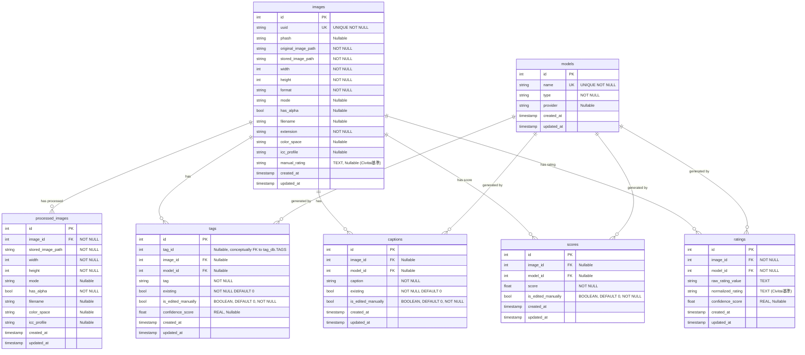

# 画像データベース スキーマ変更計画

## 1. 概要

画像レーティング機能の追加、およびタグ、キャプション、スコアの手動編集情報を区別して保存可能にするためのスキーマ変更計画。

## 2. 変更点

### 2.1. `ratings` テーブルの新規作成

*   **目的:** AI モデルによるレーティング結果（生データとCivitai基準の統一データ、確信度スコア）を保存。
*   **カラム:**
    *   `id` (INTEGER PRIMARY KEY)
    *   `image_id` (INTEGER, FOREIGN KEY references images(id) ON DELETE CASCADE, NOT NULL)
    *   `model_id` (INTEGER, FOREIGN KEY references models(id) ON DELETE SET NULL, NOT NULL)
    *   `raw_rating_value` (TEXT): モデルが出力した生のレーティング値。
    *   `normalized_rating` (TEXT): Civitai 基準 ('PG', 'PG-13', 'R', 'X', 'XXX') に変換した値。
    *   `confidence_score` (REAL, Nullable): AI モデルが判定したレーティングに対する確信度スコア。
    *   `created_at` (TIMESTAMP DEFAULT CURRENT_TIMESTAMP)
    *   `updated_at` (TIMESTAMP DEFAULT CURRENT_TIMESTAMP)
*   **制約:** `UNIQUE (image_id, model_id)`

### 2.2. `images` テーブルへのカラム追加

*   **目的:** 手動評価（Civitai基準）を保存。
*   **追加カラム:** `manual_rating` (TEXT, Nullable)

### 2.3. `tags` テーブルへのカラム追加

*   **目的:** 手動編集フラグと確信度スコアを保存。
*   **追加カラム:**
    *   `is_edited_manually` (BOOLEAN, DEFAULT 0, NOT NULL)
    *   `confidence_score` (REAL, Nullable)

### 2.4. `captions` テーブルへのカラム追加

*   **目的:** 手動編集フラグを保存。
*   **追加カラム:** `is_edited_manually` (BOOLEAN, DEFAULT 0, NOT NULL)

### 2.5. `scores` テーブルへのカラム追加

*   **目的:** 手動編集フラグを保存。
*   **追加カラム:** `is_edited_manually` (BOOLEAN, DEFAULT 0, NOT NULL)

## 3. 最終スキーマ（案）

## 4. 実装ステップ

1.  **スキーマ変更:** `src/lorairo/database/database.py` の `create_tables` メソッドを修正。
2.  **データアクセス層の修正:** `ImageRepository` クラスのメソッドを修正・追加。
3.  **ビジネスロジック層の修正:** `ImageDatabaseManager` クラスなどのロジックを修正。
4.  **UI/API 層の修正:** GUI や API を修正。