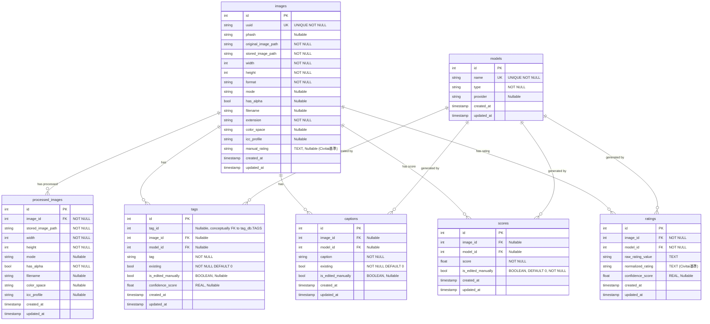

# 画像データベース スキーマ変更計画

## 1. 概要

画像レーティング機能の追加、およびタグ、キャプション、スコアの手動編集情報を区別して保存可能にするためのスキーマ変更計画。

## 2. 変更点

### 2.1. `ratings` テーブルの新規作成

*   **目的:** AI モデルによるレーティング結果（生データとCivitai基準の統一データ、確信度スコア）を保存。
*   **カラム:**
    *   `id` (INTEGER PRIMARY KEY)
    *   `image_id` (INTEGER, FOREIGN KEY references images(id) ON DELETE CASCADE, NOT NULL)
    *   `model_id` (INTEGER, FOREIGN KEY references models(id) ON DELETE SET NULL, NOT NULL)
    *   `raw_rating_value` (TEXT): モデルが出力した生のレーティング値。
    *   `normalized_rating` (TEXT): Civitai 基準 ('PG', 'PG-13', 'R', 'X', 'XXX') に変換した値。
    *   `confidence_score` (REAL, Nullable): AI モデルが判定したレーティングに対する確信度スコア。
    *   `created_at` (TIMESTAMP DEFAULT CURRENT_TIMESTAMP)
    *   `updated_at` (TIMESTAMP DEFAULT CURRENT_TIMESTAMP)
*   **制約:** なし (履歴保持のため UNIQUE 制約は削除)

### 2.2. `images` テーブルへのカラム追加

*   **目的:** 手動評価（Civitai基準）を保存。
*   **追加カラム:** `manual_rating` (TEXT, Nullable)

### 2.3. `tags` テーブルへのカラム追加

*   **目的:** 手動編集フラグと確信度スコアを保存。
*   **追加カラム:**
    *   `is_edited_manually` (BOOLEAN, Nullable)
    *   `confidence_score` (REAL, Nullable)

### 2.4. `captions` テーブルへのカラム追加

*   **目的:** 手動編集フラグを保存。
*   **追加カラム:** `is_edited_manually` (BOOLEAN, Nullable)

### 2.5. `scores` テーブルへのカラム追加

*   **目的:** 手動編集フラグを保存。
*   **追加カラム:** `is_edited_manually` (BOOLEAN, DEFAULT 0, NOT NULL)

## 3. 最終スキーマ（案）

**(2025-04-16 追記)** 履歴保持のため、`tags`, `captions`, `scores`, `ratings` の複合 UNIQUE 制約は削除。

## 4. 実装ステップ

1.  **スキーマ変更 (`src/lorairo/database/database.py` - `SQLiteManager.create_tables`):**
    *   `ratings` テーブルを新規作成する SQL を追加。
    *   `images`, `tags`, `captions`, `scores` テーブルの `CREATE TABLE` 文を修正し、新しいカラム (`manual_rating`, `is_edited_manually` (Tag/CaptionはNullable), `confidence_score`) を追加。

2.  **データアクセス層の修正 (`src/lorairo/database/database.py` - `ImageRepository`):**
    *   `add_original_image`: `manual_rating` を保存できるように修正（初期値は NULL）。
    *   `save_annotations`: `tags`, `captions`, `scores` 保存時に `is_edited_manually` フラグを適切に設定するロジックを追加 (Tag/CaptionはNullable, デフォルトは `None`?)。`tags` 保存時に `confidence_score` も保存できるように修正。
    *   `_save_tags`, `_save_captions`, `save_score`: `is_edited_manually` (Tag/CaptionはNullable) と `confidence_score` (タグのみ) を扱うように内部実装を修正。
    *   `save_ratings` (新規): `ratings` テーブルにデータを挿入するメソッドを実装。
    *   `get_image_metadata`: `manual_rating` を取得できるように修正。
    *   `get_image_annotations`: `tags`, `captions`, `scores` 取得時に `is_edited_manually` フラグや `confidence_score` も取得できるように修正。
    *   `get_ratings` (新規): `ratings` テーブルからデータを取得するメソッドを実装。
    *   `update_image_metadata`: `manual_rating` を更新できるように修正。
    *   `update_annotation_manual_flag` (新規 or 既存修正): `tags`, `captions`, `scores` の `is_edited_manually` フラグを更新するメソッドを実装。

3.  **ビジネスロジック層の修正 (`src/lorairo/database/database.py` - `ImageDatabaseManager`):**
    *   `register_original_image`: `manual_rating` の初期化処理を追加。
    *   `save_annotations`: `ImageRepository` の変更に合わせて、`is_edited_manually` (Tag/CaptionはNullable) や `confidence_score` を渡せるようにインターフェースを修正。
    *   `save_ratings` (新規): `ImageRepository.save_ratings` を呼び出す高レベルメソッドを実装。
    *   `get_image_metadata`: `ImageRepository` の変更に合わせて、`manual_rating` を返すように修正。
    *   `get_image_annotations`: `ImageRepository` の変更に合わせて、`is_edited_manually` や `confidence_score` を返すように修正。
    *   `get_ratings` (新規): `ImageRepository.get_ratings` を呼び出す高レベルメソッドを実装。
    *   手動編集用メソッド (例: `update_manual_rating`, `mark_tag_as_manual`) を必要に応じて追加。

4.  **テスト (`tests/`)**:
    *   **既存テストの修正 (`tests/step_defs/test_database_management.py` など):**
        *   スキーマ変更に伴い、テストデータの準備 (`sample_*` フィクスチャや `Given` ステップ) を見直し、新しいカラムのデフォルト値などを考慮する。
        *   アノテーション保存・取得関連のテスト (`when_save_annotations_with_datatable`, `then_check_annotations_saved` など) で、新しいカラム (`is_edited_manually`, `confidence_score`) の値が期待通りか検証するアサーションを追加。
    *   **新規テストの追加 (`tests/features/database_management.feature` と `tests/step_defs/test_database_management.py`):**
        *   `ratings` テーブルへのレーティング情報の保存、取得、モデルとの関連付けに関するシナリオを追加。
        *   `manual_rating` の設定、取得、更新に関するシナリオを追加。
        *   `tags`, `captions`, `scores` の `is_edited_manually` フラグの更新と、その状態が取得結果に反映されるかを確認するシナリオを追加。
        *   `tags` の `confidence_score` の保存と取得を確認するシナリオを追加。
        *   新しいカラム (レーティング、編集フラグ) を用いたフィルタリング検索 (`get_images_by_filter`) が必要であれば、そのテストシナリオを追加。

5.  **UI/API 層の修正:** GUI や API を修正 (本計画の範囲外だが、後続タスクとして認識)。

## 5. 現状のテスト失敗状況 (sqlite3 実装)

SQLAlchemy への移行前に、現在の `sqlite3` ベースのコード (`src/lorairo/database/database.py`) で確認されているテスト (`tests/features/database_management.feature`) の失敗状況を記録する。
これは、移行後にこれらの問題が解決されているかを確認するためのベースラインとなる。

*   **タグによる詳細検索 (AssertionError: Expected 1, Actual 0)**
    *   **現象:** `When タグ person AND outdoor で画像を検索する` ステップで、期待される1件ではなく0件の結果が返される。
    *   **疑われる原因:**
        *   `ImageDatabaseManager.get_images_by_filter` における複数タグの AND 条件処理 (`set.intersection`) が正しく機能していない。
        *   `ImageRepository.get_images_by_tag` の SQL クエリ (特に `JOIN` や `WHERE` 句) が、複数のタグが指定された場合に意図した結果を返していない。

*   **キャプションによる詳細検索 (AssertionError: Expected 1, Actual 0)**
    *   **現象:** `When キャプション person sitting で完全一致検索する` ステップで、期待される1件ではなく0件の結果が返される。
    *   **疑われる原因:**
        *   `ImageRepository.get_images_by_caption` における完全一致検索の SQL クエリ (ダブルクオートの処理や `=` 演算子) が正しく機能していない。
        *   （修正済みだが記録として）`ImageDatabaseManager` から `ImageRepository` へ日付 (`start_date`, `end_date`) を渡す際の型不一致 (`str` vs `int`) が影響していた可能性。(現在は `str` に統一済み)

*   **タグとキャプションの複合検索 (直近で修正済み)**
    *   **現象:** `Then 該当する画像のリストが返される` という曖昧なステップ定義により `StepDefinitionNotFoundError` が発生していた。
    *   **対応:** `Then 1件の画像が返される` のように具体的な件数指定に修正済み。

これらの失敗は、現在の `sqlite3` と手動での SQL 文字列構築による実装の複雑さや潜在的なバグを示唆しており、SQLAlchemy ORM への移行によって、より堅牢で信頼性の高いデータベース操作が期待される。