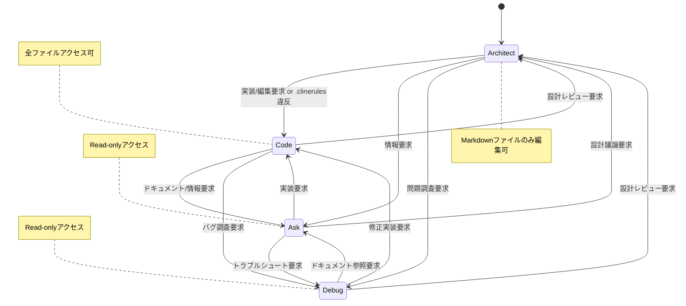

# Roo Code Memory Bank 実装計画案

この計画は、ご提示いただいた仕様に基づき、Memory Bank機能を段階的に実装することを目的としています。

## フェーズ 1: 基盤構築

Memory Bankシステムの基本的なファイル構造と設定ファイルを準備します。

1.  **`memory-bank/` ディレクトリ作成:** プロジェクトルートに `memory-bank/` ディレクトリを作成する機能。
2.  **コアファイル生成:** 以下のコアMarkdownファイルのテンプレートを生成する機能。
    *   `activeContext.md`
    *   `productContext.md`
    *   `progress.md`
    *   `decisionLog.md`
3.  **`projectBrief.md` の定義:** プロジェクト全体の目標、主要なステークホルダー、技術的な制約などを記述するファイルとして定義し、初期テンプレートを生成します。
4.  **`.clinerules` ファイル生成:** 各モードに対応する設定ファイル (`.clinerules-architect`, `.clinerules-code`, `.clinerules-ask`, `.clinerules-debug`) のテンプレートを生成し、初期のファイルアクセス権限やモードスイッチングに関するルールを定義します。

```mermaid
graph TD
    subgraph フェーズ1: 基盤構築
        A[プロジェクト開始] --> B{memory-bank/ 存在確認};
        B -- なし --> C[memory-bank/ 作成];
        C --> D[コアファイル生成<br>(activeContext, productContext, progress, decisionLog)];
        C --> E[projectBrief.md 生成];
        C --> F[.clinerules-* ファイル生成];
        B -- あり --> G[既存ファイルをロード];
        D & E & F & G --> H[基盤準備完了];
    end
```

## フェーズ 2: モード連携とインテリジェントスイッチング

各モードがMemory Bankと連携し、状況に応じてモードが切り替わる機能を実装します。

1.  **Memory Bankアクセスロジック:** 各モードが `.clinerules` に基づいてMemory Bankファイルにアクセス（読み取り/書き込み）するロジックを実装します。
2.  **インテリジェントモードスイッチング:**
    *   ユーザーのプロンプトに含まれるキーワード（Intent-Based Triggers）に基づいてモード切り替えを提案・実行する機能。
    *   ファイル操作（例: Codeモード以外でコードファイルを編集しようとした場合）に基づいてモード切り替えを提案・実行する機能（Operational Triggers）。
    *   モード切り替え時に `activeContext.md` などを参照し、タスクのコンテキストを維持する機能。



## フェーズ 3: リアルタイム更新システム

プロジェクトの進行に合わせてMemory Bankファイルが自動的に更新される仕組みを実装します。

1.  **イベントモニター:** ファイル変更、Git操作、Roo Code内のアクションなどを監視するイベントモニターを実装します。
2.  **自動更新ロジック:** 監視したイベントに応じて、関連するMemory Bankファイル（`activeContext.md`, `progress.md`, `decisionLog.md` など）を自動更新するロジックを実装します。
3.  **更新キューと同期:** 複数の更新が同時に発生した場合でも、整合性を保ちながら効率的に処理するためのキューイングシステムと同期メカニズムを実装します。
4.  **手動更新コマンド (`UMB`):** ユーザーが明示的にMemory Bankの保存・同期を実行できる `update memory bank` (UMB) コマンドを実装します。

```mermaid
flowchart LR
    subgraph フェーズ3: リアルタイム更新
        A[プロジェクトイベント<br>(ファイル変更, Git操作, Rooアクション)] --> B(イベントモニター);
        B --> C{イベント分類};
        C -- activeContext更新 --> D[activeContext.md 更新キュー];
        C -- progress更新 --> E[progress.md 更新キュー];
        C -- decisionLog更新 --> F[decisionLog.md 更新キュー];
        D & E & F --> G(同期マネージャー);
        G --> H[Memory Bankファイル書き込み];
        I[ユーザーコマンド<br>(UMB)] --> G;
    end
```

## フェーズ 4: マルチプロジェクト対応

VS Codeワークスペース内に複数のプロジェクトが存在する場合に対応します。

1.  **Memory Bank検出:** ワークスペース起動時やチャットセッション開始時に、ワークスペース内の `memory-bank/` ディレクトリをスキャンして検出する機能。
2.  **プロジェクト選択:** 複数のMemory Bankが検出された場合に、ユーザーに対象プロジェクトを選択させるプロンプトを表示する機能。
3.  **コンテキスト切り替え:** 選択されたプロジェクトのMemory Bankを現在のセッションのコンテキストとしてロードし、関連する `.clinerules` を適用する機能。

## フェーズ 5: ドキュメントとテスト

機能の利用方法を明確にし、品質を確保します。

1.  **利用ガイド作成:** Memory Bank機能のセットアップ方法、各ファイルの役割、モード連携、`UMB` コマンドの使い方などを記述したドキュメントを作成します。
2.  **テスト実装:** 各コンポーネント（ファイル生成、モードスイッチング、リアルタイム更新、マルチプロジェクト対応など）に対する単体テストおよび結合テストを作成し、機能の信頼性を確保します。

## 優先順位

提示されたフェーズ 1 から順に実装を進めます。