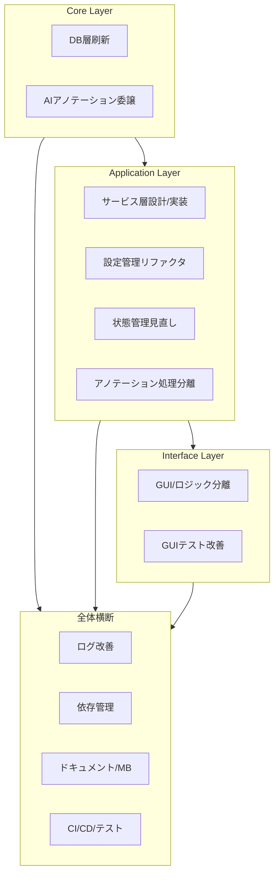

# クラス再設計・リファクタリング計画

## 1. 背景

現在のコードベースでは、GUIとビジネスロジックの密結合、クラス間の密結合、状態管理の課題、ライブラリインターフェースの曖昧さ、テスト容易性の低さなどの問題点が指摘されている。これらの問題を解決し、保守性、拡張性、テスト容易性を向上させるために、大規模なリファクタリングを実施する。

## 2. 基本方針: レイヤードアーキテクチャの導入

責務の分離を明確にするため、以下のレイヤードアーキテクチャを採用する。

1.  **プレゼンテーション層 (GUI / Interfaces):** ユーザーインターフェースの表示、ユーザー入力受付、Application/Service層への処理依頼、結果表示を担当。
2.  **アプリケーション/サービス層 (Application):** GUIからのリクエストを受け、ドメインロジックやインフラストラクチャ層の機能を組み合わせてユースケースを実現。
3.  **ドメイン/コア層 (Core):** アプリケーションの中核となるビジネスルールやデータ構造 (SQLAlchemyモデルなど)、基盤となる機能 (画像処理アルゴリズム、DBアクセス、ライブラリ連携など) を担当。
    *   **インフラストラクチャ層:** DBアクセス、ファイルシステム操作、外部API/ライブラリ連携など、技術的詳細を担当する部分。今回は Core 層に含めて考える。

## 3. 主要な変更計画 (概要)

各レイヤーにおける具体的なリファクタリング項目と進捗は、以下の詳細チェックリストを参照してください。

-   **[Core Layer Refactoring Checklist](./core/refactoring_checklist.md)**
    -   データベース層の刷新 (SQLAlchemy移行)
    -   AIアノテーション機能のライブラリ委譲
-   **[Application Layer Refactoring Checklist](./application/refactoring_checklist.md)**
    -   アプリケーション/サービス層の設計と実装
    -   設定管理 (`ConfigurationService` の導入とリファクタリング)
    -   状態管理の見直し (`dataset_image_paths` 分離など)
    -   アノテーション処理の責務分離
-   **[Interfaces Layer Refactoring Checklist](./interfaces/refactoring_checklist.md)**
    -   GUIとビジネスロジックの分離
    -   GUIウィジェットのテスト容易性向上

---

## 4. 全体横断的なリファクタリング・運用・ドキュメント・CI/CD・依存管理

### 4.1. ログ機能・運用改善
- [x] `loguru` の導入と `logging` からの完全移行
- [x] 設定ファイル主導のロギング (`config/lorairo.toml` `[log]` セクション)
- [x] モジュールごとのログレベル制御
- [x] テスト・運用時のログ出力一貫性確認
- [ ] ログ仕様・運用ガイド (`logging_specification.md`) の最新化・Memory Bank反映

### 4.2. 依存ライブラリ・自作パッケージ管理
- [x] 必須/不要/自作ライブラリの整理 (`lib.md` 参照)
- [ ] `genai-tag-db-tools` のAPI拡張・外部連携 (`genai_tag_db_tools_api_plan.md`)
- [ ] 依存パッケージのバージョン管理・ドキュメント整備

### 4.3. Memory Bank運用・ドキュメント
- [x] Memory Bankコアファイルの作成・運用開始
- [ ] Memory Bank運用ガイド (`memory_bank_plan.md`) の整備・運用ルールの明文化
- [ ] UMB(Update Memory Bank)コマンド運用の徹底

### 4.4. ドキュメント・設計仕様の整備
- [ ] 仕様書・設計書・インターフェース定義の最新化(Plan/specs配下全体)
- [ ] Mermaid図・全体フロー図の最新化
- [ ] 進捗・決定事項のMemory Bank/decisionLog.mdへの反映

### 4.5. CI/CD・テスト自動化
- [ ] テスト自動化(pytest, pytest-bdd, coverage, ruff等)
- [ ] CI/CDパイプラインの整備(GitHub Actions等)
- [ ] テスト・CI運用ガイドの作成

---

## 5. 段階的な進め方 (全体像)

(注: 上図は大まかな依存関係を示しており、実際の作業は並行して進む部分もあります。より詳細なフローは以前のバージョンを参照)

---

## 6. チェックリスト運用・進捗管理

- 各タスクをissueやTODOリストとして管理
- 完了したものは各層のチェックリスト ([Core](./core/refactoring_checklist.md), [Application](./application/refactoring_checklist.md), [Interface](./interfaces/refactoring_checklist.md)) でチェック済みにし、進捗をMemory Bankやprogress.mdに反映
- 各ステップで設計・実装・テスト・ドキュメントの観点で抜け漏れがないか確認

---

## 7. 参考: 全体処理フロー概要

- データセット準備・登録 → 画像処理 → AIアノテーション → DB保存 → エクスポート
- 詳細は `../specs/overall_workflow.md`、各仕様書参照
