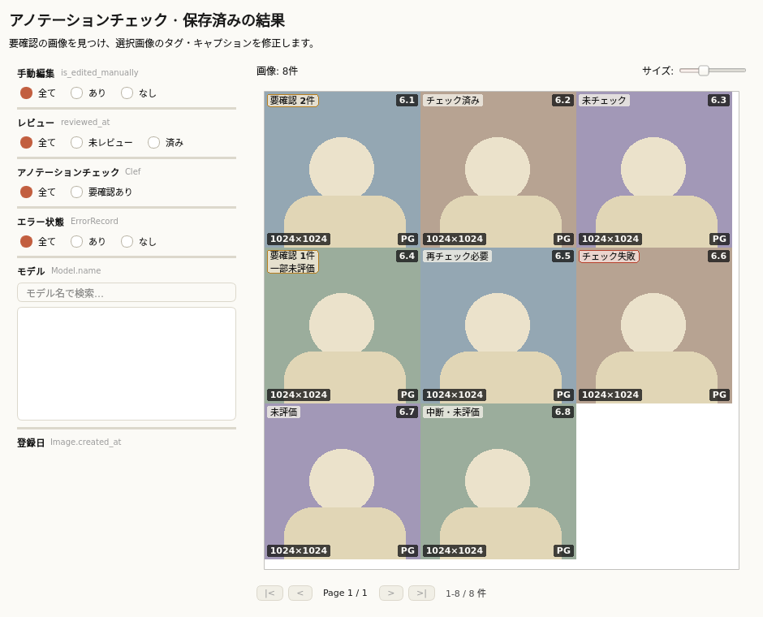
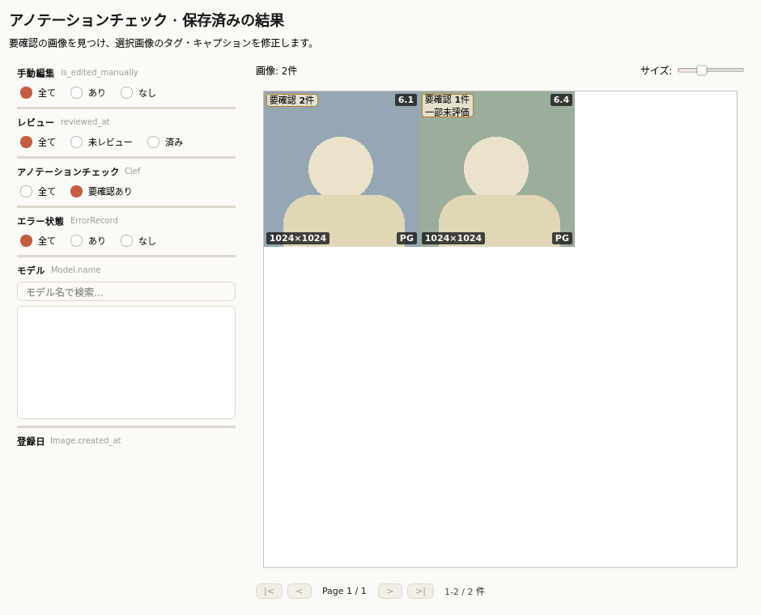
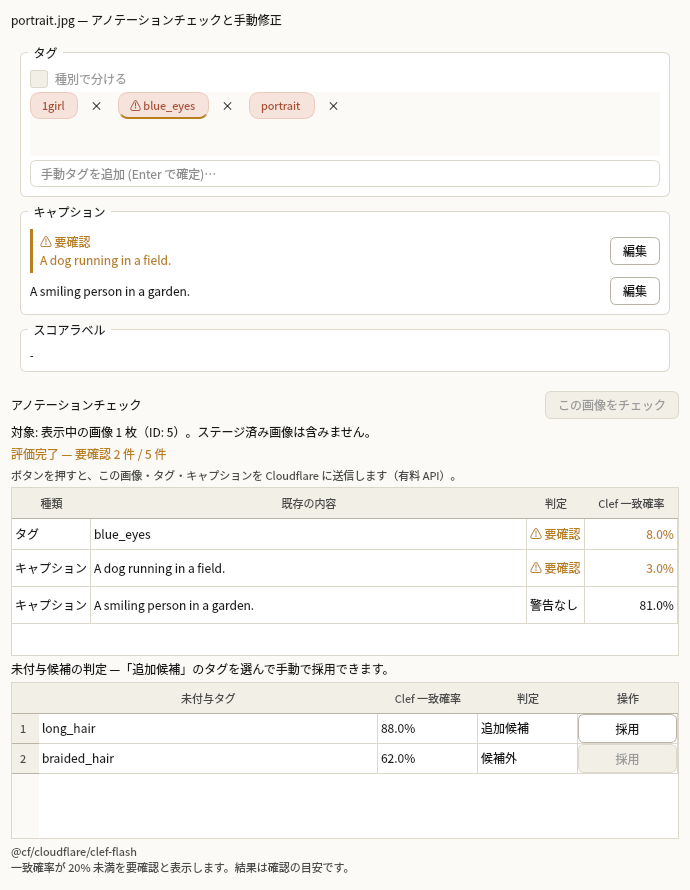
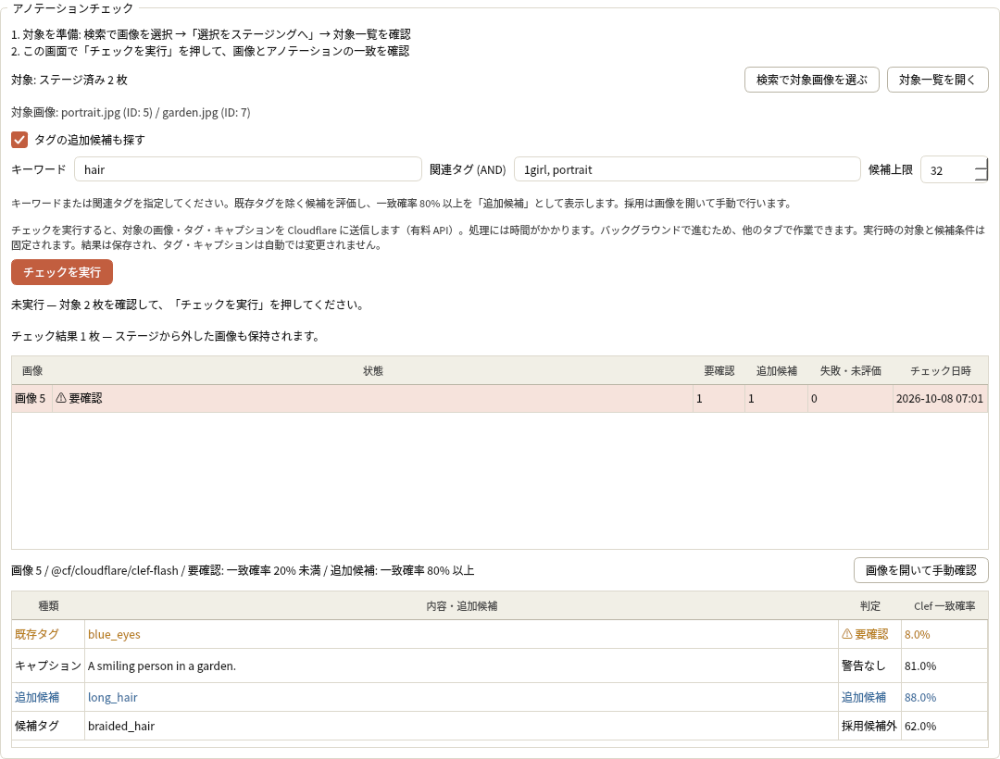
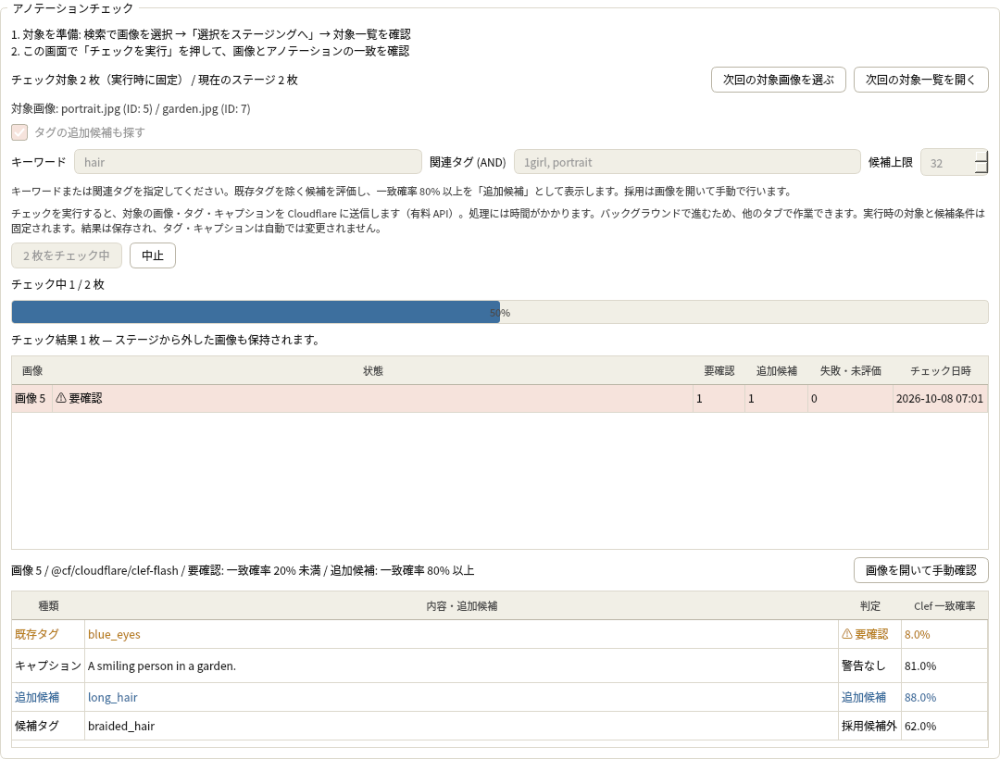
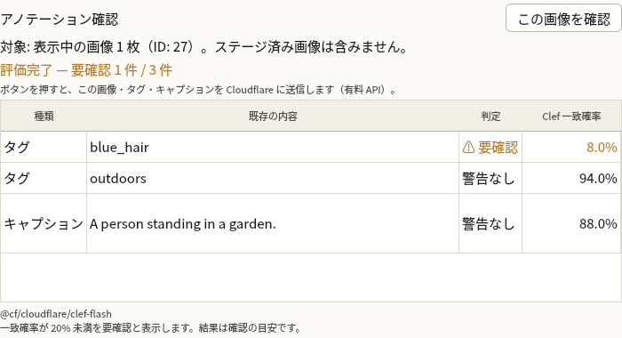
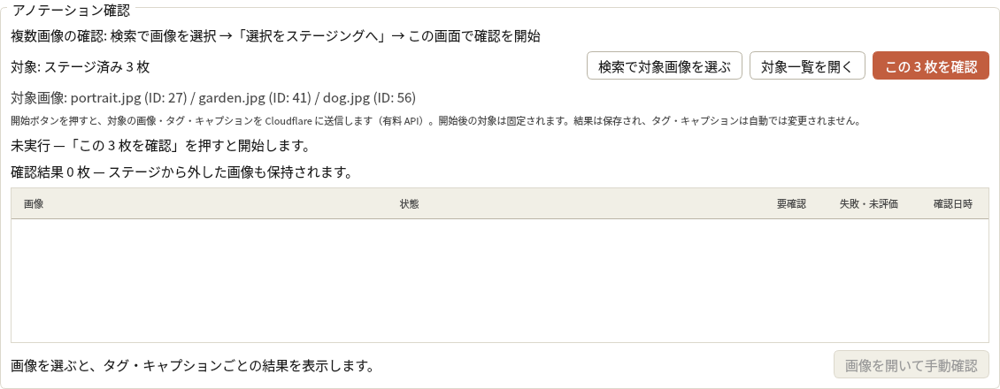
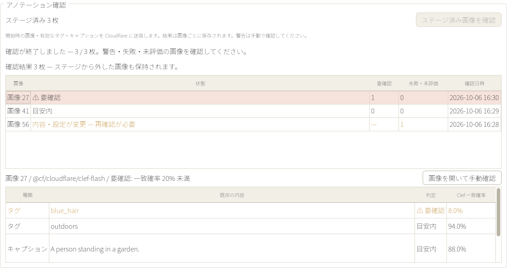
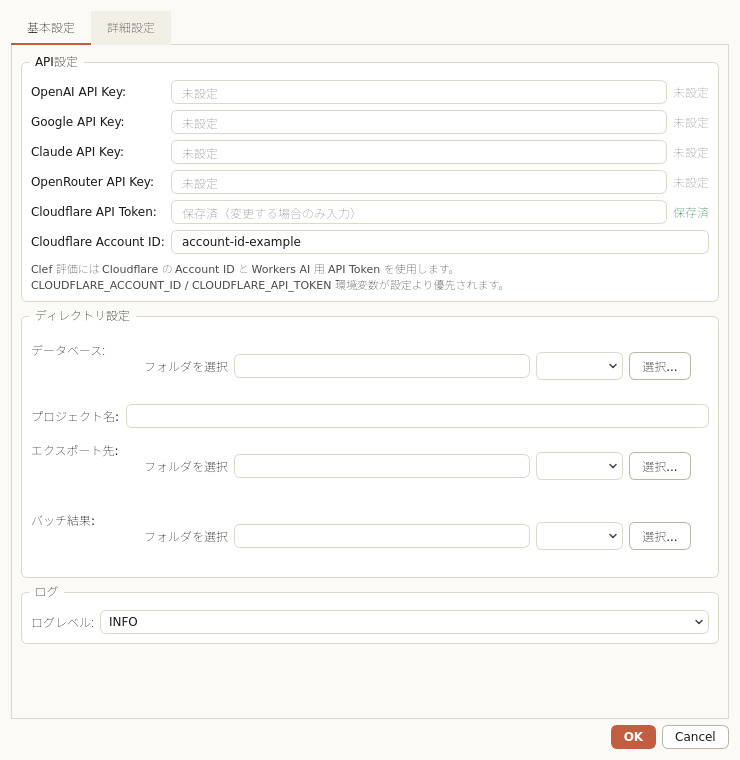

# Clef によるアノテーションチェック

Cloudflare Workers AI の Clef は、登録済みの画像とタグ・キャプションを照合する。
たとえば犬が写っていない画像の `dog` タグや、赤髪の人物を青髪と説明するキャプションを
個別の確認候補として表示する。判定は参考情報で、修正するかはユーザーが決める。

## 設定と実行

設定画面の API 欄で Cloudflare Account ID と API Token を設定する。
トークンには対象アカウントの Workers AI 実行権限が必要。
環境変数 `CLOUDFLARE_ACCOUNT_ID` と `CLOUDFLARE_API_TOKEN` も利用できる。
環境変数が設定されていればローカル設定より優先し、`CLOUDFLARE_AUTH_TOKEN` は
`CLOUDFLARE_API_TOKEN` が未設定の場合の代替として読む。

設定ファイル `config/lorairo.toml` の例:

```toml
[api]
cloudflare_account_id = "YOUR_ACCOUNT_ID"
cloudflare_api_token = "YOUR_API_TOKEN"

[annotation_review]
model = "clef-flash"      # clef も選択可
warning_threshold = 0.2
suggestion_threshold = 0.8 # 未付与タグの追加候補はこの確率以上
timeout = 60.0            # 各リクエストの上限秒数 (1–600)
```

画像を選択し、詳細欄の「この画像をチェック」を押す。対象は表示中の 1 枚で、ステージ済み画像は含まない。
保存済みの元画像（クロップならそのクロップ画像）と
有効なタグ・キャプションを Cloudflare に送信する。有料 API の呼び出しはこの操作で開始し、
画像を選択しただけでは実行しない。soft-reject 済みの注釈は送信しない。

CLI は対象 ID を明示して実行する:

```bash
lorairo-cli --read-only review run --project my_dataset --image-ids 12,34
lorairo-cli --json review run --project my_dataset --image-ids-file ids.txt
```

CLI は 1 回につき最大 500 枚を確認する。ID ファイルを使う場合も同じ上限で、
超過時は通信・画像読み込み前に `RESULT_SET_TOO_LARGE` で拒否する。
CLI の結果は個々の候補に画像 ID、注釈 ID、種別、原文、状態、一致確率を付けて返す。
警告がある場合も正常な判定なら終了コードは 0。通信・解析失敗や古い判定は終了コード 1、
引数の誤りは 2。候補がない画像は未評価として報告し、通信しない。

## 一致確率と状態

一致確率は「このタグ・キャプションの内容が画像に支持されている」という質問が真である確率。
`0.03` は画像との一致が低い判定で、既定では `0.2` 未満を要確認とする。
ちょうど `0.2` は警告対象外。基準は設定で変更できるが、一般的な正解率を保証する値ではない。
警告がないことも注釈の正確さの保証にはならない。

| 状態 | 意味 |
|---|---|
| 要確認 | 一致確率が設定した基準を下回る |
| 警告対象外 | 評価が成功し、一致確率が基準以上 |
| 失敗 | 認証・通信・画像入力・応答解析などで評価できなかった |
| 未評価 | 候補がない、キャンセルされた、または前のリクエスト失敗で処理されなかった |
| 古い結果 | 画像ファイル・注釈・判定設定が変わったため、再確認が必要 |

64 件を超える注釈は分割して評価する。途中で失敗した場合、それまでの成功結果を残し、
失敗した部分と未評価の部分を分ける。自動再試行はしない。
確認中のキャンセルは次の送信を止める。送信済みの通信はタイムアウトまで終わらない場合がある。

## 複数画像の確認と結果の保存

「結果」タブの「検索で対象画像を選ぶ」から検索画面を開き、画像を選択して
「選択をステージングへ」を押す。「結果」タブに戻ると、対象の枚数とファイル名を表示する。
「対象一覧を開く」でステージ済み画像を確認・削除できる。「チェックを実行」を押すと開始する。
現在の選択画像や保存済み結果の画像は自動では対象に入らない。
1 回の対象は最大 500 枚。開始時の画像 ID を固定し、バックグラウンドで画像と有効な
タグ・キャプションの状態を読み取ってから Cloudflare に送信する。実行中に別の画像を選択したり
ステージングを変更したりしても、実行対象は変わらない。

画像ごとに最新の確認結果をプロジェクト DB に保存する。画像を切り替えたりアプリを再起動したり
しても結果は残る。結果には元の注釈 ID・文章、一致確率、警告や失敗の状態、判定モデル・基準、
確認時刻を保持する。途中で中止しても、それまでに完了した画像の結果は失われない。
CLI の明示実行は従来どおり読み取り専用で、結果を DB に保存しない。

「結果」画面で画像ごとの警告を確認し、手動確認の操作から検索画面の対象画像を開く。
結果一覧は直近の最大 500 枚を表示する。それ以前の結果も DB に保持し、対象画像の詳細欄から確認できる。
タグ・キャプションは既存の手動編集操作で修正する。画像や注釈、判定モデル・基準が変わった
結果は「古い結果」として扱い、現在の内容に対する一致確率として表示しない。

結果の保存には `annotation_review_results` テーブルを追加する。既存 DB は通常の
Alembic マイグレーションで更新される。保存対象は確認結果で、既存の注釈、confidence、
品質スコア、reviewed 状態、出力対象は変更しない。
文法の専用チェック、好みの予測、自動修復、出力対象の自動除外はこの確認の対象外。

## 検索から確認・修正する

検索サムネイルには保存済みの判定を表示する。「要確認 3件」などの印がある画像は、
画像を選んで詳細欄の該当タグ・キャプションを確認する。検索の「要確認あり」で絞り込める。
この絞り込みは現在の画像・注釈・判定設定に一致する警告だけを対象にし、古い判定は含めない。
未チェック、未評価、失敗、部分失敗、古い判定は警告なしと区別する。
保存済み結果の取得と鮮度確認だけを検索時に行い、Cloudflare には送信しない。
処理が完了した画像からサムネイルと選択中の詳細へ反映する。

要確認のタグには既存の手動タグ操作を使う。キャプション欄は有効な全キャプションを
注釈行ごとに表示し、各行の「編集」から文章を変更して保存できる。保存は対象行 ID と
編集前の文章を確認して置き換え、変更済みの文章を古い編集画面で上書きしない。
手動編集フラグを設定し、元のモデル情報と行 ID は保持する。
編集後のチェック結果は古い判定になり、一致確率や追加候補の採用操作を無効にする。
強調はタグまたはキャプション全体に対するもので、説明文や単語単位の問題箇所は生成しない。

## 関連画像群から未付与タグを提案する

結果タブで「タグの追加候補も探す」を選び、候補を集める画像群のキーワードまたは
関連タグを指定する。複数タグは AND 条件。キーワード・タグの両方が空の実行はできない。
既存のタグクラウドと同じ集計を利用し、1画像に同じタグが複数あっても1件として数える。
頻度順の候補から対象画像に既に付いているタグを除き、指定件数を各画像に渡す。
既定32件、最大64件で、タグクラウドの表示ノード数とは独立している。

開始時に対象画像 ID と候補条件を固定し、全画像の注釈と未付与候補を準備してから送信する。
既存タグの一致が `warning_threshold` 未満なら要確認、未付与候補の一致が
`suggestion_threshold` 以上なら追加候補とする。追加候補は警告件数へ数えない。
候補外・評価失敗・未評価も結果で区別し、判定の内容・候補条件・追加基準を保存する。
旧形式の保存結果も読み込める。今回の拡張に追加の DB マイグレーションは必要ない。

対象枚数と処理内容を確認して「チェックを実行」を押すと、直ちに準備中の表示になる。
進捗と実行中の表示はタブを移っても確認できる。所要時間の予測は表示しない。
詳細欄の追加候補には「採用」があり、選んだ候補だけを手動タグとして登録する。
採用時に最新の保存結果と画像・注釈・設定を再確認し、古い候補や置き換わった結果は採用しない。
一致確率をタガー confidence・手動スコアへ書き込まず、reviewed 状態も変更しない。

## 表示例

以下は表示確認用の架空の結果で、実 API の精度検証ではない。



















## ライブラリとの境界

`image_annotator_lib.decisions` は `annotate()` と別の公開 API。
Cloudflare 接続、ローカル画像の送信、真偽・候補選択・段階評価の型と検証を担当する。
LoRAIro は DB の注釈 ID を質問 ID (`tag_123` / `caption_456`) に対応付け、質問文、
警告基準、画面表示、編集後の無効化を担当する。
通常の annotation モデル選択や `AnnotationSaveService` に判定結果を流さない。

設計判断: [ADR 0094](decisions/0094-clef-annotation-review.md)、
[ADR 0095](decisions/0095-clef-review-batch-results.md)、
[ADR 0096](decisions/0096-clef-search-tag-suggestions.md)。
関連 Issue: [LoRAIro #1366](https://github.com/NEXTAltair/LoRAIro/issues/1366)、
[image-annotator-lib #167](https://github.com/NEXTAltair/image-annotator-lib/issues/167)。
API 仕様: [Cloudflare Clef-flash](https://developers.cloudflare.com/workers-ai/models/clef-flash/)。
