# LoRAIro Architecture Documentation

## System Overview

LoRAIro is an AI-powered image annotation and dataset management application built with a clean 3-layer architecture designed for machine learning dataset preparation. The system processes images through multiple AI providers and provides quality assessment tools for training data curation.

## Architectural Principles

### Clean Architecture
The application follows clean architecture principles with clear separation of concerns:

- **Presentation Layer**: PySide6-based GUI components with QThreadPool worker system
- **Application Layer**: Business logic services and use cases
- **Domain Layer**: Core business entities and rules
- **Infrastructure Layer**: Database, file system, and external APIs

### PySide6 Worker Architecture (Updated: 2025-07-21)
The system uses Qt's QThreadPool and QRunnable for asynchronous operations:

- **WorkerManager**: QThreadPool-based task execution coordination (`src/lorairo/gui/workers/manager.py`)
- **BaseWorker**: Standardized QRunnable implementation with progress reporting (`src/lorairo/gui/workers/base_worker.py`)
- **Specialized Workers**: Database, annotation, search, and thumbnail workers in `src/lorairo/gui/workers/`
- **WorkerService**: Qt service layer for worker coordination and GUI integration (`src/lorairo/gui/services/worker_service.py`)
- **DatasetStateManager**: Centralized state management with Qt signals (`src/lorairo/gui/state/dataset_state.py`)

### Dependency Injection
Services are injected into components to maintain loose coupling and enable testability.

### Configuration-Driven Development
All system behavior is configurable through TOML files, enabling easy customization without code changes.

### Event-Driven Architecture
Components communicate through Qt signals/slots for loose coupling and responsive UI:

- **Qt Auto-connection**: Standardized signal naming (e.g., `on_buttonName_clicked`)
- **Custom Signals**: Inter-component communication via DatasetStateManager
- **Worker Signals**: Progress updates and result delivery from background threads
- **State Synchronization**: Centralized state updates via signal/slot patterns

## System Components

### Core Application Flow

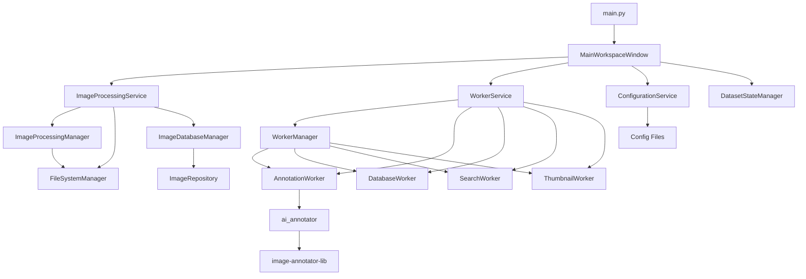

#### Entry Point
- **`src/lorairo/main.py`**: Application initialization
  - Sets up Qt application
  - Configures logging
  - Initializes service dependencies
  - Launches main window

#### Main Window Controller
- **`src/lorairo/gui/window/main_workspace_window.py`**: Primary GUI orchestrator (MainWorkspaceWindow)
  - Workflow-centered 3-panel layout design
  - Coordinates between filter/search, thumbnail, and preview panels
  - Manages service dependencies and worker coordination
  - Handles application lifecycle

#### Service Layer
- **`src/lorairo/services/image_processing_service.py`**: Image processing business logic
  - Coordinates between GUI, ImageProcessingManager, and database
  - Manages image processing workflows
- **`src/lorairo/services/annotation_service.py`**: AI annotation business logic (deprecated)
  - Legacy service - functionality migrated to WorkerService
  - Coordinates with image-annotator-lib integration
- **`src/lorairo/services/configuration_service.py`**: Configuration management
  - TOML configuration file handling
  - Application settings management

#### GUI Services
- **`src/lorairo/gui/services/worker_service.py`**: Qt-based worker coordination
  - High-level API for GUI layer
  - Manages WorkerManager and asynchronous operations
  - Provides unified interface for database registration, search, annotation, and thumbnail loading

#### Core Processing Components
- **`src/lorairo/editor/image_processor.py`**: ImageProcessingManager
  - Coordinates image processing workflows
  - Integrates with AutoCrop and Upscaler modules
- **`src/lorairo/editor/autocrop.py`**: AutoCrop
  - Automatic letterbox detection and removal
  - Complementary color difference algorithm
- **`src/lorairo/editor/upscaler.py`**: Upscaler
  - AI-powered image upscaling functionality
  - Configuration-driven model selection
  - Supports RealESRGAN and other models
- **`src/lorairo/database/db_manager.py`**: ImageDatabaseManager
  - High-level database operations
  - Coordinates with ImageRepository
- **`src/lorairo/database/db_repository.py`**: ImageRepository
  - Direct database access layer
  - SQLAlchemy-based data operations
- **`src/lorairo/storage/file_system.py`**: FileSystemManager
  - File system operations
  - Image storage and metadata handling

#### AI Integration
- **`src/lorairo/annotations/ai_annotator.py`**: AI library integration
  - Clean wrapper for image-annotator-lib
  - Functions: `get_available_annotator_models()`, `call_annotate_library()`
  - Comprehensive error handling with `AiAnnotatorError`
  - Structured logging for debugging
- **`local_packages/image-annotator-lib/`**: External AI annotation library
  - Multi-provider AI annotation support (OpenAI, Anthropic, Google, Local models)
  - Unified interface via `annotate()` function
  - Returns `PHashAnnotationResults` with structured data
  - Local and cloud-based model execution

### Service Layer Architecture

The service layer encapsulates business logic and provides clean interfaces for the GUI layer.

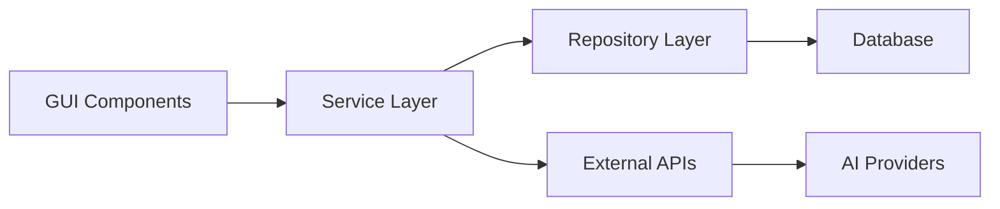

#### Core Services

**ImageProcessingService**
- Image loading and validation
- Format conversion (JPEG, PNG, WebP)
- Resizing and quality optimization
- Batch processing coordination
- Metadata extraction

**AnnotationService**
- AI provider coordination
- Caption and tag generation
- Quality scoring integration
- Batch annotation processing
- Result aggregation and storage

**ConfigurationService**
- TOML configuration management
- Environment variable integration
- Runtime configuration updates
- Validation and defaults

### Data Layer Architecture

The data layer provides persistent storage and manages image metadata.

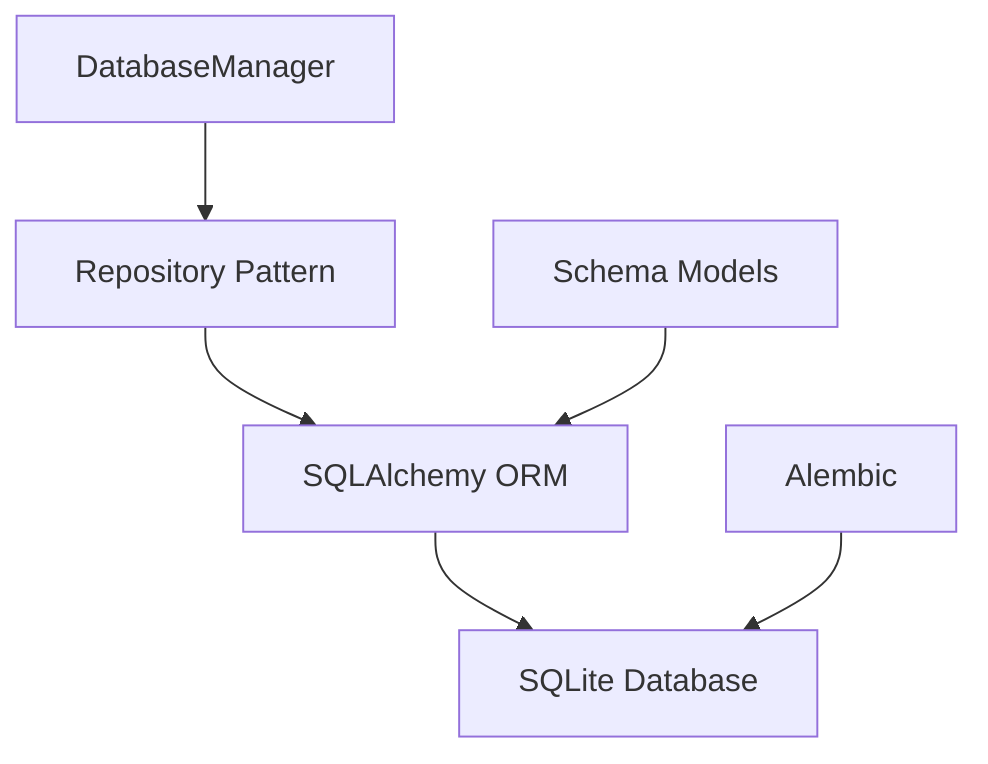

#### Database Components

**DatabaseManager** (`src/lorairo/database/db_manager.py`)
- Connection management
- Transaction coordination
- Session lifecycle
- Migration management

**Repository Layer** (`src/lorairo/database/db_repository.py`)
- Data access abstraction
- Query optimization
- Business logic isolation
- Transaction boundaries

**Schema Models** (`src/lorairo/database/schema.py`)
- Entity definitions
- Relationship mapping
- Validation rules
- Database constraints

### GUI Architecture (Updated: 2025-07-21)

The GUI follows a workflow-centered 3-panel design with PySide6 Worker System architecture.

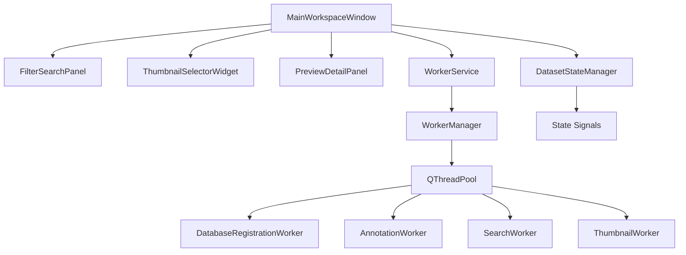

#### GUI Components (Modernized Architecture)

**Main Window**
- **`src/lorairo/gui/window/main_workspace_window.py`**: MainWorkspaceWindow
- Workflow-centered 3-panel design replacing legacy page-based architecture
- Qt auto-connection pattern with standardized signal naming
- Dependency injection for services (ConfigurationService, WorkerService, DatasetStateManager)

**Panel Components**
- **`src/lorairo/gui/widgets/filter_search_panel.py`**: Advanced search and filtering
- **`src/lorairo/gui/widgets/thumbnail_selector_widget.py`**: Efficient image display and selection
- **`src/lorairo/gui/widgets/preview_detail_panel.py`**: Rich preview and metadata display
- Virtual scrolling and progressive loading for performance

**State Management**
- **`src/lorairo/gui/state/dataset_state.py`**: DatasetStateManager
- Centralized state coordination with Qt signals
- Image selection tracking, filter state persistence
- Worker status coordination

**Designer Integration (Legacy)**
- **`src/lorairo/gui/designer/`**: Auto-generated UI classes (being phased out)
- **`.ui` files**: Qt Designer interface definitions
- **`*_ui.py` files**: Compiled Python UI classes

### Worker Architecture (PySide6 QThreadPool System)

The worker system provides asynchronous task execution using Qt's QRunnable and QThreadPool with standardized patterns.

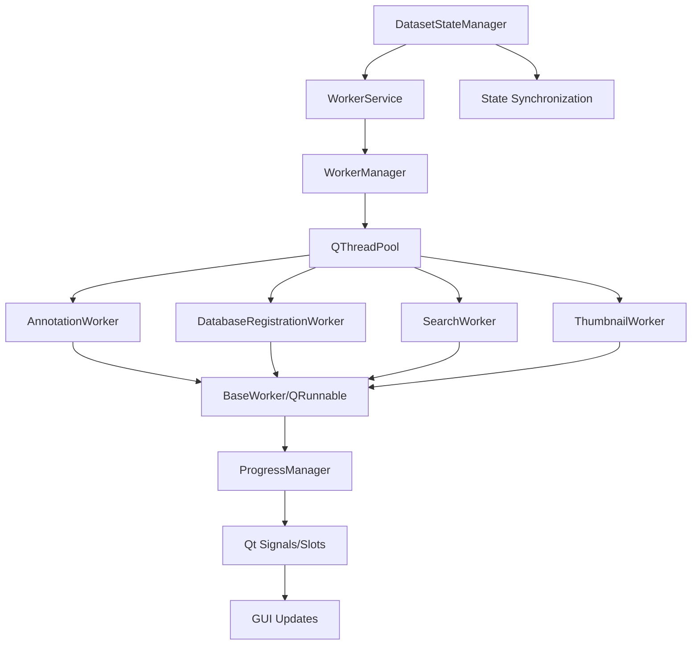

#### Worker Components

**Core Worker Infrastructure**
- **`src/lorairo/gui/workers/base_worker.py`**: LoRAIroWorkerBase
- Standardized QRunnable implementation with progress reporting
- Built-in cancellation support and error handling
- Qt signal integration for GUI communication

**Worker Management**
- **`src/lorairo/gui/workers/manager.py`**: WorkerManager
- QThreadPool coordination and lifecycle management
- Worker registration and status tracking
- Resource management and cleanup

**Service Integration**
- **`src/lorairo/gui/services/worker_service.py`**: WorkerService
- High-level API for async operations
- Unified signal patterns across all workers
- State management integration

**Specialized Workers**
- **DatabaseRegistrationWorker**: Batch image registration to database
- **AnnotationWorker**: AI annotation processing with progress reporting
- **SearchWorker**: Asynchronous database search operations
- **ThumbnailWorker**: Progressive thumbnail loading and caching
    E --> I
    F --> I
    G --> I
```

#### Worker Implementation Details

**Worker Data Structures** (`src/lorairo/gui/workers/base_worker.py`)
- `WorkerProgress`: Progress reporting data structure
- `ProgressReporter`: Qt signal-based progress reporting
- `CancellationController`: Cooperative cancellation support

#### Worker Features

**Asynchronous Execution**
- Non-blocking GUI operations
- QRunnable-based task execution
- QThreadPool for efficient resource management

**Progress Reporting**
- Real-time progress updates via Qt signals
- Percentage-based and message-based reporting
- Integration with QProgressDialog

**Cancellation Support**
- Cooperative cancellation mechanism
- Resource cleanup on cancellation
- Graceful worker termination

**Error Handling**
- Structured error reporting
- Exception capture and forwarding
- Worker state recovery

### AI Integration Architecture

The system supports multiple AI providers through a unified interface.

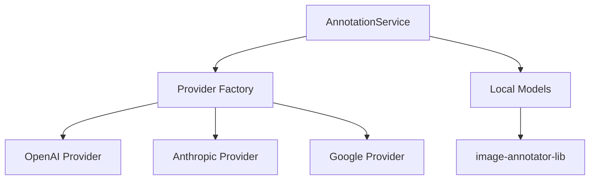

#### AI Provider Integration

**Multi-Provider Support**
- OpenAI GPT-4 Vision
- Anthropic Claude
- Google Gemini
- Local ML models via image-annotator-lib

**Provider Abstraction**
- Unified annotation interface
- Provider-specific configuration
- Error handling and retry logic
- Rate limiting and quota management

**Local Model Integration**
- CLIP-based aesthetic scoring
- DeepDanbooru tagging
- ONNX and TensorFlow models
- GPU acceleration support

### Storage Architecture

File system management handles image storage and organization.

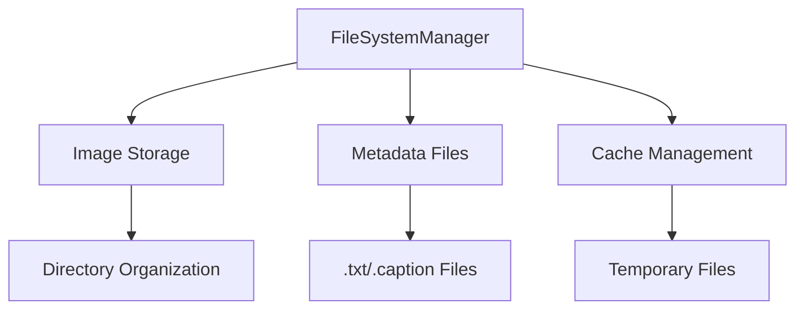

#### Storage Components

**FileSystemManager** (`src/lorairo/storage/file_system.py`)
- Directory management
- File organization patterns
- Metadata file coordination
- Cleanup and maintenance

**File Organization**
- Images with associated metadata files
- Directory-based categorization
- Atomic file operations
- Backup and recovery support

## Local Package Integration

### Submodule Architecture

The project leverages two local packages as Git submodules managed through uv:

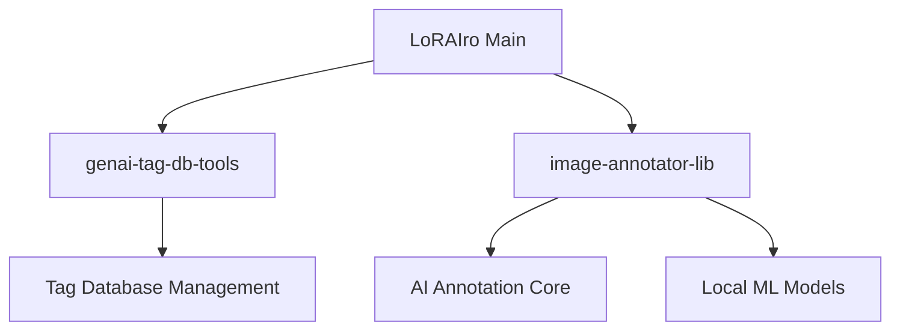

#### genai-tag-db-tools
- **Purpose**: Tag database management and cleaning utilities
- **Integration**: Direct Python import via `from genai_tag_db_tools import initialize_tag_searcher`
- **Location**: `local_packages/genai-tag-db-tools/`
- **Features**: 
  - Tag taxonomy database (tags_v3.db)
  - Tag cleaning and normalization (`initialize_tag_searcher`)
  - Used in `src/lorairo/annotations/cleanup_txt.py`
  - Database path resolution via `src/lorairo/database/db_core.py`

#### image-annotator-lib
- **Purpose**: Core AI-powered image annotation functionality
- **Integration**: Direct Python import via `from image_annotator_lib import annotate, list_available_annotators`
- **Location**: `local_packages/image-annotator-lib/`
- **Features**: 
  - Multi-provider AI annotation (OpenAI, Anthropic, Google)
  - Local ML model support (CLIP, DeepDanbooru)
  - Unified annotation interface with structured results
  - Integration via `src/lorairo/annotations/ai_annotator.py`

### Dependency Management

**uv Integration**
- Packages linked via `uv.sources` in `pyproject.toml`
- Editable installs for development
- Automatic dependency resolution
- Version pinning and updates

## Configuration Architecture

### Hierarchical Configuration

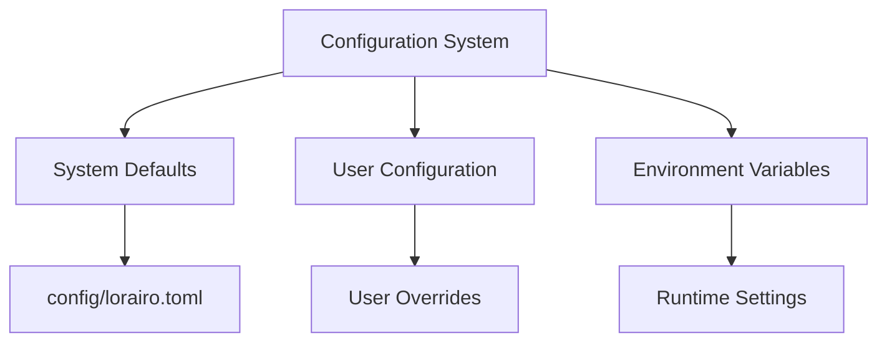

#### Configuration Layers

**System Configuration** (`config/lorairo.toml`)
- Application defaults
- AI provider settings
- Database configuration
- Logging setup

**Environment Integration**
- API key management
- Development/production flags
- Debug configuration
- Path overrides

**Runtime Configuration**
- User preference persistence
- Session state management
- Dynamic setting updates
- Validation and defaults

## Security Architecture

### Data Protection

**API Key Management**
- Environment variable storage
- Secure configuration handling
- No credential logging
- Provider-specific security

**File System Security**
- Proper file permissions
- Temporary file cleanup
- Path validation
- Directory traversal prevention

### Error Handling

**Comprehensive Error Management**
- Structured error types
- User-friendly messages
- Detailed logging for debugging
- Graceful degradation strategies

## Performance Architecture

### Memory Management

**Image Processing Optimization**
- Lazy loading strategies
- Memory-efficient processing
- Garbage collection optimization
- Resource cleanup automation

**Database Performance**
- Connection pooling
- Query optimization
- Index management
- Batch operations

### Batch Processing Architecture

**Hybrid Controlled Batch Processing**
- **Design**: 100-image batches for registration and processing
- **Performance Target**: 5 minutes for 1000 image database registration
- **Benefits**: Memory control, error isolation, responsive progress updates
- **Implementation**: Sequential batch processing with cancellation support

### Scalability Considerations

**Batch Processing**
- Parallel image processing
- Queue management
- Progress tracking
- Error recovery

**Resource Management**
- Memory usage monitoring
- CPU utilization optimization
- I/O operation efficiency
- Network request optimization

## Testing Architecture

### Test Strategy

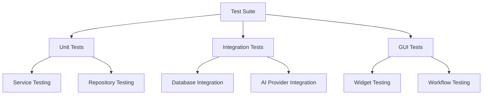

#### Test Categories

**Unit Tests** (`pytest -m unit`)
- Service layer testing
- Business logic validation
- Mock-based isolation
- Fast execution

**Integration Tests** (`pytest -m integration`)
- Database operations
- File system interactions
- Service coordination
- End-to-end workflows

**GUI Tests** (`pytest -m gui`) - pytest-qt Framework
- **pytest-qt Integration**: Standard patterns using qtbot fixtures
- **Widget Testing**: QWidget lifecycle management with automatic cleanup
- **Cross-platform Support**: Linux headless (QT_QPA_PLATFORM=offscreen) vs Windows native GUI
- **Signal Testing**: Qt signal/slot validation and async worker coordination
- **Mock Strategies**: Dependency injection patterns for service isolation

**Custom Test Markers**
- **`fast`**: Fast unit tests (no external dependencies, <30s)
- **`standard`**: Standard unit tests (light mocking, <3min)
- **`real_api`**: Real API tests (for validation)
- **Additional markers**: `webapi`, `scorer`, `tagger`, `model_factory` from local packages

## Deployment Architecture

### Development Environment

**Local Development**
- uv virtual environment
- Local SQLite database
- File-based configuration
- Debug logging enabled

### Package Management

**Dependencies**
- Core dependencies in `pyproject.toml`
- Development tools separation
- Local package integration
- Version pinning strategy

## Future Architecture Considerations

### Extensibility Points

**Plugin Architecture**
- AI provider plugins
- Processing pipeline extensions
- Custom widget plugins
- Export format plugins

**Microservice Potential**
- Annotation service separation
- API-based communication
- Horizontal scaling capability
- Cloud deployment options

### Technology Evolution

**Framework Updates**
- PySide6 version management
- Python version compatibility
- Dependency update strategy
- Migration planning

## Sequence Diagrams

The following sequence diagrams illustrate the detailed interactions between components during key application workflows.

### Application Startup Flow

```mermaid
sequenceDiagram
    participant User
    participant Main as main.py
    participant Config as ConfigurationService
    participant Log as Logger
    participant App as QApplication
    participant MW as MainWindow
    participant UI as Ui_MainWindow

    User->>+Main: アプリケーション起動
    Main->>+Config: get_config()
    Config-->>-Main: 設定情報
    Main->>+Log: initialize_logging(config)
    Log-->>-Main: ログ初期化完了
    Main->>+App: QApplication([])
    App-->>-Main: アプリインスタンス
    Main->>+MW: MainWindow()
    MW->>+UI: setupUi(self)
    UI-->>-MW: UI初期化完了
    MW-->>-Main: ウィンドウインスタンス
    Main->>MW: show()
    Main->>App: exec()
    App-->>-User: アプリケーション表示
```

### MainWindow Initialization Flow

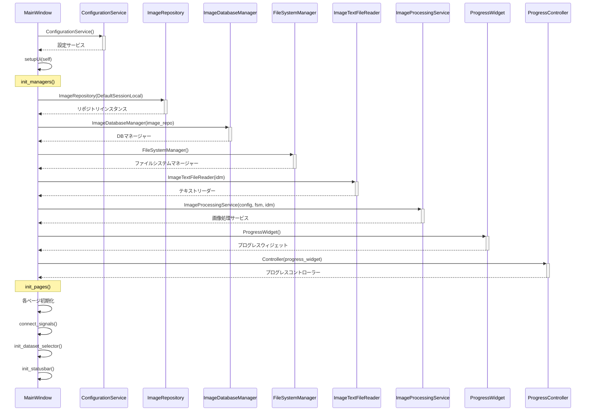

### Image Processing Flow

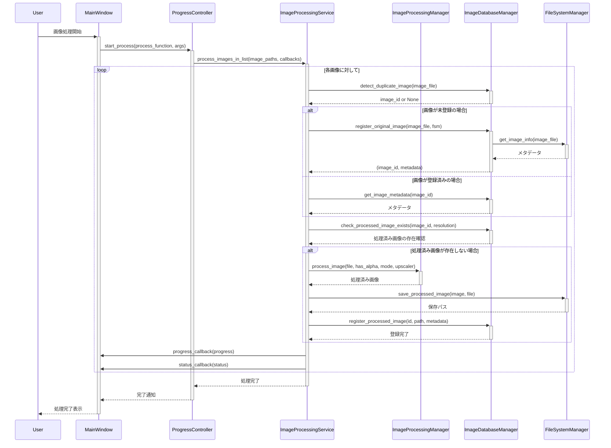

### AI Annotation Processing Flow

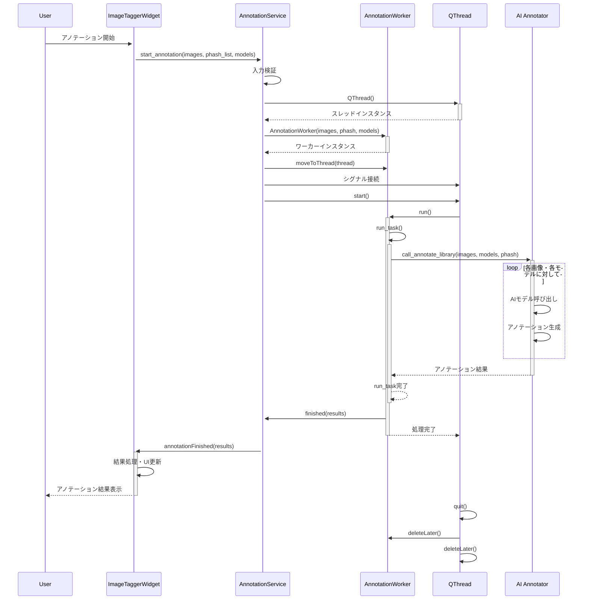

### Database Operation Flow

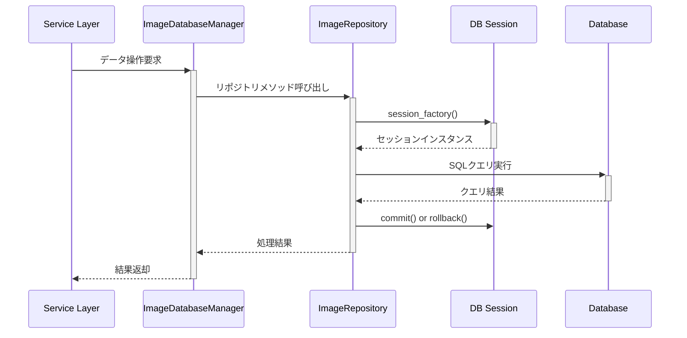

### Configuration Management Flow

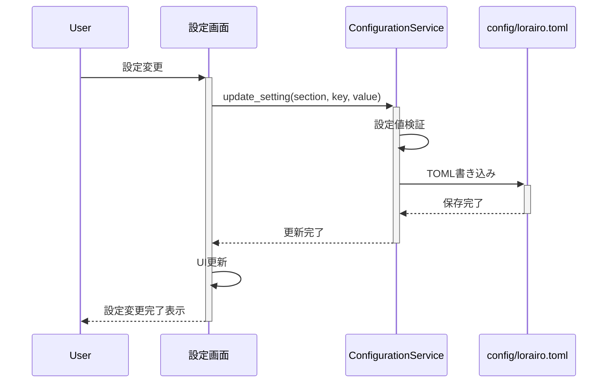

This architecture provides a solid foundation for the LoRAIro application while maintaining flexibility for future enhancements and scaling requirements.
