# LoRAIro Architecture Documentation

## System Overview

LoRAIro is an AI-powered image annotation and dataset management application built with a clean 3-layer architecture designed for machine learning dataset preparation. The system processes images through multiple AI providers and provides quality assessment tools for training data curation.

## Architectural Principles

### Clean Architecture
The application follows clean architecture principles with clear separation of concerns:

- **Presentation Layer**: PySide6-based GUI components
- **Application Layer**: Business logic services and use cases
- **Domain Layer**: Core business entities and rules
- **Infrastructure Layer**: Database, file system, and external APIs

### Dependency Injection
Services are injected into components to maintain loose coupling and enable testability.

### Configuration-Driven Development
All system behavior is configurable through TOML files, enabling easy customization without code changes.

### Event-Driven Architecture
Components communicate through Qt signals/slots for loose coupling and responsive UI.

## System Components

### Core Application Flow

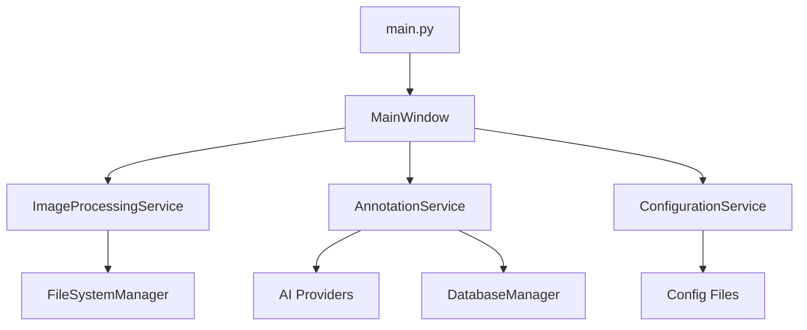

#### Entry Point
- **`src/lorairo/main.py`**: Application initialization
  - Sets up Qt application
  - Configures logging
  - Initializes service dependencies
  - Launches main window

#### Main Window Controller
- **`src/lorairo/gui/window/main_window.py`**: Primary GUI orchestrator
  - Coordinates between widgets
  - Manages application state
  - Handles user interactions
  - Displays notifications and progress

### Service Layer Architecture

The service layer encapsulates business logic and provides clean interfaces for the GUI layer.

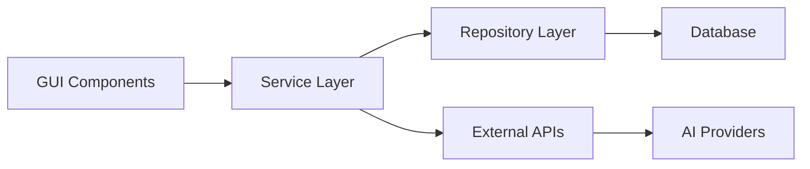

#### Core Services

**ImageProcessingService**
- Image loading and validation
- Format conversion (JPEG, PNG, WebP)
- Resizing and quality optimization
- Batch processing coordination
- Metadata extraction

**AnnotationService**
- AI provider coordination
- Caption and tag generation
- Quality scoring integration
- Batch annotation processing
- Result aggregation and storage

**ConfigurationService**
- TOML configuration management
- Environment variable integration
- Runtime configuration updates
- Validation and defaults

### Data Layer Architecture

The data layer provides persistent storage and manages image metadata.

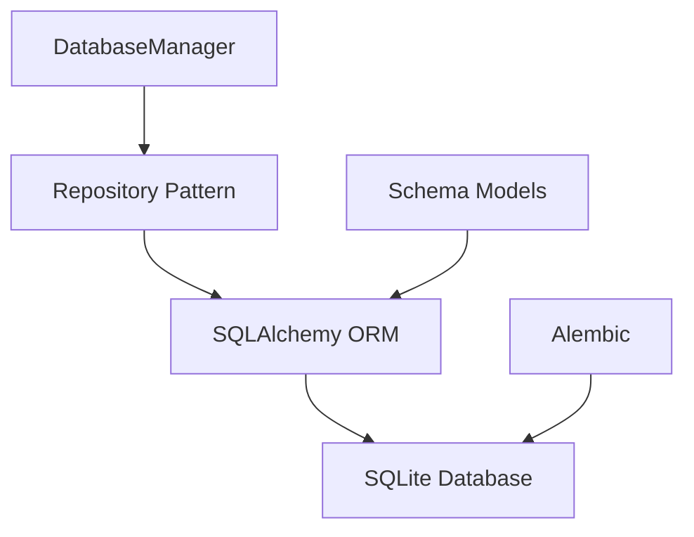

#### Database Components

**DatabaseManager** (`src/lorairo/database/db_manager.py`)
- Connection management
- Transaction coordination
- Session lifecycle
- Migration management

**Repository Layer** (`src/lorairo/database/db_repository.py`)
- Data access abstraction
- Query optimization
- Business logic isolation
- Transaction boundaries

**Schema Models** (`src/lorairo/database/schema.py`)
- Entity definitions
- Relationship mapping
- Validation rules
- Database constraints

### GUI Architecture

The GUI follows the Model-View-Controller pattern with PySide6 components.

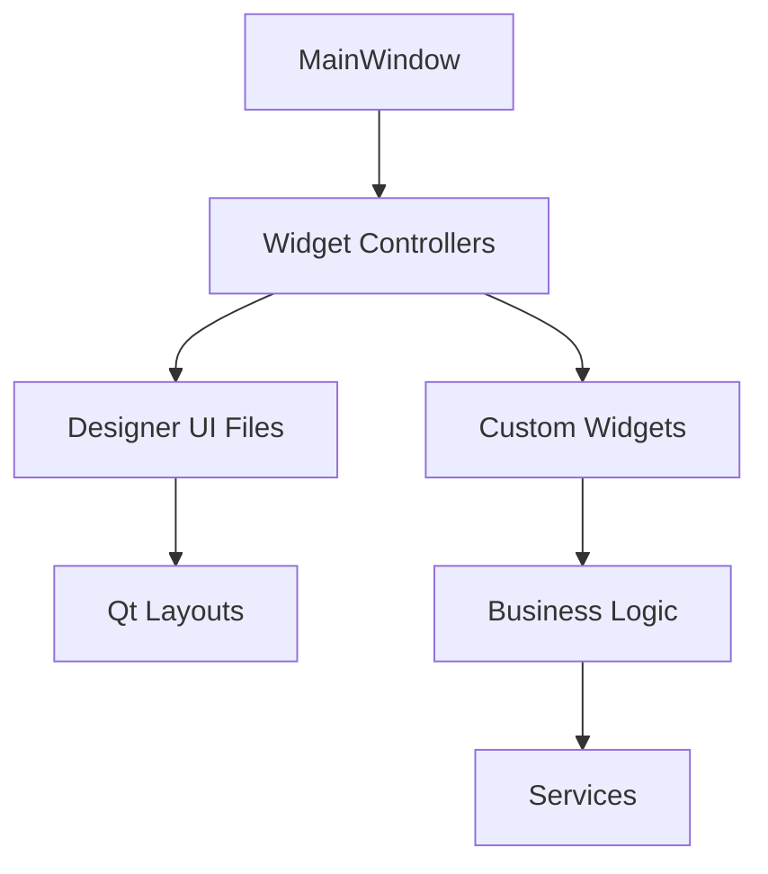

#### GUI Components

**Designer Integration**
- **`src/lorairo/gui/designer/`**: Auto-generated UI classes
- **`.ui` files**: Qt Designer interface definitions
- **`*_ui.py` files**: Compiled Python UI classes

**Widget Controllers**
- **`src/lorairo/gui/widgets/`**: Custom widget implementations
- Business logic integration
- Signal/slot connections
- Data binding and validation

**Window Controllers**
- **`src/lorairo/gui/window/`**: Window-level orchestration
- Multi-widget coordination
- Application state management
- User workflow control

### AI Integration Architecture

The system supports multiple AI providers through a unified interface.

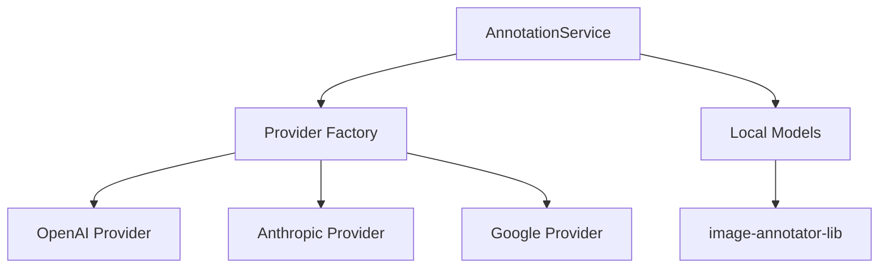

#### AI Provider Integration

**Multi-Provider Support**
- OpenAI GPT-4 Vision
- Anthropic Claude
- Google Gemini
- Local ML models via image-annotator-lib

**Provider Abstraction**
- Unified annotation interface
- Provider-specific configuration
- Error handling and retry logic
- Rate limiting and quota management

**Local Model Integration**
- CLIP-based aesthetic scoring
- DeepDanbooru tagging
- ONNX and TensorFlow models
- GPU acceleration support

### Storage Architecture

File system management handles image storage and organization.

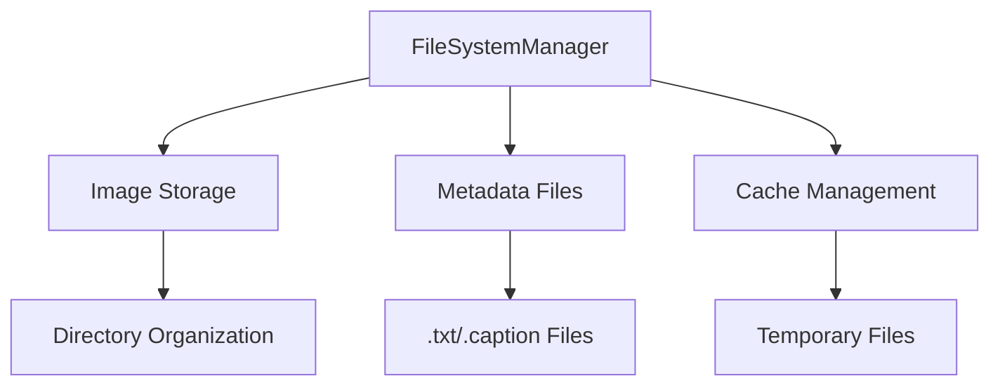

#### Storage Components

**FileSystemManager** (`src/lorairo/storage/file_system.py`)
- Directory management
- File organization patterns
- Metadata file coordination
- Cleanup and maintenance

**File Organization**
- Images with associated metadata files
- Directory-based categorization
- Atomic file operations
- Backup and recovery support

## Local Package Integration

### Submodule Architecture

The project leverages two local packages as Git submodules managed through uv:

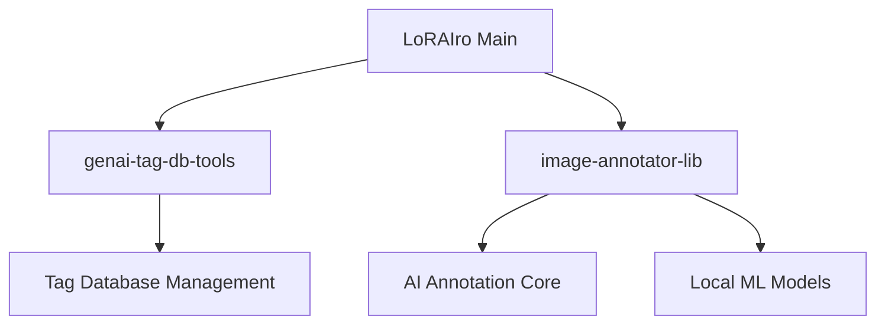

#### genai-tag-db-tools
- **Purpose**: Tag database management utilities
- **Integration**: CLI tool (`tag-db` command)
- **Location**: `local_packages/genai-tag-db-tools/`
- **Features**: Tag taxonomy management, database operations

#### image-annotator-lib
- **Purpose**: Core image annotation functionality
- **Integration**: Python library import
- **Location**: `local_packages/image-annotator-lib/`
- **Features**: Multi-provider AI annotation, local model support

### Dependency Management

**uv Integration**
- Packages linked via `uv.sources` in `pyproject.toml`
- Editable installs for development
- Automatic dependency resolution
- Version pinning and updates

## Configuration Architecture

### Hierarchical Configuration

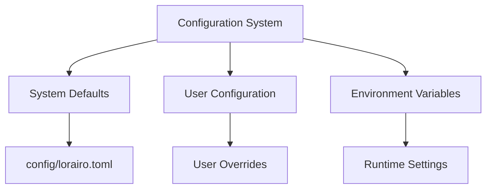

#### Configuration Layers

**System Configuration** (`config/lorairo.toml`)
- Application defaults
- AI provider settings
- Database configuration
- Logging setup

**Environment Integration**
- API key management
- Development/production flags
- Debug configuration
- Path overrides

**Runtime Configuration**
- User preference persistence
- Session state management
- Dynamic setting updates
- Validation and defaults

## Security Architecture

### Data Protection

**API Key Management**
- Environment variable storage
- Secure configuration handling
- No credential logging
- Provider-specific security

**File System Security**
- Proper file permissions
- Temporary file cleanup
- Path validation
- Directory traversal prevention

### Error Handling

**Comprehensive Error Management**
- Structured error types
- User-friendly messages
- Detailed logging for debugging
- Graceful degradation strategies

## Performance Architecture

### Memory Management

**Image Processing Optimization**
- Lazy loading strategies
- Memory-efficient processing
- Garbage collection optimization
- Resource cleanup automation

**Database Performance**
- Connection pooling
- Query optimization
- Index management
- Batch operations

### Scalability Considerations

**Batch Processing**
- Parallel image processing
- Queue management
- Progress tracking
- Error recovery

**Resource Management**
- Memory usage monitoring
- CPU utilization optimization
- I/O operation efficiency
- Network request optimization

## Testing Architecture

### Test Strategy

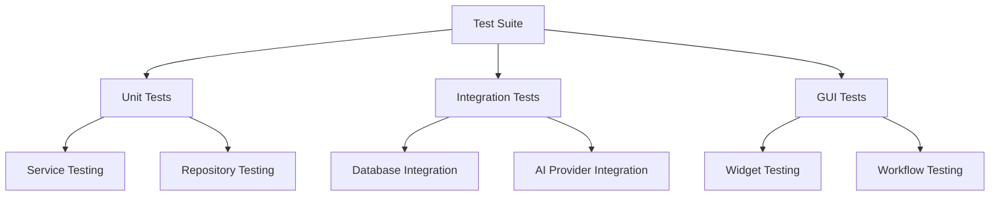

#### Test Categories

**Unit Tests** (`pytest -m unit`)
- Service layer testing
- Business logic validation
- Mock-based isolation
- Fast execution

**Integration Tests** (`pytest -m integration`)
- Database operations
- File system interactions
- Service coordination
- End-to-end workflows

**GUI Tests** (`pytest -m gui`)
- Widget functionality
- User interaction simulation
- Visual component testing
- Accessibility validation

## Deployment Architecture

### Development Environment

**Local Development**
- uv virtual environment
- Local SQLite database
- File-based configuration
- Debug logging enabled

### Package Management

**Dependencies**
- Core dependencies in `pyproject.toml`
- Development tools separation
- Local package integration
- Version pinning strategy

## Future Architecture Considerations

### Extensibility Points

**Plugin Architecture**
- AI provider plugins
- Processing pipeline extensions
- Custom widget plugins
- Export format plugins

**Microservice Potential**
- Annotation service separation
- API-based communication
- Horizontal scaling capability
- Cloud deployment options

### Technology Evolution

**Framework Updates**
- PySide6 version management
- Python version compatibility
- Dependency update strategy
- Migration planning

## Sequence Diagrams

The following sequence diagrams illustrate the detailed interactions between components during key application workflows.

### Application Startup Flow

```mermaid
sequenceDiagram
    participant User
    participant Main as main.py
    participant Config as ConfigurationService
    participant Log as Logger
    participant App as QApplication
    participant MW as MainWindow
    participant UI as Ui_MainWindow

    User->>+Main: アプリケーション起動
    Main->>+Config: get_config()
    Config-->>-Main: 設定情報
    Main->>+Log: initialize_logging(config)
    Log-->>-Main: ログ初期化完了
    Main->>+App: QApplication([])
    App-->>-Main: アプリインスタンス
    Main->>+MW: MainWindow()
    MW->>+UI: setupUi(self)
    UI-->>-MW: UI初期化完了
    MW-->>-Main: ウィンドウインスタンス
    Main->>MW: show()
    Main->>App: exec()
    App-->>-User: アプリケーション表示
```

### MainWindow Initialization Flow

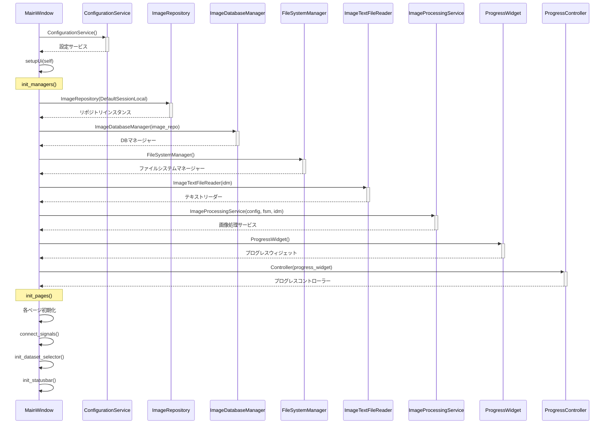

### Image Processing Flow

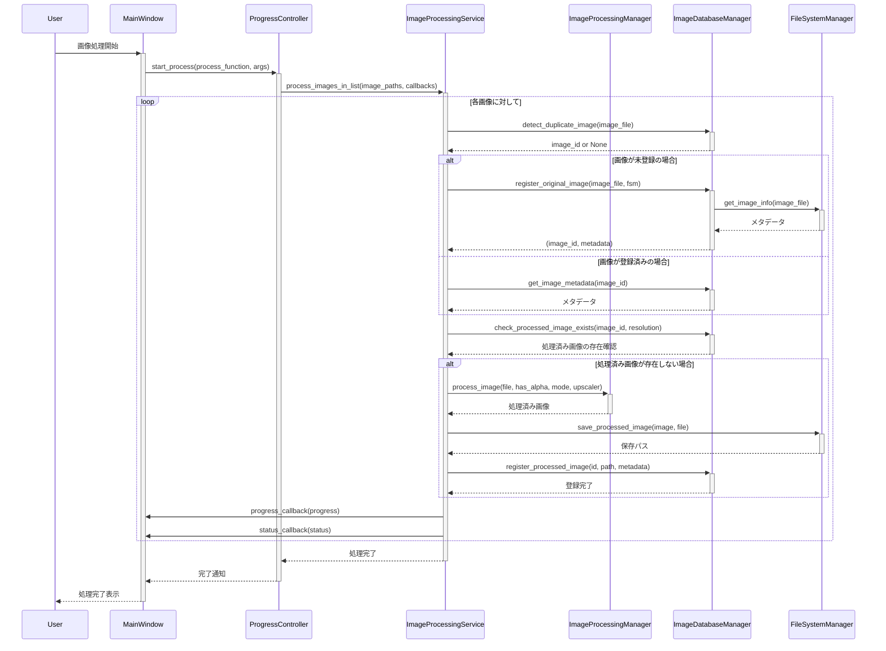

### AI Annotation Processing Flow

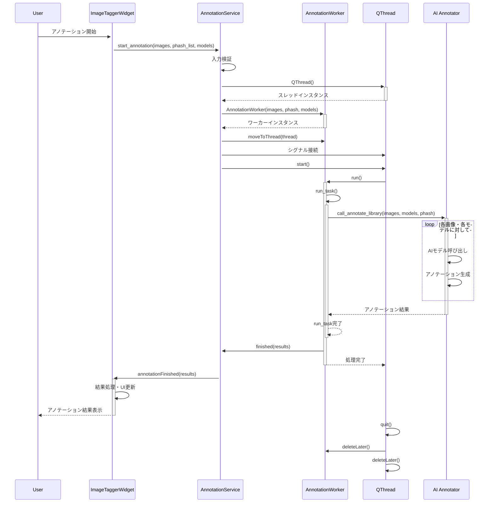

### Database Operation Flow

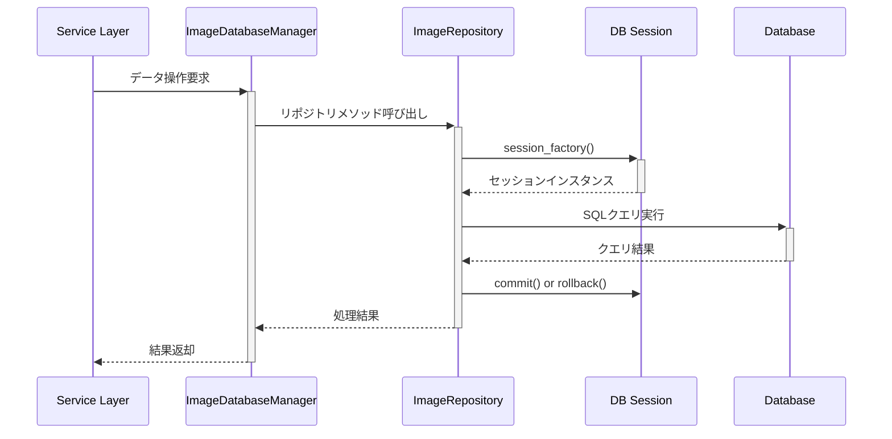

### Configuration Management Flow

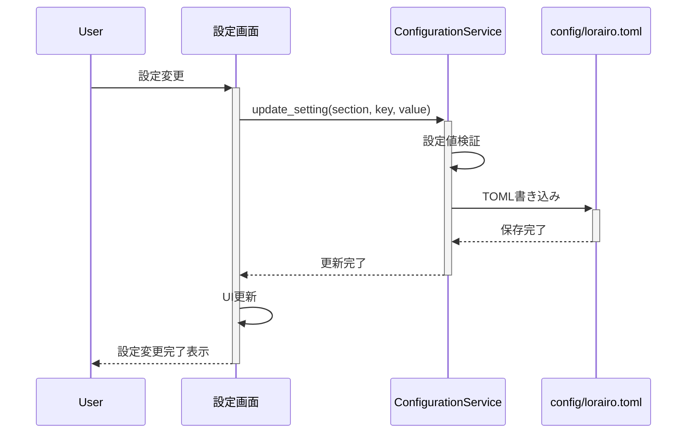

This architecture provides a solid foundation for the LoRAIro application while maintaining flexibility for future enhancements and scaling requirements.
