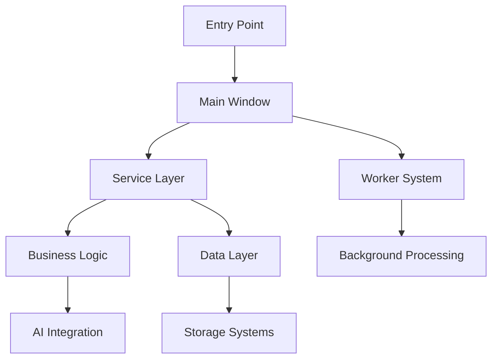
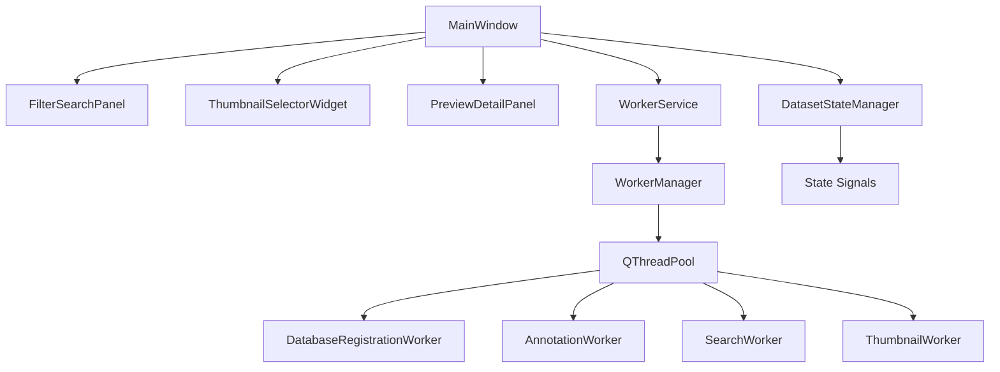

# LoRAIro Architecture Documentation

## System Overview

LoRAIro is an AI-powered image annotation and dataset management application built with a clean 3-layer architecture designed for machine learning dataset preparation. The system processes images through multiple AI providers and provides quality assessment tools for training data curation.

## Architectural Principles

### Clean Architecture
The application follows clean architecture principles with clear separation of concerns:

- **Presentation Layer**: PySide6-based GUI components with QThreadPool worker system
- **Application Layer**: Business logic services and use cases
- **Domain Layer**: Core business entities and rules
- **Infrastructure Layer**: Database, file system, and external APIs

### PySide6 Worker Architecture (Updated: 2025-07-21)
The system uses Qt's QThreadPool and QRunnable for asynchronous operations:

- **WorkerManager**: QThreadPool-based task execution coordination (`src/lorairo/gui/workers/manager.py`)
- **BaseWorker**: Standardized QRunnable implementation with progress reporting (`src/lorairo/gui/workers/base.py`)
- **Specialized Workers**: Database, annotation, search, and thumbnail workers in `src/lorairo/gui/workers/`
- **WorkerService**: Qt service layer for worker coordination and GUI integration (`src/lorairo/gui/services/worker_service.py`)
- **DatasetStateManager**: Centralized state management with Qt signals (`src/lorairo/gui/state/dataset_state.py`)

### Dependency Injection
Services are injected into components to maintain loose coupling and enable testability.

### Configuration-Driven Development
All system behavior is configurable through TOML files, enabling easy customization without code changes.

### Event-Driven Architecture
Components communicate through Qt signals/slots for loose coupling and responsive UI:

- **Qt Auto-connection**: Standardized signal naming (e.g., `on_buttonName_clicked`)
- **Custom Signals**: Inter-component communication via DatasetStateManager
- **Worker Signals**: Progress updates and result delivery from background threads
- **State Synchronization**: Centralized state updates via signal/slot patterns

## System Components

### High-Level Component Overview

### Component Architecture Summary

**Detailed implementation information is maintained in Serena memory.**  
Use `mcp__serena__read_memory current-project-status` for current implementation status.

#### Core Layers
- **Presentation Layer**: PySide6 GUI with Qt worker system
- **Service Layer**: Business logic coordination (2-tier architecture)
- **Data Layer**: SQLite database with repository pattern
- **AI Integration**: Multi-provider annotation system

#### Implementation Reference

**For detailed component implementations, file paths, and current status:**

- **Current Status**: `mcp__serena__read_memory current-project-status`
- **Implementation Details**: `mcp__serena__read_memory active-development-tasks`
- **Architecture Patterns**: `mcp__serena__list_memories` for specific component memories

#### Core Architecture Layers

**Service Layer**: Business logic coordination with 2-tier architecture  
**Data Layer**: SQLite database with repository pattern  
**Worker System**: QThreadPool-based asynchronous processing  
**AI Integration**: Multi-provider annotation with local package integration

**Detailed information about specific services, components, and integration patterns is maintained in Serena memory for current reference.**

### Service Layer Architecture

**For detailed service implementations and current architecture:**
- **Service Details**: `mcp__serena__read_memory service-layer-architecture`  
- **Implementation Status**: `mcp__serena__read_memory current-project-status`

The service layer encapsulates business logic with a 2-tier architecture:

**Business Logic Services** (`src/lorairo/services/`):
- SearchCriteriaProcessor, ModelFilterService, ImageProcessingService, ConfigurationService

**GUI Services** (`src/lorairo/gui/services/`):
- WorkerService, SearchFilterService

**Current implementation details and integration patterns are maintained in Serena memory.**

### Data Layer Architecture

**For detailed data layer implementation:**
- **Database Architecture**: `mcp__serena__read_memory database-architecture`
- **Schema Details**: `mcp__serena__read_memory current-project-status`

The data layer provides persistent storage with:

**Core Components**:
- DatabaseManager (`src/lorairo/database/db_manager.py`)
- Repository Pattern (`src/lorairo/database/db_repository.py`)
- SQLAlchemy ORM with Schema Models (`src/lorairo/database/schema.py`)
- SQLite Database with Alembic migrations

**Current implementation details maintained in Serena memory.**

### GUI Architecture (Updated: 2025-07-21)

The GUI follows a workflow-centered 3-panel design with PySide6 Worker System architecture.

#### GUI Components

**For detailed GUI implementation:**
- **Widget Architecture**: `mcp__serena__read_memory gui-architecture`
- **State Management**: `mcp__serena__read_memory current-project-status`

**Main Components**:
- **MainWindow** (`src/lorairo/gui/window/main_window.py`): 3-panel workflow design
- **Panel Widgets**: Filter/Search, Thumbnail Selector, Preview/Detail panels
- **State Management** (`src/lorairo/gui/state/dataset_state.py`): DatasetStateManager
- **Worker Integration**: Qt QThreadPool-based asynchronous processing

**Current implementation details maintained in Serena memory.**

### Worker Architecture (PySide6 QThreadPool System)

**For detailed worker implementation:**
- **Worker Architecture**: `mcp__serena__read_memory worker-architecture`
- **Implementation Details**: `mcp__serena__read_memory current-project-status`

**Core Architecture**: Qt QRunnable and QThreadPool-based asynchronous processing

**Key Components**:
- **WorkerService** (`src/lorairo/gui/services/worker_service.py`): High-level API
- **WorkerManager** (`src/lorairo/gui/workers/manager.py`): QThreadPool coordination
- **BaseWorker** (`src/lorairo/gui/workers/base.py`): Standardized QRunnable implementation
- **Specialized Workers**: Database, Annotation, Search, Thumbnail workers

**Features**: Progress reporting, cancellation support, error handling, state management integration

**Current implementation details maintained in Serena memory.**

### AI Integration Architecture

**For detailed AI integration:**
- **AI Architecture**: `mcp__serena__read_memory ai-integration-architecture`
- **Provider Details**: `mcp__serena__read_memory current-project-status`

**Multi-Provider Support**: OpenAI, Anthropic, Google, Local ML models via `image-annotator-lib`

**Key Integration**:
- **AnnotationWorker**: Primary AI coordination
- **image-annotator-lib**: Unified provider interface
- **Local Models**: CLIP, DeepDanbooru, ONNX/TensorFlow support

**Current implementation details maintained in Serena memory.**

### Storage Architecture

**For detailed storage implementation:**
- **Storage Architecture**: `mcp__serena__read_memory storage-architecture`
- **File Management**: `mcp__serena__read_memory current-project-status`

**Key Components**:
- **FileSystemManager** (`src/lorairo/storage/file_system.py`): Directory and file management
- **File Organization**: Images with metadata files (.txt/.caption)
- **Project Structure**: `lorairo_data/project_name_YYYYMMDD_NNN/` format

**Current implementation details maintained in Serena memory.**

## Local Package Integration

**For detailed local package information:**
- **Package Integration**: `mcp__serena__read_memory local-package-integration`
- **Dependency Management**: `mcp__serena__read_memory current-project-status`

**Local Packages (uv-managed submodules)**:
- **genai-tag-db-tools**: Tag database management and cleaning utilities
- **image-annotator-lib**: Multi-provider AI annotation core

**Integration**: Direct Python imports, editable installs via uv.sources

**Current implementation details maintained in Serena memory.**

## Configuration Architecture

**For detailed configuration implementation:**
- **Configuration Details**: `mcp__serena__read_memory configuration-architecture`

**Hierarchical Configuration**: System defaults (`config/lorairo.toml`), environment variables, user overrides

**Key Features**: API key management, runtime updates, validation

**Current implementation details maintained in Serena memory.**

## Security Architecture

**Security Details**: `mcp__serena__read_memory security-architecture`

**Key Features**: API key management, file system security, error handling

**Current implementation details maintained in Serena memory.**

## Performance Architecture

**Performance Details**: `mcp__serena__read_memory performance-architecture`

**Key Features**: 
- **Batch Processing**: 100-image batches, 5min target for 1000 images
- **Memory Management**: Lazy loading, resource cleanup automation
- **Scalability**: Parallel processing, queue management

**Current implementation details maintained in Serena memory.**

## AI Assistance Tooling (MCP)

**Development Agents**: OpenClaw (long-term memory via Notion), serena (repository/memory management)

**Working Memory**: `.serena/memories/` for current project knowledge
**Long-Term Memory**: Notion LTM via OpenClaw

**Development-only tools that do not affect runtime application.**

## Testing Architecture

**Testing Details**: `mcp__serena__read_memory testing-architecture`

**Test Categories**:
- **Unit Tests** (`pytest -m unit`): Service and business logic testing
- **Integration Tests** (`pytest -m integration`): Database and service coordination
- **GUI Tests** (`pytest -m gui`): pytest-qt framework with cross-platform support

**Current implementation details maintained in Serena memory.**

## Deployment & Future Architecture

**Deployment Details**: `mcp__serena__read_memory deployment-architecture`

**Current**: Local development with uv virtual environment, SQLite database

**Future Considerations**: Plugin architecture, microservice potential, framework evolution

**Current implementation details maintained in Serena memory.**

## Detailed Implementation Information

**For comprehensive implementation details, sequence diagrams, and workflow documentation:**
- **Sequence Diagrams**: `mcp__serena__read_memory architecture-sequence-diagrams`
- **Implementation Workflows**: `mcp__serena__read_memory workflow-documentation`
- **Component Interactions**: `mcp__serena__read_memory current-project-status`

**All detailed architectural information is maintained in Serena memory for current reference.**

This simplified architecture documentation provides the essential system overview while maintaining detailed implementation information in dynamic memory storage.
