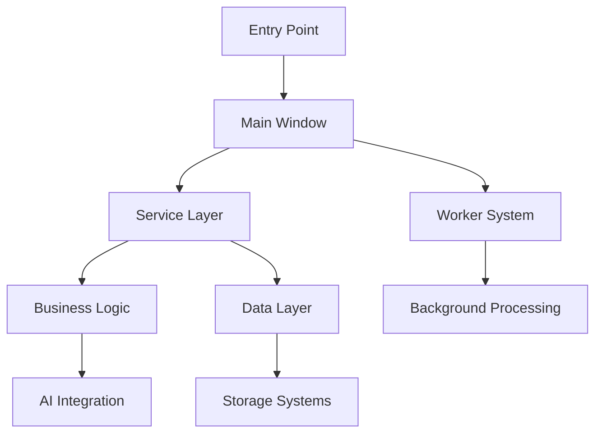
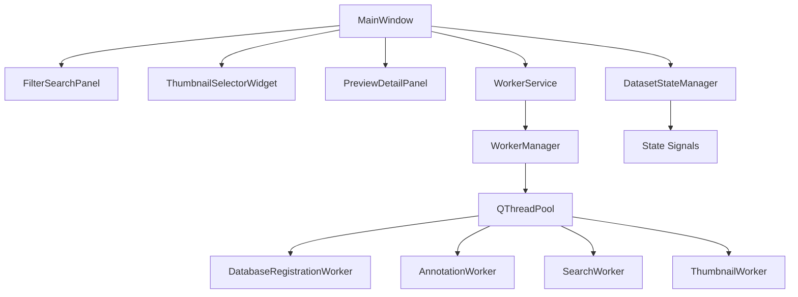

# LoRAIro Architecture Documentation

## System Overview

LoRAIro is an AI-powered image annotation and dataset management application built with a clean 3-layer architecture designed for machine learning dataset preparation. The system processes images through multiple AI providers and provides quality assessment tools for training data curation.

## Architectural Principles

### Clean Architecture
The application follows clean architecture principles with clear separation of concerns:

- **Presentation Layer**: PySide6-based GUI components with QThreadPool worker system
- **Application Layer**: Business logic services and use cases
- **Domain Layer**: Core business entities and rules
- **Infrastructure Layer**: Database, file system, and external APIs

### PySide6 Worker Architecture (Updated: 2025-07-21)
The system uses Qt's QThreadPool and QRunnable for asynchronous operations:

- **WorkerManager**: QThreadPool-based task execution coordination (`src/lorairo/gui/workers/manager.py`)
- **BaseWorker**: Standardized QRunnable implementation with progress reporting (`src/lorairo/gui/workers/base.py`)
- **Specialized Workers**: Database, annotation, search, and thumbnail workers in `src/lorairo/gui/workers/`
- **WorkerService**: Qt service layer for worker coordination and GUI integration (`src/lorairo/gui/services/worker_service.py`)
- **DatasetStateManager**: Centralized state management with Qt signals (`src/lorairo/gui/state/dataset_state.py`)

### Dependency Injection
Services are injected into components to maintain loose coupling and enable testability.

### Configuration-Driven Development
All system behavior is configurable through TOML files, enabling easy customization without code changes.

### Event-Driven Architecture
Components communicate through Qt signals/slots for loose coupling and responsive UI:

- **Qt Auto-connection**: Standardized signal naming (e.g., `on_buttonName_clicked`)
- **Custom Signals**: Inter-component communication via DatasetStateManager
- **Worker Signals**: Progress updates and result delivery from background threads
- **State Synchronization**: Centralized state updates via signal/slot patterns

## System Components

### High-Level Component Overview

```mermaid
graph TD
    A[Entry Point] --> B[Main Window]
    B --> C[Service Layer]
    B --> D[Worker System]
    C --> E[Business Logic]
    C --> F[Data Layer]
    D --> G[Background Processing]
    E --> H[AI Integration]
    F --> I[Storage Systems]
```

### Component Architecture Summary

#### Core Layers
- **Presentation Layer**: PySide6 GUI with Qt worker system
- **Service Layer**: Business logic coordination (2-tier architecture)
- **Data Layer**: SQLite database with repository pattern
- **AI Integration**: Multi-provider annotation system

See `docs/services.md` for the complete service catalog and `docs/decisions/` for design decision records.

### Service Layer Architecture

The service layer encapsulates business logic with a 2-tier architecture.
See `docs/services.md` for the full catalog (29 services).

**Business Logic Services** (`src/lorairo/services/`):
- SearchCriteriaProcessor, ModelFilterService, ImageProcessingService, ConfigurationService

**GUI Services** (`src/lorairo/gui/services/`):
- WorkerService, SearchFilterService

**Design decisions**: `docs/decisions/0001-two-tier-service-architecture.md`, `docs/decisions/0009-qt-decoupling-design.md`

### Data Layer Architecture

The data layer provides persistent storage with:

**Core Components**:
- DatabaseManager (`src/lorairo/database/db_manager.py`)
- Repository Pattern (`src/lorairo/database/db_repository.py`)
- SQLAlchemy ORM with Schema Models (`src/lorairo/database/schema.py`)
- SQLite Database with Alembic migrations

**Design decisions**: `docs/decisions/0002-database-schema-decisions.md`, `docs/decisions/0012-batch-tag-atomic-transaction.md`

### GUI Architecture (Updated: 2025-07-21)

The GUI follows a workflow-centered 3-panel design with PySide6 Worker System architecture.

```mermaid
graph TD
    A[MainWindow] --> B[FilterSearchPanel]
    A --> C[ThumbnailSelectorWidget]
    A --> D[PreviewDetailPanel]
    A --> E[WorkerService]
    E --> F[WorkerManager]
    F --> G[QThreadPool]
    G --> H[DatabaseRegistrationWorker]
    G --> I[AnnotationWorker]
    G --> J[SearchWorker]
    G --> K[ThumbnailWorker]
    A --> L[DatasetStateManager]
    L --> M[State Signals]
```

**Main Components**:
- **MainWindow** (`src/lorairo/gui/window/main_window.py`): 3-panel workflow design
- **Panel Widgets**: Filter/Search, Thumbnail Selector, Preview/Detail panels
- **State Management** (`src/lorairo/gui/state/dataset_state.py`): DatasetStateManager
- **Worker Integration**: Qt QThreadPool-based asynchronous processing

**Design decisions**: `docs/decisions/0011-mainwindow-ui-redesign.md`

### Worker Architecture (PySide6 QThreadPool System)

**Core Architecture**: Qt QRunnable and QThreadPool-based asynchronous processing

**Key Components**:
- **WorkerService** (`src/lorairo/gui/services/worker_service.py`): High-level API
- **WorkerManager** (`src/lorairo/gui/workers/manager.py`): QThreadPool coordination
- **BaseWorker** (`src/lorairo/gui/workers/base.py`): Standardized QRunnable implementation
- **Specialized Workers**: Database, Annotation, Search, Thumbnail workers

**Features**: Progress reporting, cancellation support, error handling, state management integration

### AI Integration Architecture

**Multi-Provider Support**: OpenAI, Anthropic, Google, Local ML models via `image-annotator-lib`

**Key Integration**:
- **AnnotationWorker**: Primary AI coordination
- **image-annotator-lib**: Unified provider interface
- **Local Models**: CLIP, DeepDanbooru, ONNX/TensorFlow support

**Design decisions**: `docs/decisions/0003-annotator-config-management.md`, `docs/decisions/0004-annotator-lib-architecture.md`

### Storage Architecture

**Key Components**:
- **FileSystemManager** (`src/lorairo/storage/file_system.py`): Directory and file management
- **File Organization**: Images with metadata files (.txt/.caption)
- **Project Structure**: `lorairo_data/project_name_YYYYMMDD_NNN/` format

## Local Package Integration

**Local Packages (uv-managed submodules)**:
- **genai-tag-db-tools**: Tag database management and cleaning utilities
- **image-annotator-lib**: Multi-provider AI annotation core

**Integration**: Direct Python imports, editable installs via uv.sources

See `docs/integrations.md` for detailed integration patterns.

## Configuration Architecture

**Hierarchical Configuration**: System defaults (`config/lorairo.toml`), environment variables, user overrides

**Key Features**: API key management, runtime updates, validation

## Security Architecture

**Key Features**: API key management, file system security, error handling

See `.claude/rules/security.md` for security guidelines.

## Performance Architecture

**Key Features**:
- **Batch Processing**: 100-image batches, 5min target for 1000 images
- **Memory Management**: Lazy loading, resource cleanup automation
- **Scalability**: Parallel processing, queue management

**Design decisions**: `docs/decisions/0010-torch-import-design.md`

## AI Assistance Tooling

**Development Agents**: OpenClaw (long-term memory via Notion)

**Documentation**: `docs/decisions/` for design decisions, `docs/plans/` for planning records
**Long-Term Memory**: Notion LTM via OpenClaw

**Development-only tools that do not affect runtime application.**

## Testing Architecture

**Test Categories**:
- **Unit Tests** (`pytest -m unit`): Service and business logic testing
- **Integration Tests** (`pytest -m integration`): Database and service coordination
- **GUI Tests** (`pytest -m gui`): pytest-qt framework with cross-platform support

See `docs/testing.md` for comprehensive testing patterns and best practices.

## Deployment & Future Architecture

**Current**: Local development with uv virtual environment, SQLite database

**Future Considerations**: Plugin architecture, microservice potential, framework evolution
