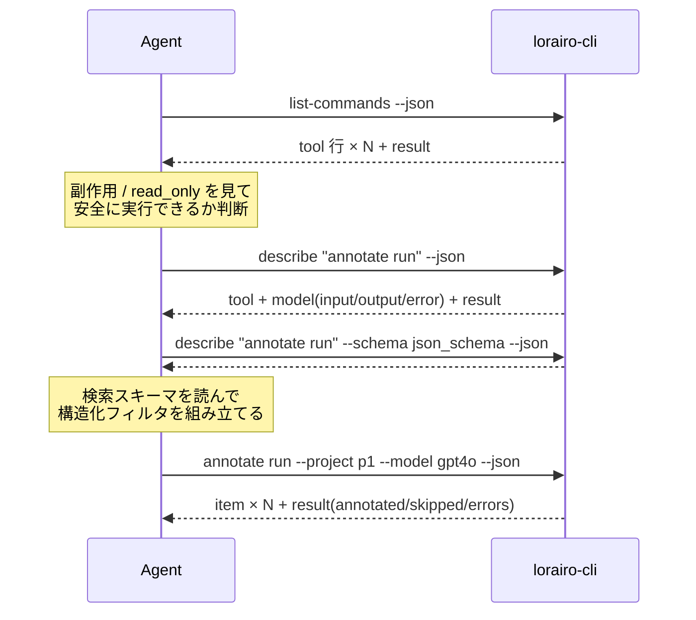
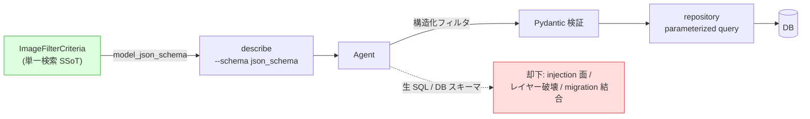
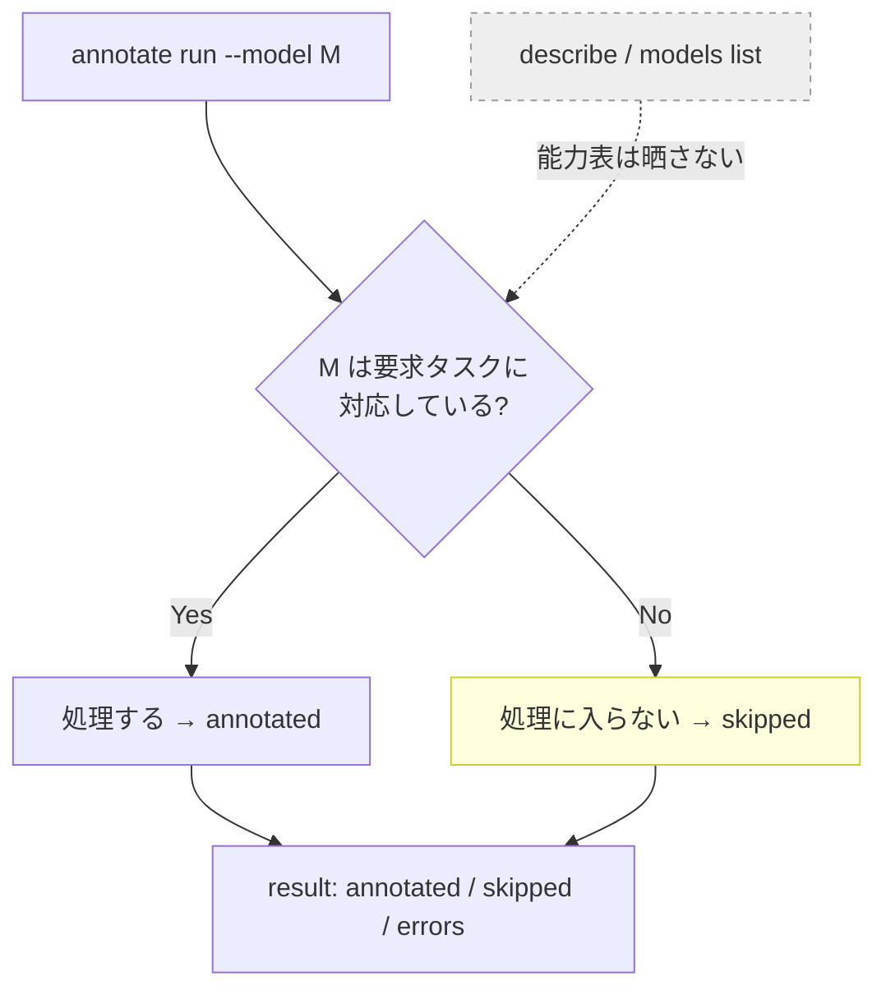

# ADR 0059: CLI Command Introspection Contract

- **日付**: 2026-06-06
- **ステータス**: Proposed
- **関連 Issue**: #634 (epic) / #638
- **関連 ADR**: [0057](0057-cli-jsonl-output-and-error-contract.md) (JSONL 出力 / エラー契約), [0058](0058-cli-output-mode-trigger-and-entrypoint-policy.md) (出力モード / エントリ方針), [0048](0048-webapi-annotation-candidate-filtering.md) (モデル候補フィルタ), [0055](0055-workspace-export-target-staging-unification.md) (検索→ステージング集合), [0056](0056-exact-set-selector-id-count-guard.md) (exact-set 上限)
- **参照**: tag-db ADR 0005 (CLI Command Introspection Contract)

## Context

ADR 0057 / 0058 で `lorairo-cli` の機械可読 (JSONL) 出力契約・エラー契約・出力モードトリガを定めた。
しかし `lorairo-cli --help` は人間向けで、エージェントや CI が各コマンドの **入力モデル・出力モデル・
副作用分類** を機械的に取得する契約が無い。実行結果は JSONL 化されたが、**実行前に**「このコマンドが
何を受け取り、何を返し、何を書き込むか」を知る手段が欠けている。

sibling の `genai-tag-db-tools` (tag-db) は tag-db ADR 0005 で `describe` / `list-commands` を導入し、
コマンド仕様を `tool` / `model` / `result` 行の JSONL で晒すことでこの課題を解決済み。LoRAIro にも同等の
introspection を導入する (epic #634)。

ただし LoRAIro は tag-db と次の点で構造が異なり、設計をそのまま流用できない:

- **CLI 実装が Typer (click) 製**で、入力面はコマンド関数シグネチャ (`typer.Argument` / `typer.Option`)。
  tag-db のように「コマンド = 1 Pydantic Request」が一対一で揃っているわけではなく、`--json` / `--force` /
  `--format` のような **CLI 専用フラグ** は `lorairo.api` の Request モデルに存在しない。
- **コマンドがネスト**している (`project list` / `images update` / `annotate run` / `batch ...` の 6 グループ)。
  tag-db のフラットなコマンド集合と違い、introspection はグループ→サブコマンドのツリーを扱う。
- **検索条件 (フィルタ) が単一のドメイン契約に統一済み**。GUI の「検索 → ステージング集合 → 各処理」フロー
  (ADR 0055) が示すとおり、export / annotate / images update / GUI / repository はすべて
  `database/filter_criteria.py` の `ImageFilterCriteria` (全 23 フィールド) を共有する。CLI 各コマンドは
  その**一部フィールドだけをフラグで露出している**にすぎず、検索語彙そのものは 1 本に揃っている。
- **出力モデルは `lorairo.api.types` に Pydantic で整備済み** (`ProjectInfo` / `ImageMetadata` 等)。
  `model_json_schema()` から出力スキーマをほぼコストなく生成できる (tag-db と同型)。

## Scope / Non-Goals

本 ADR は **introspection の契約 (何を晒し、何を晒さないか)** を固定する。スキーマ生成の具体機構
(Typer/click のコマンドツリーから導出するか、コマンドごとに Pydantic Request を起こすか) は実装 Issue
(#641) で確定し、本 ADR は「**コマンド仕様の SSoT を手書き複製しない**」という要件レベルに留める。

### Non-Goals

- **モデル × タスク能力マトリクスの公開はしない。** 「このモデルはタグ付け可能/スコアリング専用」といった
  タスク種別の能力を introspection で晒し、エージェントに事前フィルタさせる方式は採らない。非対応モデルは
  ランタイムでスキップし `result` の `skipped` 件数で報告する (§5)。`describe` / `models list` を能力表で
  肥大化させない。実行不能・用途不適なモデルの除外は discovery/sync 時点の関心事 (ADR 0048) であり本 ADR の
  対象外。
- **CLI 入力面の統一はしない。** 検索駆動コマンド (annotate / export / images update) に
  `ImageFilterCriteria` の全語彙を一律のフラグとして展開するか、「検索 → image_ids 集合 → 各処理」の
  二段構えにするか (= GUI ステージングの CLI 再現) は、独立した CLI 入力面の設計であり別 Issue に切る。
  本 ADR は「introspection が単一検索スキーマを晒す」ことだけを決め、各コマンドがそれをどう受理するかには
  踏み込まない。「一度作って足りないものを足す」イテレーティブ方針を採る。
- **検索フィルタの新規統一定義はしない。** 検索語彙は既に `ImageFilterCriteria` 1 本に統一済み (Context 参照)
  なので、新たなフィルタ契約を起こさない。introspection はこの既存契約を晒すだけ。
- **生 SQL / DB スキーマの公開・受理はしない** (§4 のセキュリティ不変条件)。

## Decision

### 1. `list-commands` / `describe <command>` を追加し JSONL 契約に乗せる

`lorairo-cli list-commands` と `lorairo-cli describe <command>` を追加する。出力は ADR 0057 の JSONL 契約に
従い、行種は次の 3 つ:

- `kind:"tool"` — コマンドのメタ (名前・説明・`read_only`・`side_effects`・入出力/エラーモデル名)
- `kind:"model"` — 入力 (`input`) / 出力 (`output`) / エラー (`error`) のフィールドスキーマ
- `kind:"result"` — 終端サマリ (ADR 0057 と同じ終端不変条件)

`list-commands` は `tool` 行 + 終端 `result` のみ (`model` 行は出さない)。`describe <command>` は対象コマンドの
`tool` 行 + 入力/出力/エラーの `model` 行 + 終端 `result` を返す。

ネストしたコマンドは **空白区切りのコマンドパス** で表現する (`"images update"` / `"annotate run"`)。
`describe` の引数も同じパス文字列で受ける。

エージェントが introspection を使ってコマンドを安全に組み立てる典型フロー:

### 2. 入力 / 出力 / 副作用 / read_only を晒す。スキーマは SSoT から生成する

各コマンドについて以下を晒す:

- **入力** — コマンドが受け取る引数 (名前・型・必須・既定値)。検索駆動コマンドの検索条件は §4 の単一
  検索スキーマ (`ImageFilterCriteria`) として表現する。
- **出力** — コマンドが返す結果の形 (`lorairo.api.types` の Pydantic 出力モデル由来)。
- **副作用** — `db_read` / `db_write` / `file_read` / `file_write` / `network` の分類。
- **`read_only`** — 定常状態 (base DB 存在・追加書き込み無し) で副作用が読み取りのみか。

**スキーマ本体は Pydantic 等の SSoT から生成し、CLI 側でフィールド構造を手書き複製しない。** 出力モデルは
`lorairo.api.types`、検索スキーマは `database/filter_criteria.py` の `ImageFilterCriteria` が SSoT。
入力スキーマを Typer/click のコマンドツリーから導出するか、コマンドごとに Pydantic 入力モデルを用意するかは
実装 Issue (#641) の決定に委ねる (本 ADR は SSoT 単一化の要件のみ固定)。

`side_effects` / `read_only` は **定常状態の分類**であり、cold-cache のモデルダウンロードや
`--user-db-dir` 相当の条件付き副作用は注記で補う (tag-db ADR 0005 と同方針)。

### 3. schema モードは `compact` (既定) + `json_schema` の 2 つ

tag-db ADR 0005 を踏襲し、`describe` のスキーマ表現を 2 モードとする:

- **`compact` (既定)**: フィールドを簡易型表記 (`str (required)` / `int>=1?` / `list[str]?` /
  `bool=true`) で `kind:"model"` 行に載せる。入れ子モデルは名前参照。人間にもエージェントにも読める既定形で、
  ADR 0057 の「行を浅く保つ」方針と整合する。
- **`json_schema`**: `model_json_schema()` の完全版。**この時のみ ADR 0057 の「stdout 全行 JSONL」契約の
  文書化された例外**とし、先頭に人間向け `#` note 1 行 + 各モデルの生スキーマを 1 行 JSON で出力する。
  JSON Schema は深くネストし JSONL の浅い行方針と相容れないための割り切り。

検索スキーマ (`ImageFilterCriteria`) のように「絞り込める軸・型・制約」をエージェントが厳密に読みたい場面は
`json_schema` モードを使う。

### 4. 検索語彙は単一の公開フィルタ契約として晒す。生 SQL / DB スキーマは扱わない

検索駆動コマンド (annotate / export / images update) の検索条件は、**単一の公開フィルタ契約
`ImageFilterCriteria` として `describe ... --schema json_schema` で晒す**。エージェントはこのスキーマを読んで
構造化フィルタを組み立てる (= エージェントが得意なスキーマ推論をここで活用する)。

**生 SQL も DB スキーマそのものも CLI で受け取らない・晒さない** (セキュリティ不変条件):

- 生 SQL を CLI で受けるのはインジェクション面 (security.md: 生 SQL 文字列連結禁止・ORM 経由必須)・
  レイヤー破壊 (repository/service を飛ばす)・スキーマ結合 (migration で壊れる) のため却下する。
- introspection が晒すのは **DB スキーマでなくキュレートされた公開フィルタ契約** (`ImageFilterCriteria`)。
  内部列を漏らさず、migration しても公開契約は安定し、エージェントは検証済みの構造化フィルタのみを渡す。
- CLI は構造化フィルタを Pydantic 等で検証し、repository が parameterized query に翻訳する。生 SQL は通らない。

検索語彙は既に `ImageFilterCriteria` 1 本に統一済み (export / annotate / images / GUI / repository が共有) の
ため、introspection はこの 1 本を晒せばすべての検索駆動コマンドで同じ検索契約が読める。

エージェントが読むのは **DB スキーマでなくキュレートされた公開フィルタ契約**。生 SQL 経路は契約に存在しない。

### 5. モデル能力ミスマッチはランタイムスキップに委ね、introspection では晒さない

タグ付け能力の無いモデルにタグ付けを要求した場合のような **タスク種別の能力ミスマッチは、コマンドの
ランタイムが該当モデルをスキップ (そもそも処理に入らない) し、ADR 0057 の `result` の `skipped` 件数で
報告する**。introspection は「モデル × タスク能力マトリクス」を晒さず、エージェントに事前能力チェックを
強いない。

理由: 能力表を `describe` / `models list` に持たせると契約が肥大化し、LiteLLM capability metadata の不確実性
(ADR 0048 / [[reference_litellm_capability_boolean_unreliable]]) をエージェントに転嫁することになる。
「要求 → 非対応はランタイムが黙ってスキップ → `skipped` で報告」の方が契約は薄く、挙動も予測しやすい。
実行不能・用途不適モデルの除外は discovery/sync 時点 (ADR 0048) で別途担保される。

## Rationale

- **`describe` / `list-commands` を通常 JSONL 契約に乗せる**: tag-db ADR 0005 と同じく、専用フォーマットを
  増やさず ADR 0057 の `tool` / `model` / `result` 行に統合できる。エージェントは introspection も実行結果も
  同じ JSONL パーサで読める。
- **compact 既定 + json_schema**: compact は生 JSON Schema より人間が読みやすくエージェントも解釈できる。
  完全な機械可読が要る場面 (検索スキーマの厳密な制約読み取り等) のために json_schema を用意するが、深い
  ネストは JSONL の浅い行方針と相容れないため生スキーマ 1 行 + `#` note の割り切った例外形にする。
- **単一検索スキーマを晒す**: LoRAIro のドメインは「検索 → ステージング → 各処理」(ADR 0055) で検索語彙が
  既に 1 本 (`ImageFilterCriteria`)。introspection がこの 1 本を晒せば、エージェントは「ある処理で使えた
  検索条件が別の処理でも使える」と一貫して理解できる。tag-db が単一 search コマンドだったのに対し、LoRAIro は
  検索が複数コマンドに跨る横断契約である点が固有。
- **生 SQL を受けない / スキーマ推論はさせる**: エージェントのスキーマ推論力は「公開フィルタ契約を読んで
  構造化フィルタを組む」形で活かし、SQL インジェクション面・レイヤー破壊・migration 結合を避ける。
- **能力ミスマッチをランタイムに委ねる**: introspection の契約を薄く保ち、LiteLLM metadata の不確実性を
  エージェントに転嫁しないため。

## Consequences

- `lorairo-cli` に `list-commands` / `describe` を追加する。コマンドメタ定義 (`side_effects` / `read_only` /
  入出力モデルの対応) が introspection の正本になるが、フィールドスキーマの正本は引き続き
  `lorairo.api.types` (出力) と `database/filter_criteria.py` (検索) の Pydantic / dataclass である。
- 入力スキーマの生成機構 (Typer/click 導出 vs Pydantic 入力モデル) は実装 Issue #641 で決定する。`--json` /
  `--force` / `--format` のような CLI 専用フラグの扱いもそこで確定する。
- `--schema json_schema` は stdout 全行が kind 付き JSONL という ADR 0057 不変条件の **唯一の例外**になる
  (docs/cli.md に明記する)。
- 検索スキーマ `ImageFilterCriteria` は dataclass のため、`json_schema` 出力には Pydantic ミラー or dataclass
  からのスキーマ生成が要る (実装 Issue で機構を選ぶ)。
- **CLI 入力面の統一 (検索フラグの全コマンド展開 or ステージング二段構え) は別 Issue** に切る。本 ADR 確定後に
  起票し、introspection が晒す単一検索スキーマを各コマンドがどう受理するかをそこで設計する。
- **タスク能力ミスマッチのランタイムスキップ + `skipped` 報告** が未実装なら、annotate の小さな behavior
  案件として実装 Issue で現状確認し、必要なら別途対応する (本 ADR はその挙動を introspection から切り離す
  方針のみ固定)。
- ADR 0057 / 0058 と本 ADR で epic #634 の introspection 契約が揃い、残りは実装 Issue (#640 / #641) に進む。

## 関連

- ADR 0057 (CLI Machine-Readable JSONL Output and Error Contract) — introspection が乗る JSONL 行契約・
  `skipped` を含む `result` 契約の供給元
- ADR 0058 (CLI Output Mode Trigger and Entry-Point Policy) — `--json` で introspection も JSONL になる
- ADR 0048 (WebAPI Annotation Candidate Filtering) — 実行不能・用途不適モデルの discovery/sync 時点での除外
  (本 ADR の Non-Goal「能力マトリクスを晒さない」の前提)
- ADR 0055 (Workspace Export Target = Staging Set) — 検索→ステージング集合の単一フローが検索語彙統一の根拠
- ADR 0056 (exact-set selector の大量 ID 集合ガード) — `image_ids` exact-set の上限 500
- tag-db ADR 0005 (CLI Command Introspection Contract) — 思想の参照元 (LoRAIro は Typer / ネスト / 横断検索
  契約の点で機構が異なる)
