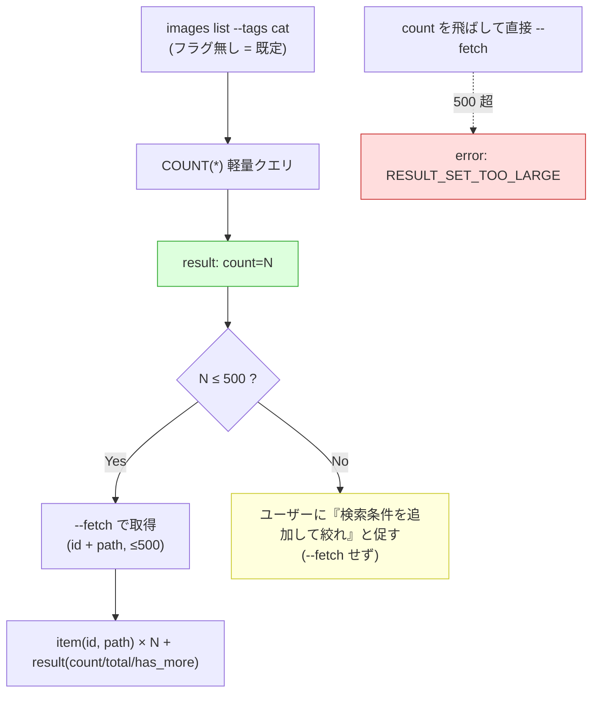

# ADR 0060: CLI Bounded Pagination and Count-First Contract

- **日付**: 2026-06-06
- **ステータス**: Proposed
- **関連 Issue**: #634 (epic) / #639
- **関連 ADR**: [0057](0057-cli-jsonl-output-and-error-contract.md) (JSONL / エラー契約 / 500 cap — 本 ADR が cap コードを amend), [0058](0058-cli-output-mode-trigger-and-entrypoint-policy.md) (rich / JSON 出力モード), [0059](0059-cli-command-introspection.md) (introspection), [0049](0049-cli-images-list-db-limit.md) (images list の DB pushdown), [0055](0055-workspace-export-target-staging-unification.md) (検索→ステージング集合), [0056](0056-exact-set-selector-id-count-guard.md) (count-only 軽量化方針), [0006](0006-pagination-approach.md) (GUI pagination)
- **参照**: tag-db ADR 0004 / 0006 (bounded pagination / filter pushdown)

## Context

ADR 0057 §3 は変更を伴うバッチ操作 (annotate / export / images update) を 1 回 500 枚にハードキャップしたが、
**read / list 系の bounded pagination 契約は本 ADR (#639) へ明示的に委譲**していた (0057 §3 末尾)。本 ADR が
それを確定する。

sibling の `genai-tag-db-tools` (tag-db) は ADR 0004 / 0006 で search に既定 `--limit` と filter pushdown、
複数 backing DB を跨ぐ merged pagination を整備した。ただし **LoRAIro は tag-db と前提が異なる**:

- **単一 SQLite** であり、tag-db が苦労した複数 backing DB の merged pagination・per-repo limit の取りこぼし
  問題は存在しない。
- フィルタは既に **Repository に pushdown 済み** (`ImageFilterCriteria` → `ImageRepository` の SQL)。
  ADR 0049 は `images list` の `limit`/`offset` を DB クエリに pushdown し、`(records, total_count)` を
  stable `Image.id` 順で返す機構を確立済み。tag-db の post-filter 取りこぼし (format 制約) のような問題も無い。
- 検索語彙は単一の `ImageFilterCriteria` に統一済み (ADR 0059 / 0055)。

そのため LoRAIro の pagination ADR は「pushdown 設計」より、**(a) 大量結果でエージェント / 人間の端末を
溢れさせない bound のかけ方、(b) その JSONL / 人間向け出力契約** が主眼になる。

加えて、**純 CLI として人間が叩く場合とエージェントに叩かせる場合で必要な処理が分岐する**。これを「まず
件数を返す (count-first)」構造で吸収する。

## Scope / Non-Goals

本 ADR は read / list / 検索系コマンドの **bounded pagination と count-first の契約** を固定する。具体的な
flag 名 (`--fetch` 等) や projection の最終フィールド確定、Repository クエリの実装機構は実装 Issue (#640 /
#641) に委ねる。本 ADR は「count 既定 / 取得は明示 / 500 上限 / 超過コード / 出力形」という契約レベルに留める。

### Non-Goals

- **cursor pagination は採らない。** LoRAIro は GUI (ADR 0006) / CLI / `ImageFilterCriteria` 全てが
  limit/offset で統一済みで、cursor 導入の必然がない。limit/offset を踏襲する。
- **大量結果の offset 巡回 UX は主眼にしない。** 500 超は「次ページを延々辿る」のでなく「検索条件を足して
  絞る」に倒す (下記 §4)。
- **小さい固定 enumeration (`models list` 等) は count 既定の対象外。** モデルレジストリのような上限が
  数百件で固定のコマンドは count せず直接列挙してよい。count 既定 / fetch 明示は **大規模になりうる画像
  検索系** (`images list` / export 選択) が対象。
- **画像の重いメタデータ (tags / scores / captions / phash) は検索結果に載せない** (§2 の projection)。
- **フィルタ語彙の再定義はしない** (`ImageFilterCriteria`、ADR 0059)。

## Decision

### 1. count を既定出力に、実データ取得を明示フラグに (count-first を構造化)

検索 / list 系コマンドの **既定出力は件数のみ**とする。実データ (image_id + path) の取得は明示フラグ
(以下 `--fetch` と仮称、最終名は実装で確定) を要する。

```jsonc
// 既定 (フラグ無し) = 件数だけ。軽量 COUNT(*)、item 行なし
{"kind": "result", "ok": true, "count": 1234, "message": "1,234 件が一致します。"}
```

これにより **count-first がデフォルト挙動として構造的に強制される**: エージェントも人間も、まず件数を
受け取り、(a) 500 以下なら `--fetch` で取得、(b) 500 超なら取得せず検索条件の追加をユーザーに促す、と
分岐できる。うっかり 18,000 行を dump することが起き得ない。これは ADR 0056 の count-only 軽量化方針の延長。

### 2. 取得時の出力 = `image_id` + `file_path` のみ。人間向けはプレーン行、エージェント向けは JSONL

`--fetch` が返すのは **`image_id` と `file_path` (ファイル名/パス) のみ**の curated projection とする。
tags / scores / captions / phash 等の重いメタは**載せない** (検索結果には不要で、表示を読みにくくするため)。

ADR 0058 の出力モードに従い表現を分ける:

- **人間 (rich 既定)**: **枠付き Table を使わず、1 行 1 件のプレーン出力** (`file_path` のみ、または
  `image_id<TAB>file_path`)。500 行でも `ls` / `find` 感覚で読め、コピー / grep できる。装飾 (枠線 / 色) は
  ADR 0058 のとおり presentation として扱い、本質的にプレーン行であることを契約とする (大量行に枠付き Table は
  不向き)。
- **エージェント (`--json`)**: `kind:"item"` の JSONL (`image_id` + `file_path`) を N 行 + 終端
  `kind:"result"` (件数メタ)。

`--fetch` が返す `image_id` 集合は ADR 0055 のステージング集合に相当し、そのまま annotate / export /
images update の `--image-id` に渡せる (検索 → ID 集合 → 各処理)。

### 3. 基本リミット = 500 (読み取り・処理 共通)。stable 順 / pushdown

- **基本リミット 500** を read / list にも適用し、ADR 0057 の処理系 500 cap と**同一値に統一**する
  ("500 = 全操作共通の作業集合の上限")。
- pagination 機構は **limit/offset**。`--fetch` 時の既定 limit は 500 (1 回で作業集合全体が取れることが多い)。
- 結果順序は **stable な `Image.id` 昇順を必須** (ADR 0049 が確立)。決定的なページング / sharding のため。
- フィルタ・limit・offset は **Repository クエリに pushdown** する (ADR 0049)。アプリ側で全件 materialize
  してから Python スライスする実装は採らない (count / fetch とも DB 側で bound する)。

### 4. 500 超過 = `RESULT_SET_TOO_LARGE` で弾く。count は常に返る

`--fetch` 時、**フィルタ全件 (total matches) が 500 を超える場合**、item を 1 行も emit する前に
**`RESULT_SET_TOO_LARGE` の `error` で弾く** (item は返さない)。利用者には検索条件の追加を促す。

**ガードは page 件数でなく total で判定する**。既定 limit=500 では返す page は常に ≤500 のため、page 件数で
判定するとバックストップが発火せず「先頭 500 件 + `has_more=true`」を出してしまう。COUNT(*) で得た total が
500 を超えたら、page を取得する前に弾く (これは §1 の count 既定が見せる件数と同一の判定軸)。

```jsonc
{"kind": "error", "ok": false, "code": "RESULT_SET_TOO_LARGE",
 "message": "1,234 件が一致しました。検索条件を追加して 500 件以下に絞ってください。",
 "retryable": false, "user_action_required": true,
 "details": {"limit": 500, "matched": 1234}}
```

- **count 既定出力はこの上限の影響を受けず、何件でも返る** (それが count-first の要点)。エージェントは
  まず count を見て 500 超を知り、`--fetch` を**叩く前に**絞り込みを促せる。`RESULT_SET_TOO_LARGE` は
  count をスキップして直接 `--fetch` した場合のバックストップ。
- 専用コードにすることで、エージェントは汎用 `INVALID_INPUT` と区別せず「この 1 コードを見たら絞り込みを
  促す」と単純分岐できる。`message` がそのまま人間向けの促し文になる (ADR 0020)。
- **ADR 0057 の処理系 500 cap (annotate / export / images update) もこの `RESULT_SET_TOO_LARGE` に統一
  する** (従来 `INVALID_INPUT`)。読み取り / 処理で「500 超 = 同一コード」となり契約が単純化する
  (本 ADR の Amendment で 0057 を改定)。処理系の recourse (sharding 等) は ADR 0057 §3 のまま。

### 5. 件数メタ

`--fetch` の終端 `result` 行に以下を載せる:

```jsonc
{"kind": "result", "ok": true, "count": 83, "total": 83,
 "limit": 500, "offset": 0, "has_more": false}
```

- `count`: このページの件数、`total`: フィルタ全件 (ADR 0049 が subquery COUNT で安価に取得済み)、
  `offset`/`limit`: echo、`has_more`: `offset + count < total`。
- 500 以下なら limit/offset で自由にページングできる (既定 limit=500 なので通常 1 回で全部取れる)。

### count-first フロー



## Rationale

- **count 既定 / fetch 明示**: 安全側 (件数だけ) を既定にすることで count-first を構造的に強制し、
  大量結果の誤 dump を不可能にする。純 CLI (人間) は「何件あるか」を即知れ、エージェントは取得前に
  絞り込み判断ができる。両者の分岐をこの 1 構造で吸収する。
- **id + path のみ / プレーン行**: 検索結果に重いメタは不要。id はステージング / 操作へのパイプ用、path は
  人間の参照用。大量行は枠付き Table より `ls` 風プレーン行が読みやすい。詳細メタが要る場面は検索の責務で
  なく、別途個別取得の関心事 (YAGNI、本 ADR では作らない)。
- **500 に統一 / 巡回でなく絞り込み**: "500 = 作業集合上限" を全操作で一貫させる。18,000 件を offset で
  辿る UX は人間にもエージェントにも不毛で、「絞れ」に倒す方が実用的。tag-db も既定 limit を導入した。
- **`RESULT_SET_TOO_LARGE` 専用コード**: 汎用 `INVALID_INPUT` だと「引数ミス」と混ざる。専用コードなら
  エージェントは 1 コード → 1 アクション (絞り込み促し) で分岐でき、読み取り / 処理で挙動が揃う。
- **limit/offset 踏襲・pushdown**: LoRAIro は全レイヤー limit/offset で統一済み、フィルタも pushdown 済み。
  cursor や複雑な merged pagination を持ち込む必然がない (単一 DB)。

## Consequences

- 検索 / list 系コマンドは既定で count を返すよう改修する (`images list` は ADR 0049 で records 既定だが、
  本 ADR で count 既定 + `--fetch` 明示に変更する)。flag 名・projection 最終確定は #640 / #641。
- `RESULT_SET_TOO_LARGE` を ADR 0057 の error code セットに追加し (14 → 15 種)、処理系 500 cap の弾き
  コードを `INVALID_INPUT` から本コードへ統一する (本 ADR の Amendment、0057 を改定)。
- count は軽量 COUNT(*) で実装し、fetch とは別経路にする (ADR 0056 count-only 方針の延長)。
- `--fetch` の `image_id` 出力は ADR 0055 のステージング集合として annotate / export / images update の
  `--image-id` にパイプできる。#638 で別 Issue に切り出した「検索 → ID 集合 → 各処理」の二段構えが、本 ADR の
  count-first / fetch 出力で素直に成立する。
- 小さい固定 enumeration (`models list`) は count 既定の対象外とし、直接列挙を維持する。
- 人間向け fetch 出力は枠付き Table でなくプレーン行とするため、既存の rich Table 表示 (該当箇所) を
  プレーン行へ変更する (#641)。
- ADR 0057 / 0058 / 0059 と本 ADR で epic #634 の契約系 ADR が出揃い、残りは実装 Issue (#640 / #641)。

## ADR 0057 への Amendment

ADR 0057 §3 / §4 を本 ADR が以下のとおり改定する (0057 側にも Amendment 注記を付す):

1. **§4 エラーコード**: `RESULT_SET_TOO_LARGE` (区分: 拡張、`retryable=false` / `user_action_required=true`、
   主因: 結果が 500 上限超 → 検索条件を絞る) を追加し全 15 種とする。
2. **§3 500 cap**: 処理系バッチ (annotate / export / images update) の 500 超過の弾きコードを
   `INVALID_INPUT` から `RESULT_SET_TOO_LARGE` に変更する。recourse (sharding 等) の記述は変更しない。
3. **§3 read/list の扱い**: 「read/list はキャップ対象外、pagination は #639」という委譲を、本 ADR が
   「read/list も基本 500 で bound するが、count 既定 + fetch 明示という別形式で実現する (処理系の
   処理前ハード弾きとは UX が異なる)」と具体化する。

## 関連

- ADR 0057 (CLI Machine-Readable JSONL Output and Error Contract) — 500 cap / error code の供給元。本 ADR が
  `RESULT_SET_TOO_LARGE` 追加と cap コード統一で amend する
- ADR 0058 (CLI Output Mode Trigger and Entry-Point Policy) — 人間 (rich プレーン行) / エージェント (JSONL) の
  出力分離
- ADR 0059 (CLI Command Introspection Contract) — `--fetch` / 検索語彙 `ImageFilterCriteria` を describe で晒す
- ADR 0049 (Apply CLI Image List Limit in the Repository Query) — limit/offset の DB pushdown と
  stable `Image.id` 順・subquery total の機構を確立
- ADR 0055 (Workspace Export Target = Staging Set) — `--fetch` の image_id 集合がステージング集合に相当
- ADR 0056 (exact-set selector の count-only 軽量化方針) — count 既定の実装方針の前提
- ADR 0006 (Pagination Approach) — GUI 側 limit/offset pagination (機構統一の根拠)
- tag-db ADR 0004 / 0006 (bounded pagination / filter pushdown) — 思想の参照元 (LoRAIro は単一 DB で
  merged pagination 問題が無く、count-first + 500 統一 + 絞り込み誘導の点で設計が異なる)
