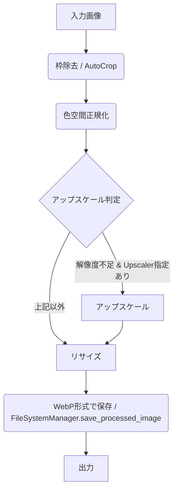

# 画像処理機能 仕様書

## 1. 概要

本ドキュメントは、LoRAIro における画像処理機能の詳細な仕様を定義する。
主な処理フローは以下の通り。



### モジュール構成

- コア処理: `src/lorairo/image_transforms/` パッケージ (#717 で旧 `editor/` から改名)
  - `image_processor.py` — `ImageProcessor` (リサイズ・色空間正規化)、`ImageProcessingManager` (フロー統括)
  - `autocrop.py` — `AutoCrop` (枠除去)
  - `upscaler.py` — `Upscaler` (AI アップスケール)
- オーケストレーション層: `src/lorairo/services/image_processing_service.py` — `ImageProcessingService`。
  GUI/登録処理と `ImageProcessingManager` を仲介し、DB タグ付け・メタデータ保存・
  `FileSystemManager.save_processed_image` 呼び出しを行う。
  詳細は [image_processing_service.md](../application/image_processing_service.md) 参照。

## 2. 機能詳細

### 2.1. アップスケール (Upscaler)

-   **目的:** 低解像度の画像を、指定されたAIモデルを用いて高解像度化する。
-   **実行条件:** 画像の長辺が `target_resolution` 未満であり、かつアップスケーラーが指定されている場合に実行される。ただし、RGBAモードの画像はスキップされる。
-   **使用ライブラリ:** `spandrel`, `torch`
-   **対応モデル:**
    -   `spandrel` ライブラリがサポートするモデルを原則として利用可能とする。
    -   モデルリストは設定ファイルの `upscaler_models` (name / path / scale を持つリスト) で管理し、
        `ConfigurationService.get_upscaler_models()` / `get_upscaler_model_by_name()` /
        `get_available_upscaler_names()` で取得する。`RealESRGAN_x4plus` (デフォルトスケール: 4.0) を含む。
-   **設定項目 (GUI経由で設定ファイルに保存):**
    -   使用するアップスケーラーモデル名 (利用可能なモデルから選択)
    -   (オプション) スケール倍率 (指定なければモデル推奨値を使用)
-   **メタデータ:** `ImageProcessingManager.process_image` が `processing_metadata`
    (`was_upscaled` / `upscaler_used` / `upscale_skipped_reason`) を返し、`ImageProcessingService` が
    DB に `upscaled` タグを追加し `upscaler_used` をメタデータ保存する。
-   **注意点:** アップスケールの成否にかかわらず後段の `resize_image` に進み、常に
    `target_resolution` 基準へリサイズされる (アップスケール結果によるスキップ処理は無い)。

### 2.2. 枠除去 (AutoCrop)

-   **目的:** 画像の周囲にある単色またはグラデーションの枠（レターボックス、ピラーボックス等）を自動検出し、除去する。
-   **使用ライブラリ:** `cv2` (OpenCV), `numpy`
-   **検出ロジック (補色差分法):** `AutoCrop.auto_crop_image` → `_get_crop_area` の単一経路。
    1.  補色差分画像を生成
    2.  `_compute_adaptive_threshold_params` が画像サイズ・輝度から閾値を自動計算 (適応的閾値)
    3.  Canny エッジ検出 + 輪郭検出でコンテンツ領域のバウンディングボックスを決定
    -   ユーザー設定可能な閾値パラメータは存在しない (全て適応計算)。
    -   注: `_evaluate_edge` / `_detect_gradient` / `_detect_border_shape` は旧アルゴリズムの
        後方互換用デッドコードで、現行経路からは呼ばれない。
-   **クロップ時のマージン:**
    -   **実装方式:** 動的計算(検出されたバウンディングボックスサイズに応じて自動調整)
    -   **計算式:**
        ```python
        margin_x = max(2, int(bbox_width * 0.005))
        margin_y = max(2, int(bbox_height * 0.005))
        ```
    -   **設計理由:**
        - バウンディングボックス基準: 実際に検出されたコンテンツ領域に対して適切なマージンを適用
        - 軸ごとの独立計算: 各軸で個別にマージン適用判定 (`bbox_width > 2 * margin_x`, `bbox_height > 2 * margin_y`)
        - 安全性チェック: 軸ごとに独立してマージンをスキップ(負の寸法を防止)
        - 最小マージン: 2px下限で極小バウンディングボックスを保護
    -   **例:**
        - バウンディングボックス 500x500 → margin_x=2px, margin_y=2px(両軸で最小値)
        - バウンディングボックス 1000x1000 → margin_x=5px, margin_y=5px(両軸で適用)
        - バウンディングボックス 2000x500 → margin_x=10px, margin_y=2px(軸ごとに異なる)
        - バウンディングボックス 1000x3 → margin_x=5px, margin_y=スキップ(3 <= 4で不十分)
        - バウンディングボックス 3x1000 → margin_x=スキップ(3 <= 4で不十分), margin_y=5px
        - バウンディングボックス 3x3 → margin_x=スキップ, margin_y=スキップ(両軸で不十分)
-   **処理フロー:** `_get_crop_area` で検出した領域を `PIL.Image.crop` で切り出す。検出できない場合は元画像を返す。

### 2.3. リサイズ (ImageProcessor.resize_image)

-   **目的:** 画像を指定されたルールに基づき、学習に適した解像度にリサイズする。アスペクト比は維持される。
-   **使用ライブラリ:** `PIL` (Pillow)
-   **補間アルゴリズム:** `Image.Resampling.LANCZOS` (固定)
-   **リサイズルール:**
    1.  入力画像の幅・高さからアスペクト比を計算。
    2.  `preferred_resolutions` (優先解像度/アスペクト比リスト) 内に同じアスペクト比の指定が存在するか検索 (`_find_matching_resolution`)。
    3.  存在する場合: `target_resolution` の面積に最も近い優先解像度を採用。
    4.  存在しない場合:
        a.  画像の長辺が `target_resolution` になるように、アスペクト比を維持して短辺を計算。
        b.  計算された幅・高さをそれぞれ最も近い32の倍数に丸める。
-   **設定項目 (GUI経由で設定ファイルに保存):**
    -   `target_resolution` (目標解像度、長辺の基準)
    -   `preferred_resolutions` (優先解像度/アスペクト比リスト - 例: `[(512, 512), (768, 512)]`)

### 2.4. 色空間正規化 (ImageProcessor.normalize_color_profile)

-   **目的:** 画像の色空間を入力処理に適した形式 (RGBまたはRGBA) に統一する。
-   **対応モード:** RGB, RGBA, CMYK, P (パレット), L, LA (グレースケール)
-   **処理:**
    -   RGB/RGBA: アルファ有無に応じて RGB または RGBA に変換。
    -   CMYK: RGB に変換。
    -   P: RGB に変換後、再帰的に処理。
    -   L/LA: アルファ有無に応じて RGB / RGBA に変換。
    -   その他: 未サポートとして警告後、RGB/RGBA に変換。

### 2.5. WebP形式への変換

-   **目的:** 処理済み画像を WebP 形式で保存する。
-   **実装箇所:** `FileSystemManager.save_processed_image` (`src/lorairo/filesystem.py`)
-   **使用ライブラリ:** `PIL` (Pillow) の `save` メソッド
-   **設定項目:** 品質、ロスレス設定、圧縮メソッドはユーザー設定不要。内部で最適なデフォルト値を使用する。
