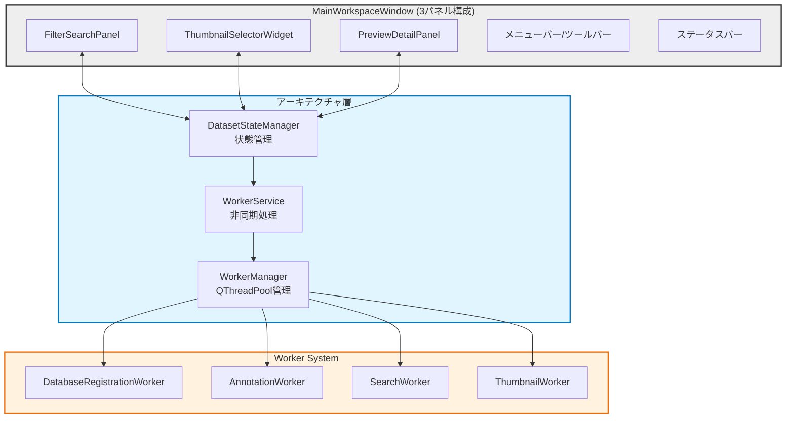
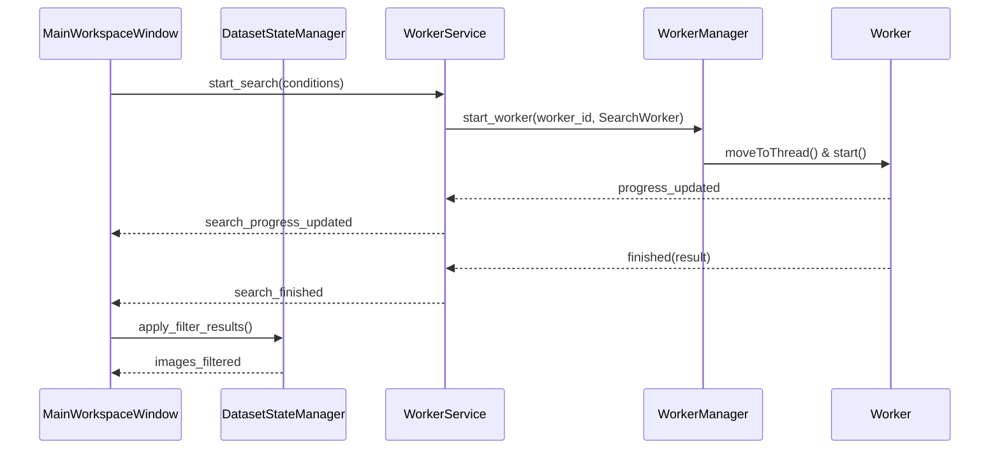

# GUIインターフェース 仕様書

## 1. 概要

本ドキュメントは、`lorairo` アプリケーションのグラフィカルユーザーインターフェース (GUI) の仕様を定義する。GUI は `PySide6` ライブラリを用いて構築され、非同期処理にQThreadPool/QRunnableベースのワーカーシステムを採用している。

## 2. 全体構成

アプリケーションは単一のメインワークスペースウィンドウ (`MainWorkspaceWindow`) で構成され、3パネル構成の統一的なワークフローインターフェースを提供する。



-   **MainWorkspaceWindow:** データベース中心設計の3パネル構成メインウィンドウ。画像管理・検索・処理を統合的に提供。
-   **FilterSearchPanel (左パネル):** 画像検索・フィルタリング機能を集約。タグ検索、日付範囲、解像度フィルタ等。
-   **ThumbnailSelectorWidget (中央パネル):** データセット画像のサムネイル表示・選択。グリッド/リスト表示切り替え、複数選択対応。
-   **PreviewDetailPanel (右パネル):** 選択画像のプレビュー表示とメタデータ・アノテーション情報表示。
-   **メニューバー/ツールバー:** データセット選択、設定、アノテーション、エクスポート等の主要機能アクセス。
-   **ステータスバー:** リアルタイム状態表示（処理進捗、選択数、エラー情報等）。

## 3. 新アーキテクチャ - PySide6 Worker System

### 3.1. 状態管理システム

#### DatasetStateManager
全ウィジェット間で共有される中央集権的状態管理システム。

**主要機能:**
- データセット情報管理（パス、全画像リスト、フィルター済み画像リスト）
- 画像選択状態管理（複数選択、現在画像、選択変更通知）
- フィルター条件管理（検索条件、適用状態）
- UI状態管理（サムネイルサイズ、レイアウトモード）

**主要シグナル:**
- `dataset_loaded(int)` - データセット読み込み完了
- `images_filtered(list)` - フィルター結果更新
- `selection_changed(list)` - 選択状態変更
- `current_image_changed(int)` - 現在画像変更

### 3.2. Worker System Architecture

#### WorkerService (高レベルAPI)
GUI層に対する統一的なワーカー管理インターフェース。

**主要機能:**
- 各種ワーカーの開始・停止・キャンセル
- 進捗情報の中継とシグナル統一
- シングルトンワーカー管理（検索、サムネイル読み込み等）
- エラーハンドリングとリカバリ

**統一シグナル:**
```python
# 開始・完了・エラーシグナル
batch_registration_started/finished/error
annotation_started/finished/error
search_started/finished/error
thumbnail_started/finished/error

# 進捗シグナル
worker_progress_updated(worker_id, WorkerProgress)
worker_batch_progress(worker_id, current, total, filename)
```

#### WorkerManager (低レベル実行基盤)
QThreadPool ベースの実際のワーカー実行管理。

**主要機能:**
- QRunnable ベースワーカーのライフサイクル管理
- ワーカーID によるタスク識別と制御
- キャンセル制御とタイムアウト管理
- 並行実行数制御とリソース管理

#### Base Worker Classes

**LoRAIroWorkerBase (抽象基底クラス):**
```python
class LoRAIroWorkerBase(QObject, Generic[T]):
    # 統一シグナル
    progress_updated = Signal(WorkerProgress)
    batch_progress = Signal(int, int, str)
    status_changed = Signal(WorkerStatus)
    finished = Signal(object)
    error_occurred = Signal(str)
    
    # 抽象メソッド
    def execute(self) -> T: pass
```

**WorkerProgress データクラス:**
```python
@dataclass
class WorkerProgress:
    percentage: int
    status_message: str
    current_item: str = ""
    processed_count: int = 0
    total_count: int = 0
```

#### 専用ワーカー実装

**DatabaseRegistrationWorker:**
- ディレクトリ内画像の一括DB登録
- 重複検出とスキップ処理
- バッチ進捗レポート（ファイル名付き）

**AnnotationWorker:**
- AI アノテーション（image-annotator-lib 統合）
- 複数モデル対応とバッチ処理
- エラー時の部分結果保持

**SearchWorker:**
- 高速データベース検索
- 複雑フィルター条件対応
- 2段階フィルタリング（DB + フロントエンド）

**ThumbnailWorker:**
- 大量画像のサムネイル生成
- メモリ効率的な読み込み
- 並行生成とプログレッシブ表示

### 3.3. 非同期処理フロー



### 3.4. シグナル・スロット統一パターン

**Qt自動接続 (on_<objectname>_<signal>):**
```python
@Slot()
def on_pushButtonSelectDataset_clicked(self) -> None:
    # Qt により自動接続される UI イベントハンドラ
```

**カスタムシグナル接続:**
```python
def setup_connections(self) -> None:
    # データセット状態管理
    self.dataset_state.selection_changed.connect(self.handle_selection_changed)
    
    # ワーカーサービス
    self.worker_service.search_finished.connect(self.handle_search_finished)
```

## 4. Testing Architecture - pytest-qt Integration

### 4.1. Testing Framework

**pytest-qt 標準パターン:**
- `qtbot` フィクスチャによるウィジェット操作
- `QTest` による UI イベントシミュレーション
- シグナル・スロットのテスト支援
- 非同期処理の適切な待機

**Test Categories:**
- `@pytest.mark.unit` - 単体テスト（モック使用）
- `@pytest.mark.integration` - 統合テスト（実際のDB/ファイルシステム）
- `@pytest.mark.gui` - GUI テスト（qtbot + ウィジェット操作）
- `@pytest.mark.fast` - 高速テスト（CI 用）
- `@pytest.mark.standard` - 標準テスト
- `@pytest.mark.real_api` - 実 API 呼び出しテスト

### 4.2. クロスプラットフォーム対応

**Linux/Container 環境:**
- ヘッドレス実行 (`QT_QPA_PLATFORM=offscreen`)
- EGL ライブラリ使用で Qt オフスクリーンレンダリング
- pytest-qt による自動化されたウィジェットテスト

**Windows 環境:**
- ネイティブ GUI ウィンドウ表示対応
- 実際の UI 操作による検証可能
- 開発時の visual debugging サポート

### 4.3. テスト品質改善 (2025/07/23)

**改善前の問題:**
- 過度なMockingにより実際のバグを見逃すテスト
- API名エラー（`register_image` → `register_original_image`）を検出できない
- インポートパスエラー（`..database.db_core` → `...database.db_core`）を検出できない
- 内部モジュール統合問題を見逃す

**改善されたテスト戦略:**
```python
@pytest.fixture
def real_db_manager(self, real_repository, real_config_service):
    """実際のImageDatabaseManager（Mockしない）"""
    return ImageDatabaseManager(real_repository, real_config_service)

@pytest.fixture
def mock_fsm(self, mock_image_files):
    """ファイルシステムのみMock化（外部依存）"""
    mock = Mock(spec=FileSystemManager)
    mock.get_image_files.return_value = mock_image_files
    return mock
```

**API名検証テスト:**
```python
def test_api_method_names_are_correct(self, real_db_manager):
    """APIメソッド名が正しいことをテスト - 実際のバグを検出可能"""
    assert hasattr(real_db_manager, 'register_original_image')  # register_imageではない！
    assert hasattr(real_db_manager, 'get_image_metadata')      # get_image_by_idではない！
    assert callable(real_db_manager.detect_duplicate_image)
```

**インポートパス検証テスト:**
```python
def test_import_paths_are_correct(self):
    """インポートパスが正しいことをテスト - インポートエラーを検出"""
    from lorairo.database.db_core import resolve_stored_path  # インポートエラーを検出
    assert resolve_stored_path is not None
```

**実際の統合テスト:**
```python
def test_worker_execution_with_real_objects(self, real_db_manager, mock_fsm):
    """実際のオブジェクト連携をテスト - Mock以外の統合をテスト"""
    with patch.object(real_db_manager, 'detect_duplicate_image') as mock_detect:
        mock_detect.return_value = None
        worker = DatabaseRegistrationWorker(temp_dir, real_db_manager, mock_fsm)
        result = worker.execute()
        # 実際のAPIが呼ばれたことを確認
        assert mock_detect.call_count == expected_count
```

### 4.4. モック戦略

**改善されたモック原則:**
- **外部依存のみMock:** ファイルシステム、ネットワーク、UI components
- **内部モジュールは実際のオブジェクト:** LoRAIro内部の全てのサービス・マネージャー
- **統合問題を検出:** 実際のAPI呼び出しとデータフロー

**依存性注入パターン:**
```python
@pytest.fixture
def minimal_main_window(self, real_config_service, real_db_manager, mock_fsm):
    with patch("...FilterSearchPanel") as mock_filter, \
         patch.object(MainWorkspaceWindow, "setupUi"):
        window = MainWorkspaceWindow()
        # 実際のサービスオブジェクトを注入
        window.config_service = real_config_service
        window.db_manager = real_db_manager
        window.fsm = mock_fsm
        return window
```

**シグナルテストパターン:**
```python
def test_dataset_selection_signal(self, main_window, qtbot):
    with qtbot.waitSignal(main_window.dataset_loaded):
        main_window.load_dataset(Path("/test/path"))
```

## 5. 主要機能仕様 (Updated)

### 5.1. 統合ワークフロー (MainWorkspaceWindow)

新しいアーキテクチャでは、従来の複数ページ構成から統合的な3パネル構成に変更。全ての主要機能が単一ウィンドウで完結する。

**主要ワークフロー:**
1. データセット選択・DB登録 (DatabaseRegistrationWorker)
2. 画像検索・フィルタリング (SearchWorker + FilterSearchPanel)
3. サムネイル表示・選択 (ThumbnailWorker + ThumbnailSelectorWidget)
4. プレビュー・詳細表示 (PreviewDetailPanel)
5. アノテーション・エクスポート (AnnotationWorker)

### 5.2. FilterSearchPanel - 検索・フィルタリング機能

**統合検索インターフェース:**
- **タグ検索:** 部分一致・完全一致切り替え可能
- **日付範囲フィルター:** 作成日時・更新日時による範囲指定
- **解像度フィルター:** 最小・最大解像度指定
- **アスペクト比フィルター:** 縦横比による絞り込み
- **ファイル形式フィルター:** PNG/JPG/WEBP 等の拡張子指定
- **アノテーション状態:** タグ未付与・キャプション未付与フィルター
- **NSFW フィルター:** 成人向けコンテンツの除外/表示

**2段階フィルタリング:**
- **1段階目:** データベース側での高速フィルタリング
- **2段階目:** フロントエンド側での詳細フィルタリング (日付範囲等)

### 5.3. ThumbnailSelectorWidget - サムネイル表示・選択

**表示機能:**
- **グリッド表示:** カスタマイズ可能なサムネイルサイズ (100-300px)
- **リスト表示:** 詳細情報付きコンパクト表示
- **バーチャルスクロール:** 大量データの効率的表示
- **プログレッシブ読み込み:** 非同期サムネイル生成・表示

**選択機能:**
- **単一選択:** クリックによる基本選択
- **複数選択:** Ctrl/Shift キーによる範囲選択・追加選択
- **全選択/解除:** キーボードショートカット対応
- **選択状態保持:** フィルタリング後も選択状態維持

### 5.4. PreviewDetailPanel - プレビュー・詳細表示

**画像プレビュー:**
- **高品質表示:** 原寸大プレビュー・ズーム機能
- **画像情報表示:** ファイルサイズ・解像度・形式・作成日時

**メタデータ表示:**
- **ファイル情報:** パス・サイズ・更新日時
- **画像特性:** 解像度・アスペクト比・色深度・アルファチャンネル
- **データベース情報:** 登録日時・phash・重複画像リンク

**アノテーション表示:**
- **タグ表示:** カンマ区切り一覧・編集可能
- **キャプション表示:** 複数行対応・編集可能  
- **スコア表示:** 品質・美観スコアの可視化

### 5.5. 廃止された機能 (Legacy)

従来のページベース機能は MainWorkspaceWindow に統合され、以下は廃止:

**廃止ページ:**
- ~~画像編集ページ (pageImageEdit)~~ → 統合ワークフロー
- ~~AIタグ付けページ (pageImageTagger)~~ → 統合ワークフロー  
- ~~データセット概要ページ (pageDatasetOverview)~~ → 統合ワークフロー
- ~~エクスポートページ (pageExport)~~ → メニューバーアクション
- ~~設定ページ (pageSettings)~~ → 設定ダイアログ

## 6. レガシー機能仕様 (参考用)

### 6.1. AIタグ付けページ (Legacy - 参考用)

-   **目的:** 選択された画像に対してAIによるタグ・キャプション生成を実行し、結果の確認・編集・保存を行う。
-   **主要コンポーネント:**
    -   **サムネイルセレクター (`ThumbnailSelector`):**
        -   データセット内の画像（.webp限定）をサムネイル表示し、処理対象を選択する (`ThumbnailSelectorWidget` を使用)。
        -   単一選択、複数選択（Ctrl/Shiftキー使用）に対応。
        -   選択された画像は `selected_webp` リストに保持される。
        -   選択変更時に画像プレビューとアノテーション表示を更新する。
    -   **画像プレビュー (`ImagePreview`):**
        -   サムネイルセレクターで最後に選択された画像を表示する (`ImagePreviewWidget` を使用)。
    -   **DB検索 (`dbSearchWidget`):**
        -   タグやキャプションでDB内の画像を検索し、結果をサムネイルセレクターに表示する機能 (`TagFilterWidget` を使用)。
        -   タグ未付与、NSFWコンテンツのフィルタリングオプションあり。
    -   **AIモデル選択:**
        -   **アノテーター/モデル (`comboBoxModel`):** `image-annotator-lib` が提供する利用可能な全てのアノテーター（APIベース、ローカルモデル等）のリストを表示し、選択する。選択されたモデル名は `ConfigManager` に保存される。(変更)
        -   **タグフォーマット (`comboBoxTagFormat`):** 出力タグの整形に使用するフォーマット名 (danbooru, e621, derpibooru) を選択。
    -   **プロンプト設定:**
        -   **メインプロンプト (`textEditMainPrompt`):** AIに渡す主要な指示。編集可能で `ConfigManager` に保存される。
        -   **追加プロンプト (`textEditAddPrompt`):** AIに渡す追加の指示。編集可能で `ConfigManager` に保存される。
        -   **画像生成プロンプト (`textEditGenaiPrompt`):** (※用途不明瞭) 編集可能で `ConfigManager` に保存される。タグとしてDBに別途登録されるロジックあり。
    -   **処理オプション:**
        -   **低解像度画像使用 (`lowRescheckBox`):** チェック時、AIへの入力にDB内の低解像度版処理済み画像を使用する。
    -   **生成実行ボタン (`pushButtonGenerate`):**
        -   選択された画像 (`selected_webp`) と **アノテーター/モデル設定** に基づき、`image-annotator-lib` の `annotate` 関数を呼び出してタグ・キャプション・スコア生成を実行する。(変更)
        -   処理結果は `all_results` 辞書 (キー: 画像パス) に保持される。
        -   最後に処理した画像の結果をタグ/キャプション編集エリアとスコアスライダーに表示する。
    -   **結果表示/編集:**
        -   **タグ (`textEditTags`):** 生成されたタグをカンマ区切りで表示。編集可能。
        -   **キャプション (`textEditCaption`):** 生成されたキャプションを表示。編集可能。
        -   **スコア (`scoreSlider`):** 生成されたスコアを0-100の範囲で表示。ツールチップで実際の値表示。編集不可？
    -   **保存オプション:**
        -   **テキストファイル保存 (`checkBoxText`):** チェック時、タグとキャプションを画像と同名の .txt / .caption ファイルとして保存。
        -   **JSONファイル保存 (`checkBoxJson`):** チェック時、アノテーション情報をJSONファイルとして保存。
        -   **DB登録 (`checkBoxDB`):** チェック時、生成/編集されたアノテーションをデータベースに保存。
        -   **キャプションをタグにマージ (`MergeCaptionWithTagscheckBox`):** テキストファイル保存時にキャプションをタグリストの先頭に追加するかどうか。
    -   **保存実行ボタン (`pushButtonSave`):**
        -   選択された保存オプションに基づき、`all_results` に保持されたアノテーション情報をファイルまたはDBに保存する。
        -   テキスト/JSON保存時は保存先ディレクトリを選択するダイアログを表示 (`DirectoryPickerSave`)。
        -   DB保存時は `idm.save_annotations` を呼び出す。画像がDB未登録の場合は先に登録する。
-   **初期化 (`initialize`):**
    -   `ConfigManager`, `ImageDatabaseManager` のインスタンスを受け取る。
    -   `ConfigManager` からプロンプト、**利用可能なアノテーター/モデルリスト (ライブラリから取得)**、ディレクトリパスなどを取得し、UIに設定。(変更)
    -   DB検索ウィジェットを初期化。
-   **データフロー:**
    -   メインウィンドウのデータセットセレクターで選択された画像リストが `load_images` で渡される。
    -   DB検索結果も `load_images` でサムネイル表示が更新される。
    -   生成/編集されたアノテーションは `all_results` 辞書に一時保持され、保存ボタン押下時に永続化される。

### 6.2. データセット概要ページ (Legacy - 参考用)

-   **目的:** 選択されたデータセット内の画像のメタデータやアノテーション情報を一覧表示・確認する。
-   **主要コンポーネント:**
    -   **サムネイルセレクター (`thumbnailSelector`):** データセット内の画像を表示・選択 (`ThumbnailSelectorWidget` を使用)。
    -   **画像プレビュー (`ImagePreview`):** 選択された画像を表示 (`ImagePreviewWidget` を使用)。
    -   **メタデータ表示:**
        -   ファイル名 (`fileNameValueLabel`)
        -   パス (`imagePathValueLabel`)
        -   フォーマット (`formatValueLabel`)
        -   モード (`modeValueLabel`)
        -   アルファチャンネル有無 (`alphaChannelValueLabel`)
        -   解像度 (`resolutionValueLabel`)
        -   アスペクト比 (`aspectRatioValueLabel`)
        -   拡張子 (`extensionValueLabel`)
    -   **アノテーション表示:**
        -   タグ (`tagsTextEdit`): 関連付けられたタグをカンマ区切りで表示。**読み取り専用**。
        -   キャプション (`captionTextEdit`): 関連付けられたキャプションを表示。**読み取り専用**。
    -   **DB検索 (`dbSearchWidget`):** タグやキャプション等でDB内の画像を検索し、結果をサムネイルセレクターに表示 (`TagFilterWidget` を使用)。日付範囲、解像度、タグ未付与、NSFWフィルタリングオプションあり。
-   **処理フロー:**
    -   データセットセレクターでディレクトリが選択されると `load_images` が呼ばれ、サムネイルセレクターに画像が表示される。
    -   サムネイルが選択されると `update_preview` が呼ばれ、画像プレビューとメタデータ・アノテーション表示が更新される (`update_metadata`, `update_annotations`)。
    -   メタデータは `FileSystemManager.get_image_info` で取得。
    -   アノテーションはまず既存ファイル (`.txt`, `.caption`) を探し (`ImageAnalyzer.get_existing_annotations`)、なければDBから取得 (`idm.get_image_annotations`) して表示。
    -   DB検索ウィジェットで検索が実行されると `on_filter_applied` が呼ばれ、DBを検索 (`idm.get_images_by_filter`) し、結果の画像パスリストでサムネイルセレクターを更新する。

## 7. アーキテクチャ移行のメリット

### 7.1. パフォーマンス向上
- **非同期処理:** QThreadPool/QRunnable による効率的な並行処理
- **プログレッシブ読み込み:** 大量データの段階的表示
- **メモリ効率:** バーチャルスクロールとサムネイル遅延読み込み
- **レスポンシブUI:** 長時間処理中もUIがブロックされない

### 7.2. ユーザビリティ向上
- **統合ワークフロー:** 3パネル構成による直感的操作
- **リアルタイム更新:** 状態変更の即座な反映
- **進捗表示:** 詳細な処理状況の可視化
- **エラー回復:** 適切なエラーハンドリングとユーザーフィードバック

### 7.3. 開発・保守性向上
- **責任分離:** 状態管理・UI・ビジネスロジックの明確な分離
- **テスタビリティ:** pytest-qt による包括的なGUIテスト
- **拡張性:** 新しいワーカー・パネル・機能の追加が容易
- **デバッグ:** 統一されたログとエラー報告システム

### 7.4. クロスプラットフォーム対応
- **Linux/Container:** ヘッドレス実行とCI/CD統合
- **Windows:** ネイティブGUI体験
- **同一コードベース:** プラットフォーム固有の差異を抽象化

## 8. 実装ファイル参照

### 8.1. 主要実装ファイル
- **MainWorkspaceWindow:** `/src/lorairo/gui/window/main_workspace_window.py`
- **DatasetStateManager:** `/src/lorairo/gui/state/dataset_state.py`
- **WorkerService:** `/src/lorairo/gui/services/worker_service.py`
- **WorkerManager:** `/src/lorairo/gui/workers/manager.py`
- **Base Worker:** `/src/lorairo/gui/workers/base.py`

### 8.2. ウィジェット実装
- **FilterSearchPanel:** `/src/lorairo/gui/widgets/filter_search_panel.py`
- **ThumbnailSelectorWidget:** `/src/lorairo/gui/widgets/thumbnail_enhanced.py`
- **PreviewDetailPanel:** `/src/lorairo/gui/widgets/preview_detail_panel.py`

### 8.3. ワーカー実装
- **DatabaseRegistrationWorker:** `/src/lorairo/gui/workers/database_worker.py`
- **AnnotationWorker:** `/src/lorairo/gui/workers/annotation_worker.py`
- **SearchWorker:** `/src/lorairo/gui/workers/database_worker.py`
- **ThumbnailWorker:** `/src/lorairo/gui/workers/database_worker.py`

### 8.4. テスト実装

**単体テスト (Unit Tests):**
- **MainWorkspaceWindow Tests:** `/tests/unit/gui/window/test_main_workspace_window_improved.py`
- **DatabaseWorker Tests:** `/tests/unit/workers/test_database_worker.py`
- **Legacy Tests (参考用):** `/tests/unit/gui/window/test_main_workspace_window.py`

**統合テスト (Integration Tests):**
- **GUI Integration Tests:** `/tests/integration/gui/test_worker_coordination.py`
- **Database Integration Tests:** `/tests/integration/test_upscaler_database_integration.py`

**GUI テスト (pytest-qt):**
- **MainWorkspaceWindow GUI Tests:** `/tests/gui/test_main_workspace_window_qt.py`

**テスト品質改善の実装例:**
```python
# tests/unit/workers/test_database_worker.py
class TestDatabaseRegistrationWorker:
    def test_api_method_names_are_correct(self, real_db_manager):
        """実際のAPIメソッド名検証 - バグ検出可能"""
        assert hasattr(real_db_manager, 'register_original_image')
        assert hasattr(real_db_manager, 'get_image_metadata')
        
    def test_import_paths_are_correct(self):
        """インポートパス検証 - インポートエラー検出"""
        from lorairo.database.db_core import resolve_stored_path
        assert resolve_stored_path is not None
        
    def test_worker_execution_with_real_objects(self, real_db_manager, mock_fsm):
        """実際のオブジェクト統合テスト"""
        # データベース操作のみMock化、内部オブジェクトは実際のもの
        with patch.object(real_db_manager, 'detect_duplicate_image'):
            worker = DatabaseRegistrationWorker(temp_dir, real_db_manager, mock_fsm)
            result = worker.execute()
            # 実際のAPI呼び出しを検証
```