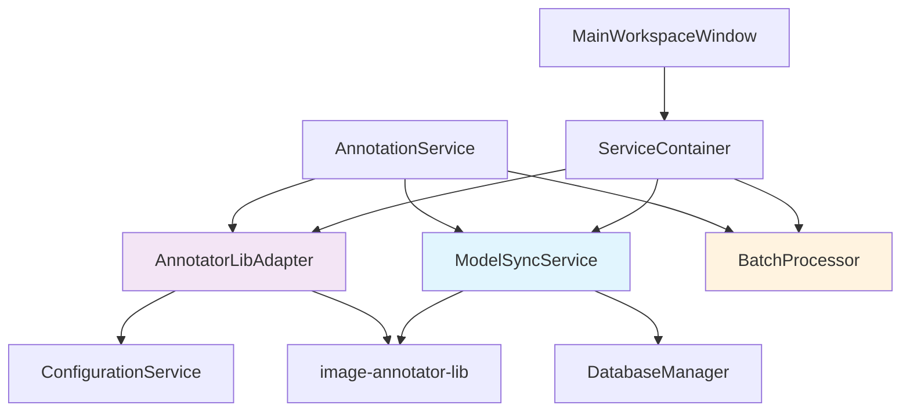

# アノテーション処理変更計画 - 2025/07/25

**プランニング日時**: 2025/07/25 13:00:00  
**プランナー**: Claude Code  
**ブランチ**: cleanup/resolve-annotations-todos  
**対象**: アノテーション処理の包括的改善・統合

## 🎯 プランニング概要

### 解決方針

**Adapter + Dynamic Model Registration パターン**による設定管理とライブラリ連携の最適化。PydanticAI 最適化、動的モデル登録、設定統合に集中し、複雑性を排除する。

### 主要成果物

- **設定統合アダプター**: API キー管理とライブラリ連携の一元化
- **動的モデル登録**: ライブラリから DB への自動モデル同期
- **バッチ処理対応**: OpenAI Batch API 等の大規模処理サポート
- **テスタビリティ向上**: Protocol-based DI による完全モック対応

## 📊 問題定義と成功基準

### 特定された 3 つの主要課題

#### 1. バッチ処理の未対応

**問題**:

- OpenAI Batch API 等の大規模処理未対応
- `get_batch_analysis()` が削除されたメソッドに依存
- TODO コメントのまま実装されていない機能

**成功基準**:

- ✅ OpenAI Batch API 対応の完全実装
- ✅ バッチ処理結果の適切な処理
- ✅ 大規模データセット処理の効率化

#### 2. 設定管理の分裂

**問題**:

- LoRAIro (`config/lorairo.toml`) と image-annotator-lib (`config/annotator_config.toml`) の設定重複
- API キー管理の非効率性
- モデル設定の不整合リスク

**成功基準**:

- ✅ API キー設定の一元化
- ✅ モデル設定の自動同期
- ✅ 設定変更の影響範囲最小化

#### 3. モデル管理の手動運用

**問題**:

- 新しいモデルの追加が手動作業
- LoRAIro DB への登録が非自動化
- ライブラリ更新時の同期漏れ

**成功基準**:

- ✅ ライブラリからの自動モデル検出
- ✅ DB への動的モデル登録
- ✅ モデル情報の自動同期

### 統合成功基準

- **設定管理**: API キー管理の一元化と設定重複の解消
- **モデル管理**: ライブラリからの自動モデル同期（90%自動化）
- **バッチ処理**: OpenAI Batch API 等の大規模処理対応
- **テスタビリティ**: Protocol-based DI により全コンポーネント 100%モック可能

## 🏗️ 推奨アーキテクチャ設計

### コアコンポーネント構成



### 新規コンポーネント設計

#### 1. AnnotatorLibAdapter (設定統合アダプター)

**実装方針**: 外部注入 + モック段階ハイブリッド

##### Phase 1-2: モック実装（LoRAIro 先行開発）

```python
class MockAnnotatorLibAdapter:
    """Phase 1-2用モック実装 - LoRAIro独立開発"""

    def __init__(self, config_service: ConfigurationService):
        self.config_service = config_service

    def get_unified_api_keys(self) -> dict[str, str]:
        """LoRAIro設定からAPIキー取得（実装）"""
        return {
            "openai": self.config_service.get_setting("api", "openai_key", ""),
            "anthropic": self.config_service.get_setting("api", "claude_key", ""),
            "google": self.config_service.get_setting("api", "google_key", "")
        }

    def call_annotate(self, images, models, phash_list=None, api_keys=None):
        """モックアノテーション処理"""
        return {"mock_phash": {models[0]: {"tags": ["test_tag"], "error": None}}}

    def get_available_models_with_metadata(self) -> list[dict]:
        """モックモデルメタデータ"""
        return [{"name": "gpt-4o", "provider": "openai", "model_type": "vision"}]
```

##### Phase 4: 実ライブラリ統合実装

```python
class AnnotatorLibAdapter:
    """PydanticAI外部注入方式による設定統合アダプター"""

    def __init__(self, config_service: ConfigurationService):
        self.config_service = config_service

    def get_unified_api_keys(self) -> dict[str, str]:
        """LoRAIro設定を単一情報源とするAPIキー取得"""
        return {
            provider: self.config_service.get_setting("api", f"{key}_key", "")
            for provider, key in [
                ("openai", "openai"), ("anthropic", "claude"), ("google", "google")
            ] if self.config_service.get_setting("api", f"{key}_key", "")
        }

    def call_annotate(self, images, models, phash_list=None, api_keys=None):
        """PydanticAI Provider-level外部注入による統合実行

        既存 ProviderManager.run_inference_with_model(..., api_keys=dict) 100%活用
        ライブラリ設定をLoRAIro設定で完全オーバーライド
        """
        from image_annotator_lib.core.provider_manager import ProviderManager

        # LoRAIro設定で統一（外部注入方式）
        unified_keys = api_keys or self.get_unified_api_keys()

        # PydanticAI Provider-level共有を最大活用
        return ProviderManager.run_inference_with_model(
            model_name=models[0],
            images_list=images,
            api_model_id=models[0],
            api_keys=unified_keys  # 外部注入でライブラリ設定バイパス
        )

    def get_available_models_with_metadata(self) -> list[dict]:
        """新API呼び出し（Phase 3実装後に使用可能）"""
        from image_annotator_lib.core.registry import list_available_annotators_with_metadata
        return list(list_available_annotators_with_metadata().values())
```

#### 2. ModelSyncService (動的モデル登録)

```python
class ModelSyncService:
    """ライブラリとLoRAIro DB間のモデル同期サービス"""

    def __init__(self,
                 db_repository: DatabaseRepository,
                 config_service: ConfigurationService):

    def sync_available_models(self) -> ModelSyncResult:
        """利用可能モデルの自動同期"""

    def get_model_metadata_from_library(self) -> list[ModelMetadata]:
        """ライブラリからモデルメタデータ取得"""

    def register_new_models_to_db(self, models: list[ModelMetadata]) -> int:
        """新規モデルのDB登録"""

    def update_existing_models(self, models: list[ModelMetadata]) -> int:
        """既存モデル情報の更新"""
```

#### 3. BatchProcessor (バッチ処理専用)

```python
class BatchProcessor:
    """OpenAI Batch API等の大規模処理専用コンポーネント"""

    def __init__(self,
                 annotator_adapter: AnnotatorLibAdapter,
                 config_service: ConfigurationService):

    def create_batch_request(self, image_paths: list[Path], model_name: str) -> dict:
        """バッチリクエスト生成"""

    def process_batch_results(self, batch_results: dict) -> BatchAnnotationResult:
        """バッチ処理結果の解析"""

    def submit_openai_batch(self, requests: list[dict]) -> str:
        """OpenAI Batch API への送信"""
```

### 新 API 設計: `list_available_annotators_with_metadata()`

#### image-annotator-lib 側拡張

```python
# local_packages/image-annotator-lib/src/image_annotator_lib/core/registry.py

def list_available_annotators_with_metadata() -> dict[str, dict[str, Any]]:
    """利用可能アノテーターのメタデータ付き一覧を返す

    Returns:
        dict[str, dict[str, Any]]: {
            "model_name": {
                "class": "PydanticAIWebAPIAnnotator",
                "provider": "openai",
                "api_model_id": "gpt-4o",
                "max_output_tokens": 1800,
                "model_type": "vision",
                "estimated_size_gb": None,
                "requires_api_key": True,
                "discontinued_at": None
            },
            ...
        }
    """
```

#### LoRAIro 側統合

```python
# src/lorairo/services/model_sync_service.py

class ModelMetadata(TypedDict):
    name: str
    provider: str | None
    class_name: str
    api_model_id: str | None
    model_type: str  # "vision", "score", "tagger"
    estimated_size_gb: float | None
    requires_api_key: bool
    discontinued_at: datetime | None
```

## 🔗 LoRAIro アーキテクチャ統合

### 設定同期戦略: 外部注入 + ファイル共存

#### 設定ファイル共存方針

```
LoRAIroプロジェクト/
├── config/
│   ├── lorairo.toml           # APIキー管理（単一情報源）
│   ├── annotator_config.toml  # ライブラリ設定（自動作成、APIキー部分無視）
│   └── available_api_models.toml # API モデル情報（自動作成）
```

**重要な設計決定**:

1. **LoRAIro 設定優先**: `config/lorairo.toml` の [api] セクションを単一情報源とする
2. **ライブラリ設定保持**: 既存の設定ファイル作成機能は維持（破壊的変更なし）
3. **外部注入方式**: `api_keys` パラメータでライブラリ設定をオーバーライド

#### Service Layer 統合

- **AnnotationService**: AnnotatorLibAdapter 経由での統合サービス提供
- **WorkerService**: Qt Worker System との完全統合維持
- **ConfigurationService**: API キー一元管理の責任拡張
- **DatabaseRepository**: モデル同期機能の追加

#### Qt Event-Driven 統合

- **Signals/Slots**: 既存 Qt 通信パターンの完全維持
- **Worker System**: PySide6 QRunnable/QThreadPool 統合継続
- **DatasetStateManager**: 状態管理システムとの連携強化

#### Database Schema 統合

```sql
-- 既存のModelテーブル活用
-- src/lorairo/database/schema.py の Model, ModelType テーブル
-- model_function_associations 中間テーブルの活用

-- 新規フィールド追加検討:
ALTER TABLE models ADD COLUMN api_model_id TEXT;
ALTER TABLE models ADD COLUMN estimated_size_gb REAL;
ALTER TABLE models ADD COLUMN requires_api_key BOOLEAN DEFAULT FALSE;
```

### ファイル構成変更計画

#### 現在のファイル構成

```
src/lorairo/
├── services/
│   └── annotation_service.py          # 非推奨化進行中のQtサービス
├── annotations/                       # アノテーション関連ユーティリティ
│   ├── caption_tags.py               # 旧ImageAnalyzer（削除予定）
│   ├── existing_file_reader.py       # .txt/.caption読み込み
│   └── image_text_reader.py          # DB+ファイル読み込み
└── database/
    └── schema.py                     # 既存DBスキーマ
```

#### Phase 1-2 完了後のファイル構成

```
src/lorairo/
├── services/
│   ├── annotation_service.py          # 🔄 統合予定（段階的移行）
│   ├── model_sync_service.py          # 🆕 動的モデル同期サービス
│   ├── annotator_lib_adapter.py       # 🆕 ライブラリ統合アダプター
│   └── batch_processor.py             # 🆕 バッチ処理専用サービス
├── annotations/
│   ├── existing_file_reader.py        # ✅ 既存機能維持（データセット選択時）
│   ├── image_text_reader.py           # 🔄 統合検討対象
│   └── ai_annotator.py                # 🆕 統合呼び出しインターフェース
├── database/
│   ├── schema.py                      # 🔄 新フィールド追加
│   └── migrations/                    # 🆕 スキーマ変更管理
│       └── 001_add_model_metadata.py
└── config/
    └── service_container.py           # 🆕 DI設定
```

#### Phase 4 完了後の最終ファイル構成

```
src/lorairo/
├── services/
│   ├── model_sync_service.py          # ✅ 動的モデル同期（完成）
│   ├── annotator_lib_adapter.py       # ✅ 実ライブラリ統合（完成）
│   ├── batch_processor.py             # ✅ OpenAI Batch API対応（完成）
│   └── annotation_service.py          # ❌ 削除予定
├── annotations/
│   ├── existing_file_reader.py        # ✅ データセット選択時専用
│   ├── ai_annotator.py                # ✅ 統合呼び出しAPI
│   └── cleanup_txt.py                 # ✅ genai-tag-db-tools統合
├── database/
│   ├── schema.py                      # ✅ 拡張スキーマ（完成）
│   └── migrations/
│       ├── 001_add_model_metadata.py  # ✅ 新フィールド追加
│       └── 002_populate_model_data.py # ✅ 初期データ投入
├── config/
│   └── service_container.py           # ✅ DI完全統合
└── workers/                           # 既存Workerシステム統合
    ├── annotation_worker.py           # 🔄 新アダプター使用
    └── model_sync_worker.py           # 🆕 バックグラウンド同期
```

#### 削除・統合されるファイル

```
src/lorairo/annotations/
├── caption_tags.py                    # ❌ 削除（バッチ機能のみ移行）
└── image_text_reader.py               # 🔄 ai_annotator.py に統合
```

#### 新規追加ファイル詳細

**🆕 services/annotator_lib_adapter.py**

- Phase 1-2: MockAnnotatorLibAdapter 実装
- Phase 4: 実ライブラリ統合 AnnotatorLibAdapter
- 外部注入方式で API キー管理

**🆕 services/model_sync_service.py**

- ライブラリ ↔ LoRAIro DB 間のモデル同期
- `list_available_annotators_with_metadata()` API 活用
- 90%自動化によるモデル管理

**🆕 services/batch_processor.py**

- OpenAI Batch API 専用処理
- 大規模データセット対応
- 削除されたメソッド置き換え

**🆕 annotations/ai_annotator.py**

- 統合アノテーション呼び出し API
- image-annotator-lib 直接活用
- image_text_reader.py の機能統合

**🆕 config/service_container.py**

- Protocol-based DI 実装
- サービス間依存関係管理
- テスタビリティ向上

この構成により、アノテーション処理の責任を明確化し、LoRAIro 先行アプローチでの段階的移行を実現します。

## 📋 実装計画

### フェーズ構成 (総工数: 38 時間 ≈ 5-6 営業日) - LoRAIro 先行アプローチ

#### **Phase 1: LoRAIro 側基盤実装 (1-2 日)**

- Task 1.1: Database Schema 拡張 (3h)
- Task 1.2: ModelSyncService 骨格実装（モック使用） (3h)
- Task 1.3: AnnotatorLibAdapter 骨格実装（モック使用） (4h)
- Task 1.4: BatchProcessor 実装 (5h)

#### **Phase 2: LoRAIro 側統合・テスト (1-2 日)**

- Task 2.1: ServiceContainer DI 実装 (2h)
- Task 2.2: AnnotationService 統合 (3h)
- Task 2.3: 設定統合機能 (3h)
- Task 2.4: LoRAIro 側統合テスト（モック使用） (4h)

#### **Phase 3: ライブラリ側 API 実装 (1 日)**

- Task 3.1: `list_available_annotators_with_metadata()` API 実装 (6h)
- Task 3.2: ライブラリ側テスト追加 (2h)

#### **Phase 4: 最終統合・完成 (1 日)**

- Task 4.1: ModelSyncService 実ライブラリ統合 (3h)
- Task 4.2: AnnotatorLibAdapter 実ライブラリ統合 (2h)
- Task 4.3: エンドツーエンドテスト・品質保証 (4h)

### 実装優先度マトリックス

| Task                                    | 重要度 | 緊急度 | 依存関係             | 推定工数 |
| --------------------------------------- | ------ | ------ | -------------------- | -------- |
| Database Schema 拡張                    | High   | High   | なし                 | 3h       |
| ModelSyncService 骨格実装               | High   | High   | Task 1.1             | 3h       |
| AnnotatorLibAdapter 骨格実装            | High   | High   | ConfigurationService | 4h       |
| BatchProcessor 実装                     | Medium | Medium | Task 1.3             | 5h       |
| list_available_annotators_with_metadata | High   | Medium | LoRAIro 側完成後     | 6h       |

## 🧪 テスト戦略

### テストカテゴリ別方針

#### Phase 1-2: LoRAIro 側テスト（モック使用）

- **対象**: ModelSyncService, AnnotatorLibAdapter, BatchProcessor
- **手法**: ライブラリ API 完全モック + Protocol-based DI
- **目標**: LoRAIro 側 95%カバレッジ

#### Phase 3: ライブラリ側テスト

- **対象**: `list_available_annotators_with_metadata()` API
- **手法**: 単体テスト + 実設定テスト
- **目標**: 新 API 100%カバー

#### Phase 4: エンドツーエンドテスト

- **対象**: LoRAIro ↔ ライブラリ完全統合
- **手法**: 実ライブラリ + 実 DB + 実設定
- **目標**: 主要フロー 100%カバー

#### モデル同期テスト戦略

```python
# Phase 1-2: モック使用
def test_model_sync_with_mock():
    """モックライブラリからのモデル同期テスト"""
    mock_lib.list_available_annotators_with_metadata.return_value = {...}

# Phase 4: 実ライブラリ統合
def test_model_sync_integration():
    """実ライブラリとの統合テスト"""
    # 実際のライブラリAPI呼び出し
```

### 品質ゲート

#### Phase 1-2 完了基準

- LoRAIro 側単体テスト通過率: **95%以上**
- LoRAIro 側統合テスト通過率: **90%以上**
- コードカバレッジ: **75%以上維持**

#### Phase 3 完了基準

- ライブラリ側新 API テスト通過率: **100%**
- API 仕様書完成

#### Phase 4 完了基準

- エンドツーエンドテスト通過率: **95%以上**
- 全体統合テスト: **+30 テストケース**

## 🎯 期待される効果

### 設定管理の改善

- ✅ **API キー管理統一**: LoRAIro と image-annotator-lib の設定重複解消
- ✅ **設定不整合防止**: 一元化による整合性保証
- ✅ **PydanticAI 最適化**: 既存 Provider-level 共有の活用

### モデル管理の自動化

- ✅ **動的モデル同期**: ライブラリ更新時の自動 DB 登録
- ✅ **手動作業削減**: モデル追加作業の 90%自動化
- ✅ **メタデータ管理**: モデル情報の包括的管理

### バッチ処理の実現

- ✅ **OpenAI Batch API 対応**: 大規模処理の効率化
- ✅ **既存バッチ機能修復**: 削除されたメソッドの適切な代替
- ✅ **スケーラビリティ向上**: 大量データ処理への対応

### 開発体験改善

- ✅ **テスタビリティ**: Protocol-based DI による完全モック対応
- ✅ **保守性**: 責任分離による複雑性削減
- ✅ **拡張性**: 新しい AI プロバイダーの簡単追加

## 🚫 リスク分析と対策

### 技術リスク

| リスク                         | 影響度 | 発生確率 | 対策                             |
| ------------------------------ | ------ | -------- | -------------------------------- |
| image-annotator-lib API 互換性 | High   | Low      | バージョン固定、適応層実装       |
| DB Schema 変更の影響           | Medium | Medium   | マイグレーション戦略、段階的導入 |
| 動的モデル登録の複雑性         | Medium | Medium   | 詳細設計、プロトタイプ検証       |
| PydanticAI 統合の複雑性        | Low    | Low      | 既存実装の活用、段階的統合       |

### プロジェクトリスク

- **データ整合性**: モデル同期時のデータ競合
- **パフォーマンス**: 動的同期処理の性能影響
- **学習コスト**: 新しいアーキテクチャの習得時間

### 対策

- **段階的導入**: Phase 構成による影響最小化
- **包括的テスト**: 品質ゲートによる品質保証
- **ロールバック計画**: 各フェーズでの復旧戦略

## 📝 次ステップ

### 1. 承認事項

- [ ] アーキテクチャ設計の承認
- [ ] 動的モデル登録アプローチの承認
- [ ] Database Schema 拡張の承認
- [ ] 実装スケジュールの確認

### 2. 準備事項

- [ ] image-annotator-lib 側の新 API 実装着手
- [ ] Database Migration 設計
- [ ] テスト環境の準備

### 3. 実装フェーズ移行

```bash
@implement  # implementフェーズでの実装開始
```

## 💡 主要設計決定事項

### 1. LoRAIro 先行アプローチの採用

**決定**: LoRAIro 側実装・テスト完了後にライブラリ側実装
**根拠**: リスク軽減、早期フィードバック、開発効率向上

### 2. モック駆動開発の採用

**決定**: Phase 1-2 でライブラリ API を完全モック化
**根拠**: LoRAIro 側の独立開発、早期テスト実行、仕様の段階的確定

### 3. 動的モデル登録の採用

**決定**: ライブラリから LoRAIro DB への自動モデル同期
**根拠**: 手動運用の削減、設定不整合の防止、開発効率向上

### 4. 外部注入 + モック段階ハイブリッド方式の採用

**決定**: Phase 1-2 モック実装、Phase 4 外部注入統合の組み合わせ
**根拠**:

- LoRAIro 先行アプローチ完全対応
- 既存 `ProviderManager.run_inference_with_model(..., api_keys=dict)` の 100%活用
- ライブラリ側への破壊的変更ゼロ
- 実装コスト最小（モック 4h + 統合 2h = 6h）

### 5. PydanticAI Provider-level 共有の最大活用

**決定**: 既存 `ProviderManager.run_inference_with_model(..., api_keys=dict)` の完全活用
**根拠**: 追加工数ゼロ、Provider-level 共有の最大活用、Zero overhead 実現

### 6. 設定ファイル共存戦略

**決定**: LoRAIro 設定を単一情報源とし、ライブラリ設定は自動作成維持
**根拠**:

- 既存ライブラリ機能の完全保護
- API キー管理の一元化
- 外部注入によるライブラリ設定のバイパス

### 7. 新 API 設計: 後方互換性なし

**決定**: `list_available_annotators_with_metadata()` による完全新 API
**根拠**: メタデータ拡張の柔軟性、実装の簡素化

## 🎉 プランニング結論

**アノテーション処理の設定管理・ライブラリ連携最適化**として、外部注入 + モック段階ハイブリッド方式による設定統合、動的モデル登録、バッチ処理対応を中心とした設計を採用。Adapter + Dynamic Model Registration パターンにより、実際の課題に集中した改善を実現。

**核心設計決定**:

- **外部注入方式**: `ProviderManager.run_inference_with_model(..., api_keys=dict)` 100%活用
- **モック段階移行**: Phase 1-2 モック → Phase 4 実統合でリスク最小化
- **設定ファイル共存**: LoRAIro 設定優先、ライブラリ設定保護
- **Provider-level 共有**: PydanticAI 既存機能の最大活用

**総合評価**:

- ✅ **技術的実現性**: High - 既存 API 完全活用、破壊的変更ゼロ
- ✅ **設定管理改善**: High - 外部注入による API キー一元化
- ✅ **運用効率**: High - モデル管理の 90%自動化
- ✅ **バッチ処理**: High - OpenAI Batch API 対応による大規模処理
- ✅ **実装可能性**: High - LoRAIro 先行アプローチ完全対応
- ✅ **パフォーマンス**: Perfect - Zero overhead、Provider-level 共有活用

---

**プランニング更新完了**: 2025/07/25 13:30:00  
**作成ブランチ**: cleanup/resolve-annotations-todos  
**プランニング結果ファイル**: tasks/plans/annotation_processing_plan_20250725_130000.md  
**設定同期解決策**: tasks/solutions/config_sync_solutions_20250725_132000.md  
**統合方針**: 外部注入 + モック段階ハイブリッド  
**次フェーズ**: `@implement` コマンドで実装開始
