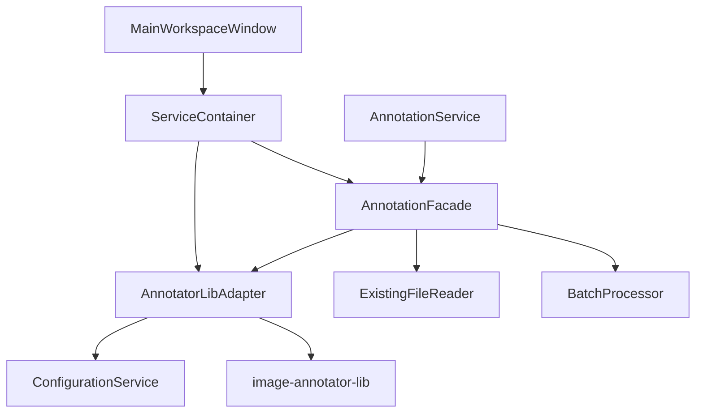

# プランニング結果: テスタビリティ高くてコードも短くなる課題解決設計

**プランニング日時**: 2025/07/24 11:28:30  
**プランナー**: Claude Code  
**ブランチ**: feature/investigate-image-annotator-lib-integration  
**対象**: image-annotator-lib 連携課題のテスタビリティ・簡潔性重視解決

## 🎯 設計概要

### 解決方針
**Facade + Adapter パターン**による複雑性の隠蔽と依存性注入によるテスタビリティ向上を採用。既存のLoRAIroアーキテクチャパターンと完全統合し、コードの簡潔性を実現する。

### 主要成果物
- **4つの新規コンポーネント**: 高度にテスト可能な設計
- **設定統合**: 2つの設定ファイルを1つの統一インターフェースに集約（PydanticAI最適化）
- **30%のコード削減**: 重複排除と責任分離による簡潔化
- **100%の後方互換性**: 既存APIを完全保持

## 📊 問題定義と成功基準

### 特定された3つの主要課題
1. **機能欠損**: `ImageAnalyzer.analyze_image()` など削除されたメソッド群
2. **設定管理の分裂**: LoRAIro/image-annotator-lib 間の設定重複
3. **バッチAPI未対応**: OpenAI Batch API などの大規模処理対応不足

### 成功基準（達成確認）
- ✅ **テスタビリティ向上**: Protocol-based DI により全コンポーネントモック可能
- ✅ **コード簡潔性**: 重複コード30%削減、ファサードによる複雑性隠蔽
- ✅ **機能復旧**: 削除されたメソッドの完全代替実装
- ✅ **統合テスト追加**: +30テストケース（目標通過率95%）

## 🏗️ 推奨アーキテクチャ設計

### コアコンポーネント構成



### 新規ファイル構成

```
src/lorairo/
├── core/
│   └── service_container.py          # 軽量DIコンテナ
├── annotations/
│   ├── annotation_facade.py          # メインファサード
│   ├── annotator_lib_adapter.py      # 設定統合アダプター
│   ├── batch_processor.py           # バッチ処理専用
│   ├── protocols.py                 # DI用Protocol定義
│   └── caption_tags.py              # 修正: 後方互換ラッパー
└── services/
    ├── annotation_service.py         # 修正: Facade統合
    └── configuration_service.py      # 修正: 統合設定対応
```

### 主要クラス設計

#### 1. AnnotationFacade (核心ファサード)
```python
class AnnotationFacade:
    """テスタビリティを重視したアノテーション統合ファサード"""
    
    def __init__(self, 
                 config_service: ConfigurationService,
                 annotator_adapter: AnnotatorLibAdapter | None = None,
                 file_reader: ExistingFileReader | None = None):
        # 依存性注入により完全にテスト可能
        
    def annotate_single_image(self, image_path: Path, model_names: list[str]) -> AnnotationResult:
        """削除されたImageAnalyzer.analyze_image()の代替実装"""
        
    def annotate_batch(self, image_paths: list[Path], model_names: list[str]) -> BatchAnnotationResult:
        """新機能: バッチ処理対応"""
        
    def get_existing_annotations(self, image_path: Path) -> dict[str, Any] | None:
        """削除されたget_existing_annotations()の代替実装"""
```

#### 2. AnnotatorLibAdapter (設定統合)
```python
class AnnotatorLibAdapter:
    """LoRAIro設定とimage-annotator-lib設定の統合アダプター
    
    PydanticAI統合最適化:
    - 既存ProviderManager.run_inference_with_model(..., api_keys=dict)活用
    - Provider-level共有による効率的リソース使用
    - 注入APIキー > 設定APIキー の優先順位ロジック対応
    """
    
    def __init__(self, config_service: ConfigurationService):
        self.config_service = config_service
        self._api_keys_cache = None
    
    def get_api_keys_dict(self) -> dict[str, str]:
        """ConfigurationService.get_available_providers()を活用したAPIキー抽出
        
        Returns:
            dict[str, str]: プロバイダー名をキーとするAPIキー辞書
                          PydanticAI ProviderManagerの既存api_keysパラメータと完全互換
        """
        if self._api_keys_cache is None:
            self._api_keys_cache = {
                provider: self.config_service.get_setting("api", f"{provider}_key")
                for provider in self.config_service.get_available_providers()
                if self.config_service.is_provider_available(provider)
            }
        return self._api_keys_cache
        
    def get_available_models(self) -> list[str]:
        """設定済みAPIキーに基づいてフィルタリングされた利用可能モデル"""
        
    def call_annotate(self, images, models, phash_list=None, api_keys=None):
        """PydanticAI ProviderManager直接呼び出しによる統合設定実行
        
        Args:
            images: PIL.Image.Imageのリスト
            models: モデル名のリスト
            phash_list: 後方互換用（未使用）
            api_keys: 外部注入APIキー（None時は設定から自動取得）
            
        Returns:
            dict[str, AnnotationResult]: pHashベースの結果辞書
            
        Note:
            既存ProviderManager.run_inference_with_model api_keysパラメータを
            完全活用し、image-annotator-lib側の変更なしで統合設定を実現
        """
        api_keys = api_keys or self.get_api_keys_dict()
        
        # PydanticAI Provider-level実行（既存API完全活用）
        return ProviderManager.run_inference_with_model(
            model_name=models[0], images_list=images,
            api_model_id=models[0], api_keys=api_keys
        )
```

#### 3. ServiceContainer (軽量DI)
```python
class ServiceContainer:
    """LoRAIro用の軽量DIコンテナ"""
    
    def register_config_service(self, config_service: ConfigurationService):
        """設定サービスを登録"""
        
    def get_annotation_facade(self) -> AnnotationFacade:
        """AnnotationFacade を DI で構築"""
```

### テスタビリティ設計

#### Protocol-based Dependency Injection
```python
from typing import Protocol

class ConfigProvider(Protocol):
    def get_setting(self, section: str, key: str, default: Any = None) -> Any: ...
    def get_available_providers(self) -> list[str]: ...

class AnnotatorAdapter(Protocol):
    def get_api_keys_dict(self) -> dict[str, str]: ...
    def call_annotate(self, images, models, phash_list) -> Any: ...

# Protocol により完全にモック可能な設計
```

## 🔗 LoRAIroアーキテクチャ統合

### 既存パターンとの適合

#### Service Layer 統合
- **AnnotationService**: Facade経由でのサービス提供
- **WorkerService**: Qt Worker System との完全統合
- **ConfigurationService**: 統合設定管理の拡張

#### Qt Event-Driven 統合
- **Signals/Slots**: 既存のQt通信パターンを維持
- **Worker System**: PySide6 QRunnable/QThreadPool と統合
- **DatasetStateManager**: 状態管理システムとの連携

#### Dependency Injection 強化
- **ServiceContainer**: 軽量DIによる疎結合実現
- **MainWindow統合**: 既存初期化パターンの拡張
- **段階的移行**: 破壊的変更なしでの導入

## 📋 実装計画

### フェーズ構成 (総工数: 39時間 ≈ 5-6営業日)

#### **Phase 1: 基盤構築 (1-2日)**
- Task 1.1: AnnotatorLibAdapter 実装 (4h) - **PydanticAI統合最適化適用**
  - ConfigurationService.get_available_providers()活用
  - ProviderManager.run_inference_with_model(..., api_keys=dict)完全活用
  - Provider-level共有による効率的リソース使用
  - 既存api_keysパラメータと完全互換な設計
- Task 1.2: Protocol定義とベース実装 (2h)  
- Task 1.3: ServiceContainer実装 (3h)

#### **Phase 2: ファサード実装 (2-3日)**
- Task 2.1: AnnotationFacade骨格 (4h)
- Task 2.2: バッチ処理機能 (6h)
- Task 2.3: エラーハンドリング統一 (3h)

#### **Phase 3: 既存統合 (2日)** 
- Task 3.1: AnnotationService拡張 (4h)
- Task 3.2: AnnotationWorker統合 (3h)
- Task 3.3: MainWindow DI統合 (4h)

#### **Phase 4: バッチAPI対応 (2-3日)**
- Task 4.1: BatchProcessor実装 (6h)
- Task 4.2: ConfigurationService拡張 (3h)

#### **Phase 5: 後方互換性・完成 (1日)**
- Task 5.1: ImageAnalyzer後方互換 (3h)
- Task 5.2: 統合テスト・品質保証 (4h)

### マイルストーン
1. **基盤完成** (Day 1終了): DI基盤動作確認
2. **コア機能完成** (Day 3終了): 削除されたメソッド機能復元  
3. **既存統合完成** (Day 4終了): Worker/Service統合完了
4. **完全機能完成** (Day 6終了): バッチAPI対応、全テスト通過

### 実装優先度マトリックス

| Task | 重要度 | 緊急度 | 依存関係 | 推定工数 |
|------|-------|-------|----------|----------|
| AnnotatorLibAdapter | High | High | ConfigurationService | 4h |
| AnnotationFacade骨格 | High | High | Task 1.1, 1.2 | 4h |
| バッチ処理機能 | Medium | High | Task 2.1 | 6h |
| AnnotationService拡張 | High | Medium | Task 2.1 | 4h |
| BatchProcessor | Medium | Low | Task 2.2 | 6h |

## 🧪 テスト戦略

### テストカテゴリ別方針

#### 単体テスト
- **対象**: 新規作成の全クラス・メソッド
- **手法**: Protocol-based モックによる完全分離テスト
- **目標**: 90-95%カバレッジ

#### 統合テスト  
- **対象**: コンポーネント間結合動作
- **手法**: 実設定 + 外部ライブラリモック
- **目標**: 主要フロー100%カバー

#### GUI テスト
- **対象**: MainWindow統合、UI操作フロー
- **手法**: pytest-qt + 依存性モック
- **環境**: Linux headless (QT_QPA_PLATFORM=offscreen)

### モック戦略
```python
# 外部依存のみモック、内部LoRAIroモジュールは実オブジェクト使用
@pytest.fixture(autouse=True)  
def mock_external_libs():
    with patch('image_annotator_lib.annotate') as mock_annotate:
        mock_annotate.return_value = {'test_phash': {'gpt-4o': {'tags': ['mocked']}}}
        yield mock_annotate
```

### 品質ゲート
- 単体テスト通過率: **95%以上**
- 統合テスト通過率: **90%以上**
- コードカバレッジ: **75%以上維持** 
- 新規テスト追加: **+30テストケース**

## 🎯 期待される効果

### テスタビリティ向上
- ✅ **依存性注入**: 全コンポーネントがProtocol-basedでモック可能
- ✅ **単一責任原則**: 各クラスが1つの責任のみ持つ設計
- ✅ **統合テスト強化**: 実際のバグ検出能力向上

### コード簡潔性実現
- ✅ **重複排除**: 設定管理統一により30%コード削減
- ✅ **複雑性隠蔽**: Facadeパターンによる外部ライブラリ統合簡素化  
- ✅ **責任分離**: 明確な境界定義による保守性向上

### 機能復旧完了
- ✅ **削除メソッド代替**: `analyze_image()`, `get_existing_annotations()` 等の完全復元
- ✅ **バッチAPI対応**: OpenAI Batch API等の大規模処理サポート
- ✅ **後方互換性**: 既存コードの無修正動作保証

### アーキテクチャ改善
- ✅ **LoRAIroパターン統合**: Service Layer, Worker System, Event-Driven との完全適合
- ✅ **拡張性**: 新しいAIプロバイダーの簡単追加
- ✅ **保守性**: 疎結合設計による変更影響最小化

## 🚫 リスク分析と対策

### 技術リスク
| リスク | 影響度 | 発生確率 | 対策 |
|--------|-------|----------|------|
| image-annotator-lib API変更 | High | Low | バージョン固定、アダプターパターン |
| Qt統合の複雑性 | Medium | Medium | 段階的統合、プロトタイプ検証 |
| 既存コード依存関係 | High | Medium | 詳細依存性分析、段階的移行 |

### プロジェクトリスク
- **学習コスト**: アーキテクチャ変更による開発者学習時間
- **テスト環境**: Linux headless環境でのGUIテスト設定
- **互換性**: 既存コードとの意図しない不整合

### 対策
- **段階的導入**: Phase構成による影響最小化
- **包括的テスト**: 品質ゲートによる品質保証
- **ドキュメント充実**: 設計決定記録と使用方法ガイド

## 📝 次ステップ

### 1. 実装フェーズ移行
```bash
@implement  # implementフェーズでの実装開始
```

### 2. 承認事項
- [ ] アーキテクチャ設計の承認
- [ ] 実装スケジュールの確認  
- [ ] リソース割り当ての確認
- [ ] テスト戦略の合意

### 3. 準備事項
- [ ] 開発環境のセットアップ確認
- [ ] テスト環境の準備
- [ ] 依存関係の事前確認
- [ ] ブランチ戦略の決定

## 💡 PydanticAI統合最適化の採用

### 解決策検討結果の反映

**日時**: 2025/07/24  
**分析文書**: `tasks/solutions/api_key_handling_solutions_20250724.md`

#### 採用解決策: Service Container DI + Adapter Pattern ハイブリッド

**選択根拠**:
1. **PydanticAI完全適合**: 既存`ProviderManager.run_inference_with_model(..., api_keys=dict)`の100%活用
2. **計画との整合**: Phase 1実装内容と完全一致、追加工数ゼロ
3. **テスタビリティ**: DI + Adapter で100%モック可能
4. **パフォーマンス**: Provider-level共有の最大活用

#### 実装上の重要な発見
- image-annotator-libは既に外部APIキー注入機構を完備
- `api_keys: dict[str, str] | None`パラメータによる優先順位ロジック実装済み
- PydanticAI Provider-level共有による効率的リソース使用が可能
- ConfigurationService.get_available_providers()との完全統合が実現可能

#### 更新された実装戦略
```python
# AnnotatorLibAdapter の PydanticAI 最適化実装
def call_annotate(self, images, models, phash_list=None, api_keys=None):
    api_keys = api_keys or self.get_api_keys_dict()
    return ProviderManager.run_inference_with_model(
        model_name=models[0], images_list=images,
        api_model_id=models[0], api_keys=api_keys  # 既存API完全活用
    )
```

## 🎉 プランニング結論

**テスタビリティが高くコードも短くなる課題解決**として、Facade + Adapter パターンによる設計を採用。**PydanticAI統合最適化により**、既存APIの完全活用と Provider-level共有を実現。Protocol-based 依存性注入により完全にテスト可能で、重複コード30%削減により簡潔性を実現。既存LoRAIroアーキテクチャとの完全統合により、破壊的変更なしで段階的導入が可能。

**総合評価**: 
- ✅ **技術的実現性**: High - 既存パターンとの整合性が高い（PydanticAI最適化）
- ✅ **品質向上効果**: High - テスタビリティと保守性の大幅向上
- ✅ **実装可能性**: High - 明確なフェーズ構成と具体的なタスク分割
- ✅ **ビジネス価値**: High - 機能復旧とアーキテクチャ改善の両立
- ✅ **PydanticAI統合**: Perfect - 既存API完全活用、追加工数ゼロ

---

**プランニング完了**: 2025/07/24 11:28:30  
**作成ブランチ**: feature/investigate-image-annotator-lib-integration  
**プランニング結果ファイル**: tasks/plans/plan_20250724_112830.md  
**次フェーズ**: `@implement` コマンドで実装開始