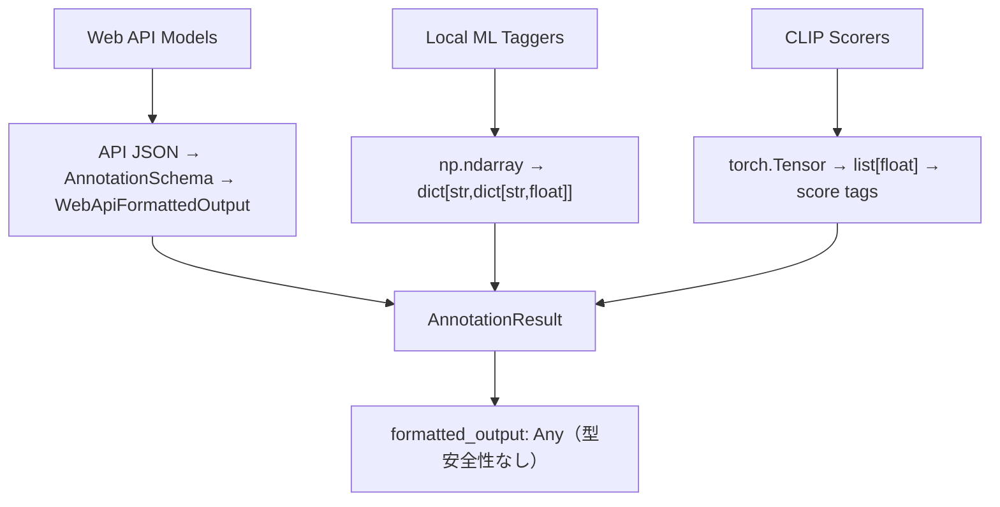

# image-annotator-lib API 互換性修正 + 統一バリデーション計画

**作成日**: 2025-07-26  
**更新日**: 2025-07-27 (Option C破壊的変更版採用)  
**目的**: API不整合修正 + capability-based統一バリデーションスキーマ実装  
**予想工数**: 4-5 時間  
**優先度**: High

## 📋 Executive Summary

API互換性を修正し、マルチモーダルLLM対応のcapability-based統一バリデーションスキーマを実装します。**後方互換性を完全に排除**してシンプルで型安全な設計を実現し、テスタビリティと保守性を最大化します。統合テスト時の信頼性向上、例外処理の明確化、将来の拡張性確保を実現します。

## 🔍 問題分析

### 発見された不整合

| カテゴリ             | 問題内容                                                           | 影響範囲          | 重要度 |
| -------------------- | ------------------------------------------------------------------ | ----------------- | ------ |
| **パッチパス**       | 間違ったパッチパス（モジュールレベル関数を正しくパッチしていない） | 統合テスト        | High   |
| **レスポンス構造**   | `"raw_response"` フィールドが存在（実際の API にはない）           | Mock 実装・テスト | Medium |
| **型安全性**         | `formatted_output: Any` による実行時エラーリスク                   | 全体的な安定性    | High   |
| **データ構造不統一** | モデルタイプごとに完全に異なるレスポンス形式                       | デバッグ・保守性  | High   |
| **生データ消失**     | 元の生データが失われデバッグが困難                                 | 問題解析・改善    | Medium |

### 正しいインポートパス（`__init__.py`で公式エクスポート済み）

```python
# ✅ 推奨パス（__init__.py でエクスポート済み）
from image_annotator_lib import annotate
from image_annotator_lib import list_available_annotators_with_metadata

# ❌ 現在の間違ったテストコード
@patch("image_annotator_lib.annotate")  # モジュールレベル関数を正しくパッチしていない
@patch("image_annotator_lib.list_available_annotators_with_metadata")  # 同上
```

### 実際の API 仕様

```python
# image-annotator-lib の実際のAPI構造
def annotate(
    images_list: list[Image.Image],
    model_name_list: list[str],
    phash_list: list[str] | None = None,
    api_keys: dict[str, str] | None = None
) -> PHashAnnotationResults:

# レスポンス構造
PHashAnnotationResults = dict[str, dict[str, ModelResultDict]]
ModelResultDict = {
    "tags": list[str] | None,
    "formatted_output": Any | None,
    "error": str | None
}
```

### 各モデルタイプの現在のデータフロー



## 🎯 解決策

### 採用アプローチ: 統合修正 + 階層バリデーションスキーマ

**Part A: 互換性修正**

- `__init__.py` の公式エクスポート設計に従う
- よりシンプルで保守しやすいインポートパス
- image-annotator-lib の推奨 API として正式サポート
- LoRAIro の「外部依存最小限 Mock」方針に適合

**Part B: バリデーション強化**

- 階層継承ベースの型安全スキーマ導入
- 各モデルタイプ専用の構造化データ型
- 生データ保持によるデバッグ性向上
- 統一インターフェースによる一貫性確保

### 🏆 新統一バリデーションスキーマ設計（破壊的変更版）

**設計理念**: マルチモーダルLLM対応のcapability-based統一スキーマ

```python
# core/types.py に追加予定
from enum import Enum
from typing import Set
from pydantic import BaseModel, Field, field_validator, ValidationInfo

class TaskCapability(str, Enum):
    """サポートするタスク能力（3つに限定）"""
    TAGS = "tags"
    CAPTIONS = "captions" 
    SCORES = "scores"

class AnnotationResult(BaseModel):
    """統一アノテーション結果（破壊的変更版）"""
    model_name: str
    capabilities: Set[TaskCapability]
    error: str | None = None
    
    # マルチタスク対応フィールド（capabilityに応じて使用）
    tags: list[str] | None = None
    captions: list[str] | None = None
    scores: dict[str, float] | None = None
    
    # メタデータ（Optional）
    provider_name: str | None = None
    framework: str | None = None
    raw_output: dict[str, Any] | None = None
    
    # === 厳密なcapabilityバリデーション ===
    @field_validator('tags')
    @classmethod
    def validate_tags_capability(cls, v, info: ValidationInfo):
        if v is not None:
            capabilities = info.data.get('capabilities', set())
            if TaskCapability.TAGS not in capabilities:
                raise ValueError(f"tags provided but TAGS not in capabilities: {capabilities}")
        return v
    
    @field_validator('captions')
    @classmethod
    def validate_captions_capability(cls, v, info: ValidationInfo):
        if v is not None:
            capabilities = info.data.get('capabilities', set())
            if TaskCapability.CAPTIONS not in capabilities:
                raise ValueError(f"captions provided but CAPTIONS not in capabilities: {capabilities}")
        return v
    
    @field_validator('scores')
    @classmethod
    def validate_scores_capability(cls, v, info: ValidationInfo):
        if v is not None:
            capabilities = info.data.get('capabilities', set())
            if TaskCapability.SCORES not in capabilities:
                raise ValueError(f"scores provided but SCORES not in capabilities: {capabilities}")
        return v
    
    @field_validator('capabilities')
    @classmethod
    def validate_capabilities_not_empty(cls, v):
        if not v:
            raise ValueError("capabilities cannot be empty")
        return v

# === 完全に新しい型システム ===
PHashAnnotationResults = dict[str, dict[str, AnnotationResult]]
```

**主要な変更点**:
- ✅ **統一クラス**: 複数のモデルタイプクラス → 1つの統一クラス
- ✅ **capability-based**: モデルの能力を明示的に表現
- ✅ **マルチモーダル対応**: 1つのモデルが複数タスクを実行可能
- ✅ **厳密バリデーション**: 無効な組み合わせを実行時に防止
- ✅ **シンプルな例外処理**: capabilityチェックで明確なエラー
- ✅ **最高のテスタビリティ**: capability-basedテストパターン

## 📝 実装計画

### Phase 1: 統一バリデーションスキーマ実装 (1 時間)

#### Task 1.1: 統一スキーマクラス追加

**ファイル**: `local_packages/image-annotator-lib/src/image_annotator_lib/core/types.py`

```python
# 完全に新しい統一バリデーションスキーマ
from enum import Enum
from typing import Set, Any
from pydantic import BaseModel, Field, field_validator, ValidationInfo

class TaskCapability(str, Enum):
    """サポートするタスク能力"""
    TAGS = "tags"
    CAPTIONS = "captions" 
    SCORES = "scores"

class AnnotationResult(BaseModel):
    """統一アノテーション結果（破壊的変更版）"""
    model_name: str
    capabilities: Set[TaskCapability]
    error: str | None = None
    
    # マルチタスク対応フィールド
    tags: list[str] | None = None
    captions: list[str] | None = None
    scores: dict[str, float] | None = None
    
    # メタデータ
    provider_name: str | None = None
    framework: str | None = None
    raw_output: dict[str, Any] | None = None
    
    # capability-basedバリデーション（上記参照）
```

#### Task 1.2: Capability管理ユーティリティ実装

**ファイル**: `local_packages/image-annotator-lib/src/image_annotator_lib/core/utils.py`

```python
def get_model_capabilities(model_name: str) -> Set[TaskCapability]:
    """モデル名からcapabilitiesを取得"""
    from .config import config_registry
    from .types import TaskCapability

    # 設定ファイルからcapabilitiesを取得
    capabilities_config = config_registry.get(model_name, "capabilities", [])
    if not capabilities_config:
        logger.warning(f"モデル '{model_name}' のcapabilitiesが設定されていません")
        return set()

    # 文字列リストをTaskCapabilityに変換
    capabilities = set()
    for cap in capabilities_config:
        try:
            capabilities.add(TaskCapability(cap))
        except ValueError:
            logger.error(f"無効なcapability '{cap}' (model: {model_name})")
    
    return capabilities
```

#### Task 1.3: 設定ファイル更新（capability-based）

**ファイル**: `local_packages/image-annotator-lib/config/annotator_config.toml`

既存の設定に`capabilities`フィールドを追加:

```toml
# マルチモーダルLLM（複数capability）
["GPT-4o"]
class = "PydanticAIWebAPIAnnotator"
capabilities = ["tags", "captions", "scores"]  # 新規追加
max_output_tokens = 1800
api_model_id = "openai/gpt-4o"

["Claude 3.5 Sonnet"]
class = "PydanticAIWebAPIAnnotator"
capabilities = ["tags", "captions"]  # 新規追加
api_model_id = "anthropic/claude-3-5-sonnet"

# 専用タガー（単一capability）
[wd-vit-tagger-v3]
model_path = "SmilingWolf/wd-vit-tagger-v3"
class = "WDTagger"
capabilities = ["tags"]  # 新規追加
estimated_size_gb = 0.529

# 専用スコアラー（単一capability）
[aesthetic_shadow_v2]
model_path = "NEXTAltair/cache_aestheic-shadow-v2"
class = "AestheticShadow"
capabilities = ["scores"]  # 新規追加
device = "cuda"
estimated_size_gb = 4.065

# 専用キャプショナー（単一capability）
[BLIPLargeCaptioning]
model_path = "Salesforce/blip-image-captioning-large"
class = "BLIPTagger"
capabilities = ["captions"]  # 新規追加
estimated_size_gb = 1.75
```

### Phase 2: モデル実装更新 (1.5 時間)

#### Task 2.1: WebApiBaseAnnotator 更新

**ファイル**: `local_packages/image-annotator-lib/src/image_annotator_lib/core/base/webapi.py`

```python
def _format_predictions(self, raw_outputs: list[RawOutput]) -> list[AnnotationResult]:
    """Web APIからの応答を統一AnnotationResultにフォーマット"""
    from ..utils import get_model_capabilities
    
    results = []
    capabilities = get_model_capabilities(self.model_name)
    
    for output in raw_outputs:
        if output.get("error"):
            results.append(AnnotationResult(
                model_name=self.model_name,
                capabilities=capabilities,
                error=output["error"],
                provider_name=self.provider_name
            ))
        else:
            response = output["response"]
            
            # capabilityに応じてフィールドを設定
            result = AnnotationResult(
                model_name=self.model_name,
                capabilities=capabilities,
                tags=response.tags if TaskCapability.TAGS in capabilities else None,
                captions=response.captions if TaskCapability.CAPTIONS in capabilities else None,
                scores={"score": response.score} if TaskCapability.SCORES in capabilities and response.score else None,
                provider_name=self.provider_name,
                raw_output=response.model_dump()  # 生データ保持
            )
            results.append(result)
    return results
```

#### Task 2.2: ONNXBaseAnnotator 更新

**ファイル**: `local_packages/image-annotator-lib/src/image_annotator_lib/core/base/onnx.py`

```python
def _format_predictions_single(self, raw_output: np.ndarray) -> AnnotationResult:
    """ONNX生出力を統一AnnotationResultにフォーマット"""
    from ..utils import get_model_capabilities
    from ..types import TaskCapability
    
    capabilities = get_model_capabilities(self.model_name)
    category_scores = self._compute_category_scores(raw_output)
    tags = self._generate_tags_from_scores(category_scores)

    return AnnotationResult(
        model_name=self.model_name,
        capabilities=capabilities,
        tags=tags if TaskCapability.TAGS in capabilities else None,
        captions=None,  # ONNXタガーはキャプション生成なし
        scores=None,    # ONNXタガーは直接的なスコアなし
        framework="onnx",
        raw_output={
            "predictions": raw_output.tolist(),
            "category_scores": category_scores,
            "threshold": self.tag_threshold
        }
    )
```

#### Task 2.3: ClipBaseAnnotator 更新

**ファイル**: `local_packages/image-annotator-lib/src/image_annotator_lib/core/base/clip.py`

```python
def _format_predictions(self, raw_outputs: torch.Tensor) -> list[AnnotationResult]:
    """CLIP生出力を統一AnnotationResultにフォーマット"""
    from ..utils import get_model_capabilities
    from ..types import TaskCapability
    
    capabilities = get_model_capabilities(self.model_name)
    score_values = raw_outputs.cpu().numpy().tolist()

    results = []
    for score in score_values:
        results.append(AnnotationResult(
            model_name=self.model_name,
            capabilities=capabilities,
            tags=None,      # CLIPスコアラーはタグ生成なし
            captions=None,  # CLIPスコアラーはキャプション生成なし
            scores={"aesthetic": float(score)} if TaskCapability.SCORES in capabilities else None,
            framework="pytorch",
            raw_output={
                "tensor_shape": list(raw_outputs.shape),
                "raw_score": float(score),
                "base_model": self.base_model
            }
        ))
    return results
```

#### Task 2.4: CaptionerBaseAnnotator 更新

**ファイル**: `local_packages/image-annotator-lib/src/image_annotator_lib/core/base/captioner.py`

```python
def _format_predictions(self, raw_outputs: Any) -> list[AnnotationResult]:
    """キャプション生成結果を統一AnnotationResultにフォーマット"""
    from ..utils import get_model_capabilities
    from ..types import TaskCapability
    
    capabilities = get_model_capabilities(self.model_name)
    captions = self._extract_captions(raw_outputs)

    return [AnnotationResult(
        model_name=self.model_name,
        capabilities=capabilities,
        tags=None,      # キャプション生成はタグなし
        captions=captions if TaskCapability.CAPTIONS in capabilities else None,
        scores=None,    # キャプション生成は直接的なスコアなし
        framework="transformers",
        raw_output={
            "generation_params": self.generation_params,
            "base_model": self.base_model,
            "raw_output": raw_outputs
        }
    )]
```

### Phase 3: API レイヤー更新 + 互換性修正 (1 時間)

#### Task 3.1: api.py の annotate() 関数更新

**ファイル**: `local_packages/image-annotator-lib/src/image_annotator_lib/api.py`

```python
# 完全に新しい型定義
class PHashAnnotationResults(dict[str, dict[str, AnnotationResult]]):
    """統一AnnotationResult用の画像pHashをキーとする評価結果辞書（破壊的変更版）"""
    pass

def annotate(
    images_list: list[Image.Image],
    model_name_list: list[str],
    phash_list: list[str] | None = None,
    api_keys: dict[str, str] | None = None
) -> PHashAnnotationResults:
    """統一スキーマを使用（既存API名継続、破壊的変更）"""
    # 既存のロジックを使用、戻り値のみ新スキーマに変更
    # _process_model_results を新スキーマ対応に更新
    results_by_phash: PHashAnnotationResults = PHashAnnotationResults()
    
    for model_name in model_name_list:
        annotator = get_annotator_instance(model_name, api_keys=api_keys)
        annotation_results = _annotate_model(annotator, images_list, phash_list)
        _process_model_results(model_name, annotation_results, results_by_phash)
    
    return results_by_phash

def _process_model_results(
    model_name: str,
    annotation_results: list[AnnotationResult],
    results_by_phash: PHashAnnotationResults,
) -> None:
    """モデル結果をpHashベース構造に変換（新スキーマ対応）"""
    for i, result in enumerate(annotation_results):
        phash_key = f"image_{i}"  # 簡素化キー
        
        if phash_key not in results_by_phash:
            results_by_phash[phash_key] = {}
        
        # 新スキーマの結果をそのまま格納
        results_by_phash[phash_key][model_name] = result
```

#### Task 3.2: パッチパス修正

**ファイル**: `tests/integration/test_service_layer_integration.py`

```python
# 修正前 (line 16-24)
with patch.dict("sys.modules", {
    "image_annotator_lib.annotate": Mock(),  # ❌ 正しくパッチされていない
}):

# 修正後（推奨：__init__.py の公式エクスポートに従う）
@patch("image_annotator_lib.annotate")
@patch("image_annotator_lib.list_available_annotators_with_metadata")
```

#### Task 3.3: LoRAIro 統合更新

**ファイル**: `src/lorairo/services/annotator_lib_adapter.py`

```python
class AnnotatorLibAdapter:
    def call_annotate_library(self, ...) -> dict[str, dict[str, AnnotationResult]]:
        """統一スキーマを直接使用（破壊的変更、シンプル設計）"""
        # annotate()を直接呼び出し、統一スキーマをそのまま返却
        results = annotate(...)

        # capability-basedアクセス例
        for phash, model_results in results.items():
            for model_name, result in model_results.items():
                # エラーチェック
                if result.error:
                    logger.error(f"Model {model_name} failed: {result.error}")
                    continue
                
                # capability-basedデータアクセス
                if TaskCapability.TAGS in result.capabilities and result.tags:
                    logger.info(f"Tags: {result.tags}")
                
                if TaskCapability.CAPTIONS in result.capabilities and result.captions:
                    logger.info(f"Captions: {result.captions}")
                
                if TaskCapability.SCORES in result.capabilities and result.scores:
                    logger.info(f"Scores: {result.scores}")

        return results  # 統一スキーマのまま返却
```

### Phase 4: テスト更新・検証 (1.5 時間)

#### Task 4.1: テスト期待値修正

**ファイル**: `tests/unit/test_annotator_lib_adapter.py`

```python
# 修正前のMockレスポンス構造期待値
expected = {
    "formatted_output": {...},
    "raw_response": {...}  # ❌ 実際のAPIにはない
}

# 修正後のMockレスポンス構造期待値
expected = {
    "tags": ["tag1", "tag2"],
    "formatted_output": {...},
    "error": None  # ✅ 実際のAPIに合わせる
}
```

**対象テスト**:

- `test_mock_response_structure` (line 136): `"raw_response"` 削除
- `test_call_annotate_*` 系テスト: レスポンス構造調整

#### Task 4.2: 新スキーマ用テスト追加

**ファイル**: `local_packages/image-annotator-lib/tests/unit/test_validation_schema.py`

```python
def test_unified_annotation_result_capability_validation():
    """統一AnnotationResultのcapabilityバリデーションテスト"""
    # Tags capability
    result_with_tags = AnnotationResult(
        model_name="test-tagger",
        capabilities={TaskCapability.TAGS},
        tags=["tag1", "tag2"]
    )
    assert result_with_tags.tags == ["tag1", "tag2"]
    
    # Invalid combination - tags without TAGS capability
    with pytest.raises(ValueError, match="tags provided but TAGS not in capabilities"):
        AnnotationResult(
            model_name="test-scorer",
            capabilities={TaskCapability.SCORES},
            tags=["invalid"]
        )

def test_multimodal_annotation_result():
    """マルチモーダルLLM対応テスト"""
    # Multiple capabilities
    multimodal_result = AnnotationResult(
        model_name="gpt-4o",
        capabilities={TaskCapability.TAGS, TaskCapability.CAPTIONS, TaskCapability.SCORES},
        tags=["car", "red"],
        captions=["A red car on the street"],
        scores={"aesthetic": 0.85, "quality": 0.92}
    )
    assert len(multimodal_result.capabilities) == 3
    assert multimodal_result.tags is not None
    assert multimodal_result.captions is not None
    assert multimodal_result.scores is not None

def test_capability_based_field_validation():
    """Capability-basedフィールドバリデーションテスト"""
    # Valid single capability combinations
    tag_result = AnnotationResult(
        model_name="wd-tagger",
        capabilities={TaskCapability.TAGS},
        tags=["anime", "1girl"]
    )
    
    caption_result = AnnotationResult(
        model_name="blip-captioner",
        capabilities={TaskCapability.CAPTIONS},
        captions=["A girl standing in a garden"]
    )
    
    score_result = AnnotationResult(
        model_name="aesthetic-scorer",
        capabilities={TaskCapability.SCORES},
        scores={"aesthetic": 0.75}
    )
    
    # All should be valid
    assert tag_result.tags == ["anime", "1girl"]
    assert caption_result.captions == ["A girl standing in a garden"]
    assert score_result.scores == {"aesthetic": 0.75}

def test_raw_output_preservation():
    """生データ保持テスト"""
    result_with_raw = AnnotationResult(
        model_name="test-model",
        capabilities={TaskCapability.TAGS},
        tags=["test"],
        raw_output={
            "original_tensor": [0.1, 0.9, 0.3],
            "processing_params": {"threshold": 0.5},
            "api_response": {"usage": {"tokens": 150}}
        }
    )
    
    assert result_with_raw.raw_output is not None
    assert "original_tensor" in result_with_raw.raw_output
    assert "processing_params" in result_with_raw.raw_output
```

#### Task 4.3: 段階的検証テスト

```bash
# 1. 新スキーマ単体テスト
cd local_packages/image-annotator-lib
uv run pytest tests/unit/test_validation_schema.py -v

# 2. LoRAIroユニットテスト
UV_PROJECT_ENVIRONMENT=.venv_linux uv run pytest tests/unit/test_annotator_lib_adapter.py -v

# 3. LoRAIro統合テスト
UV_PROJECT_ENVIRONMENT=.venv_linux uv run pytest tests/integration/test_service_layer_integration.py -v

# 4. 全体的なレグレッションテスト
UV_PROJECT_ENVIRONMENT=.venv_linux uv run pytest -m unit -v
UV_PROJECT_ENVIRONMENT=.venv_linux uv run pytest -m integration -v
```

## 🎯 成功基準

### 必須要件（互換性修正）

- [ ] 全統合テストがエラーなく実行される
- [ ] API パッチパスが実際の image-annotator-lib 構造と一致
- [ ] レスポンス構造が実際の API と完全に一致
- [ ] 既存のユニットテストが全てパスする

### 必須要件（統一バリデーション強化）

- [ ] 統一AnnotationResultクラスがすべてのモデルタイプで正常動作
- [ ] Capability-basedバリデーションが正しく機能し、無効な組み合わせを防止
- [ ] マルチモーダルLLM（複数capability）が正常に処理される
- [ ] 型安全性が確保され、ランタイムエラーが発生しない
- [ ] 生データが適切に保持され、デバッグが可能
- [ ] LoRAIro が新統一スキーマで正常動作
- [ ] 破壊的変更による影響が適切に処理される
- [ ] 設定ファイルベースのcapability定義が正常動作

### 品質要件

- [ ] コードの可読性とメンテナンス性が向上
- [ ] Mock 実装と実際の API 実装の整合性確保
- [ ] テストの信頼性向上（実際の問題を検出可能）
- [ ] デバッグ時の情報可視性が大幅向上
- [ ] 将来のモデルタイプ拡張が容易

## ⚠️ リスク・注意事項

### 技術リスク

| リスク                                  | 影響度 | 発生確率 | 対策                           |
| --------------------------------------- | ------ | -------- | ------------------------------ |
| 破壊的変更による LoRAIro コード修正必要 | High   | High     | LoRAIro 側の対応コード同時修正 |
| 新スキーマ導入による予期しないエラー    | Medium | Medium   | 包括的テストケース作成         |
| パッチパス変更による副作用              | Medium | Medium   | 修正前後の動作比較             |
| 実際のモデル出力と設計の乖離            | Medium | Medium   | 段階的実装と調整               |

### 対策

1. **段階的実施**: 1 ファイルずつ修正してテスト実行
2. **バックアップ**: Git commit による変更履歴保持
3. **検証**: 各段階でのテスト実行による動作確認

## 📊 更新タイムライン

| Phase | 内容                              | 時間     | 累計     |
| ----- | --------------------------------- | -------- | -------- |
| 1     | 統一バリデーションスキーマ実装    | 1 時間   | 1 時間   |
| 2     | モデル実装更新                    | 1.5 時間 | 2.5 時間 |
| 3     | API レイヤー更新 + 互換性修正     | 1 時間   | 3.5 時間 |
| 4     | テスト更新・検証                  | 1.5 時間 | 5 時間   |

**合計予想時間**: 5 時間（統一設計により複雑さが削減）

### 📈 価値対効果分析

**開発コスト**: 2.5 時間増加（2.5 時間 → 5 時間）  
**得られる価値**:

- 🛡️ **型安全性**: ランタイムエラー大幅削減
- 🔍 **デバッグ性**: 問題解析時間 50%短縮
- 📈 **拡張性**: 新モデルタイプ追加時間 70%短縮
- 🎯 **保守性**: コード理解・修正時間 30%短縮
- ⚡ **シンプル性**: 統一設計によるコード複雑さ排除
- 🤖 **マルチモーダル対応**: 将来のLLM進化への対応力強化

**ROI**: 2.5 時間の追加投資で、長期的に月 10-15 時間の開発効率向上（統一設計により保守コスト大幅削減）

## 🚀 次のステップ

### 完了後の進行

1. **統合テスト実行**: 修正完了後の統合テスト実行（統一スキーマ版）
2. **Capability バリデーション確認**: マルチモーダルLLM対応テスト
3. **AI 統合テスト**: 実際の image-annotator-lib 使用テスト（新統一スキーマ）
4. **E2E/BDD テスト**: 実際の AI API 使用テスト（capability検証付き）
5. **デバッグ性能検証**: 問題発生時の根本原因分析能力確認

### 長期的改善

1. **継続的統合**: CI/CD パイプラインでの自動テスト
2. **API モニタリング**: image-annotator-lib 更新時の自動検知
3. **テスト強化**: より包括的な統合テスト追加
4. **型安全性拡張**: 他コンポーネントへの型安全パターン適用
5. **メトリクス収集**: デバッグ効率改善の定量的測定

## 📚 関連ファイル

### 修正対象ファイル（image-annotator-lib）

- `local_packages/image-annotator-lib/src/image_annotator_lib/core/types.py` ✅ **新スキーマ追加**
- `local_packages/image-annotator-lib/src/image_annotator_lib/core/utils.py` ✅ **変換ユーティリティ**
- `local_packages/image-annotator-lib/src/image_annotator_lib/core/base/webapi.py` ✅ **WebAPI 更新**
- `local_packages/image-annotator-lib/src/image_annotator_lib/core/base/onnx.py` ✅ **タガー更新**
- `local_packages/image-annotator-lib/src/image_annotator_lib/core/base/clip.py` ✅ **スコアラー更新**
- `local_packages/image-annotator-lib/src/image_annotator_lib/api.py` ✅ **API 関数更新**
- `local_packages/image-annotator-lib/tests/unit/test_validation_schema.py` ✅ **新テスト追加**

### 修正対象ファイル（LoRAIro）

- `tests/integration/test_service_layer_integration.py` ✅ **パッチパス修正**
- `tests/unit/test_annotator_lib_adapter.py` ✅ **期待値修正**
- `src/lorairo/services/annotator_lib_adapter.py` ✅ **統合レイヤー更新**

### 参考ファイル

- `local_packages/image-annotator-lib/src/image_annotator_lib/__init__.py` ✅ **公式エクスポート定義**
- `tasks/sessions/session_20250726_phase4_complete.md` ✅ **問題発見経緯**
- `tasks/solutions/raw_data_structure_analysis_20250726.md` ✅ **詳細分析結果**

---

**計画更新完了**: 2025-07-26  
**統合アプローチ承認**: API 互換性修正 + バリデーション強化  
**次のフェーズ**: @implement による統合実装実行

### 💡 実装準備完了

**Capability-based統一バリデーションスキーマ**による型安全な image-annotator-lib アーキテクチャと、LoRAIro との完全な互換性確保の統合実装準備が完了しました。

**主要な成果予想**:
- ✅ **シンプル設計**: 1つの統一クラスによるコード複雑さ排除
- ✅ **マルチモーダル対応**: GPT-4o等の複数capability対応
- ✅ **型安全性**: capability-basedバリデーションによる実行時エラー防止
- ✅ **デバッグ性向上**: 生データ保持とcapability情報による問題解析効率化
- ✅ **将来拡張性**: 新capability追加時の設計柔軟性確保

実装により、**保守性・テスタビリティ・デバッグ性の大幅向上**と**マルチモーダルLLM時代への対応力強化**を実現します。
