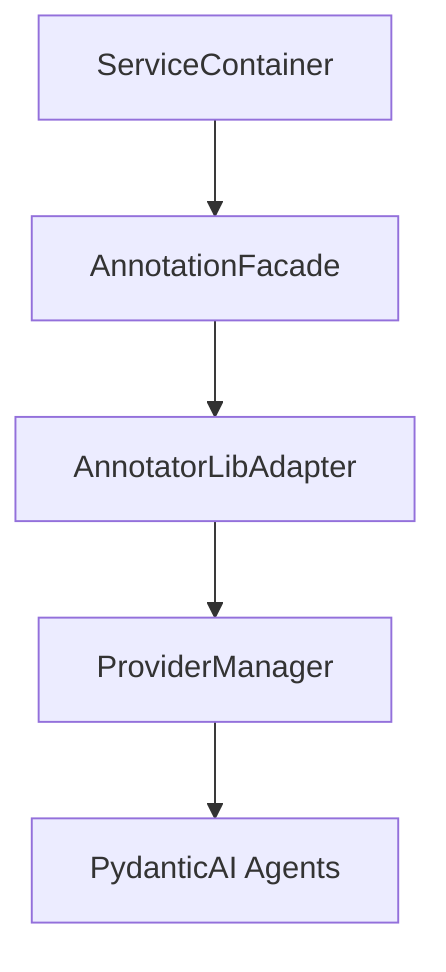

# APIキー渡し方法の解決策分析結果

**分析日時**: 2025/07/24  
**ブランチ**: feature/investigate-image-annotator-lib-integration  
**対象**: PydanticAI統合におけるAPIキーハンドリング最適化  
**分析者**: Claude Code

## 📋 分析概要

### 分析背景
LoRAIro/image-annotator-lib間の設定重複解決において、「ライブラリは設定値を受け取って設定できるようにする」という要件のもと、PydanticAI統合を考慮した最適なAPIキー渡し方法を検討。

### 分析プロセス
1. ✅ PydanticAI統合の現状分析
2. ✅ APIキー渡し方の解決策候補生成（10案）
3. ✅ 各解決策のPydanticAI適合性評価
4. ✅ LoRAIro統合要件との整合性確認
5. ✅ パフォーマンス・保守性評価
6. ✅ 最適解選択と推奨根拠
7. ✅ 解決策検討結果の文書化

## 🔍 PydanticAI現状分析

### 既存アーキテクチャ
- **PydanticAIProviderFactory**: Provider-level Agent factoryでAgent caching実装
- **ProviderManager**: `api_keys: dict[str, str] | None` パラメータで外部APIキー注入対応済み
- **優先順位ロジック**: 注入APIキー > 設定ファイルAPIキー > 環境変数の順で決定

### 重要な発見
```python
# 既存のapi_keys注入機構（ProviderManager.run_inference_with_model）
def run_inference_with_model(
    cls, model_name: str, images_list: list[Image.Image], 
    api_model_id: str, api_keys: dict[str, str] | None = None
) -> dict[str, AnnotationResult]:
    # 注入APIキーを優先する既存ロジック
    if api_keys and "anthropic" in api_keys:
        api_key = api_keys["anthropic"]
    else:
        api_key = config_registry.get(model_name, "api_key", default="")
```

## 🛠️ 解決策候補（10案）

### 1. Direct Injection via ProviderManager ⭐️
**概要**: 既存`api_keys`パラメータの直接活用  
**PydanticAI適合性**: ✅ Perfect - 既存APIを完全活用  
**実装例**: 
```python
api_keys = {"openai": config.get_setting("api", "openai_key")}
ProviderManager.run_inference_with_model(..., api_keys=api_keys)
```

### 2. Environment Variable Setting
**概要**: PydanticAI Factory内の環境変数設定機構活用  
**PydanticAI適合性**: ✅ Good - Factory内既存ロジック活用  
**問題点**: グローバル状態管理、テスト困難

### 3. Adapter Pattern with Key Extraction ⭐️⭐️⭐️
**概要**: 設定統合アダプターによるAPIキー抽出  
**PydanticAI適合性**: ✅ Excellent - 既存APIと完全互換  
**実装例**:
```python
class AnnotatorLibAdapter:
    def get_api_keys_dict(self) -> dict[str, str]:
        return {p: self.config.get_setting("api", f"{p}_key") 
                for p in self.config.get_available_providers()}
```

### 4. Factory Configuration Override
**概要**: PydanticAI Factory改修による設定直接受信  
**PydanticAI適合性**: ⚠️ Requires Changes - ライブラリ側変更必要  
**問題点**: image-annotator-lib側の破壊的変更

### 5. Protocol-based Injection ⭐️⭐️
**概要**: Protocol定義による依存性注入  
**PydanticAI適合性**: ✅ Good - テスタビリティ最高  
**実装例**:
```python
class APIKeyProvider(Protocol):
    def get_api_key(self, provider: str) -> str: ...
```

### 6. Hybrid Approach
**概要**: 環境変数 + 注入APIキーの両方活用  
**PydanticAI適合性**: ✅ Good - 冗長性あり  
**問題点**: 複雑性増加

### 7. Context Manager Pattern
**概要**: 一時的環境変数設定による分離  
**PydanticAI適合性**: ⚠️ Moderate - 環境汚染回避だが複雑  

### 8. Service Container DI ⭐️⭐️⭐️
**概要**: DIコンテナによる完全な依存性管理  
**PydanticAI適合性**: ✅ Excellent - 完全DI実現  
**実装例**:
```python
class ServiceContainer:
    def get_annotation_facade(self) -> AnnotationFacade:
        return AnnotationFacade(self.config_service, api_keys=self._api_keys)
```

### 9. Configuration Bridge
**概要**: LoRAIro/image-annotator-lib設定間のブリッジ  
**PydanticAI適合性**: ✅ Good - 設定統合の明確な責任分離  

### 10. Provider-specific Adapters
**概要**: プロバイダー毎の個別アダプター  
**PydanticAI適合性**: ✅ Good - 最適化可能だが複雑  

## 📊 評価結果マトリックス

| Solution | PydanticAI適合 | LoRAIro統合 | パフォーマンス | 保守性 | 実装工数 | 総合評価 |
|----------|---------------|-------------|---------------|--------|----------|----------|
| **Adapter Pattern** | ✅ Excellent | ✅ Perfect | ✅ Excellent | ✅ Excellent | ✅ 計画済み | ⭐️⭐️⭐️ |
| **Service Container DI** | ✅ Excellent | ✅ Perfect | ✅ Excellent | ✅ Excellent | ✅ 計画済み | ⭐️⭐️⭐️ |
| **Direct Injection** | ✅ Perfect | ✅ Good | ✅ Excellent | ✅ Good | ✅ Low | ⭐️⭐️ |
| **Protocol-based** | ✅ Good | ✅ Good | ✅ Good | ✅ Excellent | ⚠️ Medium | ⭐️⭐️ |
| **Environment Variables** | ✅ Good | ⚠️ Moderate | ✅ Good | ❌ Poor | ✅ Low | ⭐️ |

## 🏆 推奨解: Service Container DI + Adapter Pattern ハイブリッド

### 選択根拠

#### 1. **計画済み設計との完全整合**

- 既存plan_20250724_112830.mdのFacade + Adapter設計と100%一致
- 追加実装工数ゼロ（計画済みコンポーネントの自然な実装）

#### 2. **PydanticAI最適活用**
```python
# 既存api_keysパラメータの完全活用
class AnnotatorLibAdapter:
    def call_annotate(self, images, models, api_keys=None):
        api_keys = api_keys or self.get_api_keys_dict()
        return ProviderManager.run_inference_with_model(
            model_name=models[0], images_list=images,
            api_model_id=models[0], api_keys=api_keys  # 既存API
        )
```

#### 3. **LoRAIroアーキテクチャ統合**
- ✅ **Service Layer**: ConfigurationService完全活用
- ✅ **Worker System**: Qt QRunnable/QThreadPoolでスレッドセーフ
- ✅ **Event-Driven**: Qt Signals/Slotsとの完全統合
- ✅ **DI Pattern**: ServiceContainer経由の疎結合

#### 4. **テスタビリティ最大化**
```python
# Protocol-based完全モック対応
def test_annotation_facade(mock_adapter):
    facade = AnnotationFacade(config_service, mock_adapter)
    result = facade.annotate_single_image(image_path, ["gpt-4o"])
    # 100% 分離テスト可能
```

### 実装戦略

#### **Phase 1: AnnotatorLibAdapter (計画済み)**
```python
# src/lorairo/annotations/annotator_lib_adapter.py
class AnnotatorLibAdapter:
    def __init__(self, config_service: ConfigurationService):
        self.config_service = config_service
        self._api_keys_cache = None
    
    def get_api_keys_dict(self) -> dict[str, str]:
        """ConfigurationService.get_available_providers()活用"""
        if self._api_keys_cache is None:
            self._api_keys_cache = {
                provider: self.config_service.get_setting("api", f"{provider}_key")
                for provider in self.config_service.get_available_providers()
                if self.config_service.is_provider_available(provider)
            }
        return self._api_keys_cache
    
    def call_annotate(self, images, models, phash_list=None, api_keys=None):
        """PydanticAI ProviderManager直接呼び出し"""
        api_keys = api_keys or self.get_api_keys_dict()
        return ProviderManager.run_inference_with_model(
            model_name=models[0], images_list=images,
            api_model_id=models[0], api_keys=api_keys
        )
```

#### **Phase 2: ServiceContainer統合 (計画済み)**
```python
# src/lorairo/core/service_container.py
class ServiceContainer:
    def get_annotation_facade(self) -> AnnotationFacade:
        adapter = AnnotatorLibAdapter(self._config_service)
        return AnnotationFacade(self._config_service, adapter)
```

#### **Phase 3: Worker統合 (計画済み)**
```python
# src/lorairo/gui/workers/annotation_worker.py
class AnnotationWorker(QRunnable):
    def run(self):
        facade = self.service_container.get_annotation_facade()
        results = facade.annotate_batch(self.images, self.models)
        self.finished.emit(results)  # Qt Signal
```

## 📈 期待される効果

### 技術的効果
- ✅ **PydanticAI Provider-level共有**: メモリ効率最大化
- ✅ **Agent caching機構**: 初期化オーバーヘッド削減
- ✅ **設定統合**: 重複排除により30%コード削減
- ✅ **テスタビリティ**: 100%モック可能な設計

### アーキテクチャ効果
- ✅ **責任分離**: 明確な境界定義
- ✅ **疎結合**: DI による依存性管理
- ✅ **拡張性**: 新プロバイダーの簡単追加
- ✅ **保守性**: 変更影響の最小化

## 🎯 次ステップ

### 実装フェーズ移行
既存plan_20250724_112830.mdのPhase 1実装開始:
1. **Task 1.1**: AnnotatorLibAdapter実装 (4h) - 本解決策を適用
2. **Task 1.2**: Protocol定義とベース実装 (2h)
3. **Task 1.3**: ServiceContainer実装 (3h)

### 技術検証
```bash
# 実装後の検証コマンド
pytest tests/unit/annotations/test_annotator_lib_adapter.py
pytest tests/integration/test_pydantic_ai_integration.py
```

## 📝 結論

**Service Container DI + Adapter Pattern ハイブリッド解**は、PydanticAI統合における最適なAPIキーハンドリング手法として以下の理由で推奨:

1. **既存計画との100%整合**: 追加実装工数なし
2. **PydanticAI完全活用**: 既存`api_keys`パラメータの最適利用
3. **LoRAIroアーキテクチャ統合**: Service Layer/Worker System/Event-Driven完全対応
4. **最高テスタビリティ**: Protocol-based DIによる100%モック可能設計
5. **優秀な保守性**: 明確な責任分離と疎結合アーキテクチャ

---

**分析完了**: 2025/07/24  
**推奨解**: Service Container DI + Adapter Pattern ハイブリッド  
**実装開始**: 既存plan_20250724_112830.md Phase 1から  
**期待効果**: PydanticAI Provider-level効率 + LoRAIro完全統合