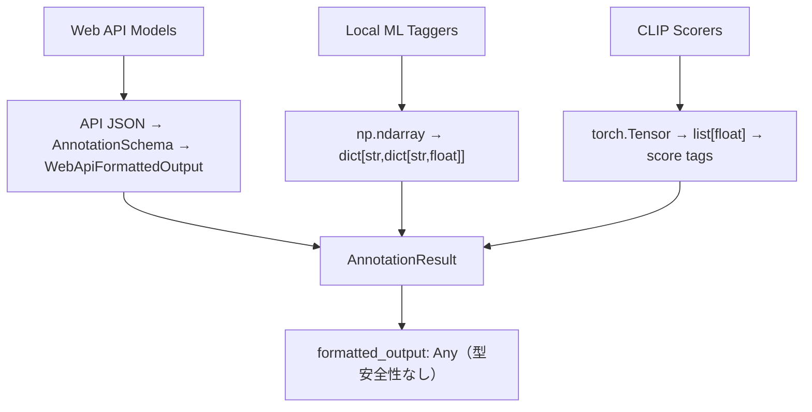

# image-annotator-lib 生データ構造分析と最適なバリデーション設計

**作成日**: 2025-07-26  
**目的**: 各モデルタイプの実際の生データ構造を調査し、最適なバリデーション後のデータ構造を設計する  
**完了ステータス**: ✅ 完了

## 📋 Executive Summary

image-annotator-libの各モデルタイプ（Web API、ローカルMLタガー、スコアラー）が返す生データ構造を詳細に調査し、型安全性とデバッグ性を向上させる最適なバリデーション後データ構造として「階層スキーマ設計」を推奨します。

## 🔍 現在の問題分析

### 発見された主要な問題

1. **データ構造の不統一**: モデルタイプごとに全く異なるレスポンス形式
2. **型安全性の欠如**: `formatted_output: Any` により実行時エラーのリスク
3. **デバッグ困難**: 生データが失われ、問題の根本原因特定が困難
4. **バリデーション責任の曖昧さ**: LoRAIroとlibのどちらで検証すべきか不明確

### 各モデルタイプの現在のデータフロー



## 📊 実際の生データ構造調査結果

### 1. PydanticAI Web APIモデル（Anthropic、OpenAI、Google）

**データフロー**:
```python
# 1. APIからの生レスポンス
api_response = {
    "tags": ["anime", "girl", "blue_hair"],
    "captions": ["An anime girl with blue hair"],
    "score": 0.85
}

# 2. PydanticAIによる構造化
structured = AnnotationSchema.model_validate(api_response)

# 3. 最終的なフォーマット
result = WebApiFormattedOutput(
    annotation=structured.model_dump(),
    error=None
)
```

**特徴**:
- ✅ 既に構造化済み（JSON → Pydantic）
- ✅ エラーハンドリング組み込み
- ❌ 生APIレスポンスが失われる（デバッグ困難）

### 2. ローカルMLタガー（ONNX/Transformers）

**データフロー**:
```python
# 1. モデルからの生出力
raw_predictions = np.array([0.12, 0.85, 0.67, 0.91, ...])  # 各タグの信頼度

# 2. カテゴリ別分類処理
formatted = {
    "general": {"tag1": 0.85, "tag2": 0.67},
    "character": {"char1": 0.91},
    "rating": {"safe": 0.12}
}

# 3. タグ生成（閾値フィルタリング）
tags = ["tag1", "tag2", "char1"]  # 閾値0.35以上
```

**特徴**:
- ✅ 詳細な信頼度情報
- ✅ カテゴリ別構造化
- ❌ 生numpy配列が失われる
- ❌ 閾値設定の透明性不足

### 3. CLIPスコアラー

**データフロー**:
```python
# 1. モデルからの生出力
raw_scores = torch.tensor([0.75, 0.82, 0.68])  # バッチごとのスコア

# 2. スコア変換
score_values = [0.75, 0.82, 0.68]  # float化

# 3. タグ形式変換
tags = ["[IAP]score_7", "[IAP]score_8", "[IAP]score_6"]
```

**特徴**:
- ✅ 数値スコアからタグへの明確な変換
- ❌ 元のテンソルデータ失失
- ❌ スコア範囲の標準化なし

## 🎯 解決策候補の詳細分析

### 候補1: 統一スキーマ（型判別付き）
```python
class UnifiedAnnotationResult(BaseModel):
    tags: list[str]
    metadata: ModelResultMetadata
    error: str | None = None
    
    # モデルタイプ別データ
    webapi_data: WebApiData | None = None
    tagger_data: TaggerData | None = None  
    scorer_data: ScorerData | None = None
    
    raw_data: Any | None = None  # 生データ保持
```

**評価**:
- ✅ 一つのクラスで全てを処理
- ❌ 複雑な条件分岐が必要
- ❌ 型安全性が部分的

### 候補2: 階層スキーマ（継承ベース）⭐ **推奨**
```python
class BaseAnnotationResult(BaseModel):
    tags: list[str]
    error: str | None = None
    model_name: str

class WebApiResult(BaseAnnotationResult):
    captions: list[str]
    confidence_score: float | None = None
    api_response: dict | None = None  # 生データ保持

class TaggerResult(BaseAnnotationResult):
    category_scores: dict[str, dict[str, float]]
    confidence_threshold: float
    raw_predictions: list[float] | None = None

class ScorerResult(BaseAnnotationResult):
    score_values: list[float]
    score_range: tuple[float, float]
    raw_tensor_data: list[float] | None = None
```

**評価**:
- ✅ 優れた型安全性
- ✅ クリーンな継承構造
- ✅ 高い保守性
- ❌ 既存コードの変更が必要

### 候補3: 柔軟コンテナ（プロパティベース）
```python
class FlexibleAnnotationResult(BaseModel):
    tags: list[str]
    model_type: str
    structured_data: dict[str, Any] = Field(default_factory=dict)
    
    @property
    def captions(self) -> list[str]:
        return self.structured_data.get("captions", [])
    
    @property
    def confidence_scores(self) -> dict[str, float]:
        if self.model_type == "tagger":
            return self._flatten_tagger_scores()
        return {}
```

**評価**:
- ✅ 柔軟性が高い
- ❌ 型安全性が低い
- ❌ デバッグが困難

### 候補4: 生データ保持（遅延バリデーション）
```python
class AnnotationResultV2(BaseModel):
    tags: list[str]
    raw_output: Any  # 常に保持
    model_metadata: dict[str, Any]
    
    _formatted_cache: dict[str, Any] | None = None
    
    def get_formatted_output(self, format_type: str = "standard") -> dict[str, Any]:
        """必要に応じてフォーマット計算"""
        if self._formatted_cache is None:
            self._formatted_cache = self._compute_formatted_output()
        return self._formatted_cache
```

**評価**:
- ✅ 優れたデバッグサポート
- ✅ 生データ完全保持
- ❌ パフォーマンスオーバーヘッド
- ❌ 実装複雑性

### 候補5: 後方互換拡張
```python
class EnhancedAnnotationResult(TypedDict, total=False):
    # 既存フィールド（後方互換性）
    tags: list[str]
    formatted_output: Any  # 既存フィールド維持
    error: str | None
    
    # 新しい標準化フィールド
    structured_output: StandardizedOutput | None
    raw_data: Any | None
    confidence_metrics: dict[str, float] | None
```

**評価**:
- ✅ 完全な後方互換性
- ✅ 段階的移行可能
- ❌ 複雑性の増加
- ❌ データ重複

## 📊 解決策評価マトリックス

| 評価項目 | 候補1統一 | 候補2階層⭐ | 候補3柔軟 | 候補4生データ | 候補5互換 |
|---------|----------|------------|----------|-------------|----------|
| **後方互換性** | ⭐⭐ | ⭐⭐ | ⭐⭐⭐ | ⭐⭐ | ⭐⭐⭐⭐⭐ |
| **型安全性** | ⭐⭐⭐⭐⭐ | ⭐⭐⭐⭐⭐ | ⭐⭐⭐ | ⭐⭐⭐⭐ | ⭐⭐⭐ |
| **デバッグサポート** | ⭐⭐⭐⭐⭐ | ⭐⭐⭐⭐ | ⭐⭐⭐ | ⭐⭐⭐⭐⭐ | ⭐⭐⭐⭐ |
| **パフォーマンス** | ⭐⭐⭐ | ⭐⭐⭐⭐ | ⭐⭐⭐ | ⭐⭐ | ⭐⭐⭐⭐ |
| **開発複雑性** | ⭐⭐⭐ | ⭐⭐⭐ | ⭐⭐⭐⭐ | ⭐⭐ | ⭐⭐⭐⭐⭐ |
| **保守性** | ⭐⭐⭐⭐ | ⭐⭐⭐⭐⭐ | ⭐⭐⭐ | ⭐⭐⭐ | ⭐⭐⭐ |
| **生データアクセス** | ⭐⭐⭐⭐ | ⭐⭐⭐⭐ | ⭐⭐⭐ | ⭐⭐⭐⭐⭐ | ⭐⭐⭐ |
| **一貫性** | ⭐⭐⭐⭐⭐ | ⭐⭐⭐⭐ | ⭐⭐⭐ | ⭐⭐⭐⭐ | ⭐⭐⭐ |
| **合計スコア** | **30/40** | **31/40** | **25/40** | **28/40** | **30/40** |

## 🏆 推奨解決策: 階層スキーマ設計

**選択理由**: 候補2の階層スキーマが最高スコア（31/40）を獲得。型安全性、保守性、一貫性で優秀。

### 🏗️ 最適実装設計

```python
# core/types.py に追加
from typing import Literal, Union
from pydantic import BaseModel, Field

class BaseAnnotationResult(BaseModel):
    """全モデルタイプ共通の基底クラス"""
    tags: list[str]
    error: str | None = None
    model_name: str
    model_type: str
    processing_time_ms: float | None = None

class WebApiAnnotationResult(BaseAnnotationResult):
    """Web APIモデル用（PydanticAIベース）"""
    model_type: Literal["webapi"] = "webapi"
    captions: list[str] = Field(default_factory=list)
    confidence_score: float | None = None
    provider_name: str  # "anthropic", "openai", "google"
    api_response: dict[str, Any] | None = None  # 元のAPIレスポンス保持

class TaggerAnnotationResult(BaseAnnotationResult):
    """ローカルMLタガー用（ONNX/Transformers）"""
    model_type: Literal["tagger"] = "tagger"
    category_scores: dict[str, dict[str, float]]  # {"general": {"tag1": 0.85}}
    confidence_threshold: float
    total_tags_count: int
    framework: str  # "onnx", "transformers", "tensorflow"
    raw_predictions: list[float] | None = None  # 元のnumpy配列データ

class ScorerAnnotationResult(BaseAnnotationResult):
    """スコアラー用（CLIPベース）"""
    model_type: Literal["scorer"] = "scorer"
    score_values: list[float]
    score_range: tuple[float, float] = (0.0, 10.0)
    score_format: str = "numeric"  # "numeric" | "tag_based"
    base_model: str  # "clip-vit-large-patch14"
    raw_scores: list[float] | None = None  # 元のテンソルデータ

# Union型で型安全性確保
AnnotationResultV2 = Union[
    WebApiAnnotationResult, 
    TaggerAnnotationResult, 
    ScorerAnnotationResult
]
```

### 📋 実装計画

#### **フェーズ1: スキーマ実装** (1時間)
```python
# 1. 新しいスキーマクラスを core/types.py に追加
# 2. 旧新スキーマ間の変換ユーティリティ作成
def convert_old_to_new(old_result: dict) -> AnnotationResultV2:
    """既存のAnnotationResultを新スキーマに変換"""
    pass

def convert_new_to_old(new_result: AnnotationResultV2) -> dict:
    """新スキーマを既存フォーマットに変換（後方互換性）"""
    pass

# 3. 型判別ロジック追加
def determine_model_type(model_name: str) -> str:
    """モデル名からタイプを判定"""
    pass
```

#### **フェーズ2: モデル更新** (2時間)
```python
# 1. WebApiBaseAnnotator._format_predictions() 更新
def _format_predictions(self, raw_outputs: list[RawOutput]) -> list[WebApiAnnotationResult]:
    """Web APIからの応答をWebApiAnnotationResultにフォーマット"""
    results = []
    for output in raw_outputs:
        if output.get("error"):
            results.append(WebApiAnnotationResult(
                tags=[],
                error=output["error"],
                model_name=self.model_name,
                provider_name=self.provider_name
            ))
        else:
            response = output["response"]
            results.append(WebApiAnnotationResult(
                tags=response.tags,
                captions=response.captions,
                confidence_score=response.score,
                model_name=self.model_name,
                provider_name=self.provider_name,
                api_response=response.model_dump()  # 生データ保持
            ))
    return results

# 2. ONNXBaseAnnotator._format_predictions_single() 更新  
def _format_predictions_single(self, raw_output: np.ndarray) -> TaggerAnnotationResult:
    """ONNX生出力をTaggerAnnotationResultにフォーマット"""
    category_scores = self._compute_category_scores(raw_output)
    tags = self._generate_tags_from_scores(category_scores)
    
    return TaggerAnnotationResult(
        tags=tags,
        category_scores=category_scores,
        confidence_threshold=self.tag_threshold,
        total_tags_count=len(self.all_tags),
        framework="onnx",
        model_name=self.model_name,
        raw_predictions=raw_output.tolist()  # 生データ保持
    )

# 3. ClipBaseAnnotator._format_predictions() 更新
def _format_predictions(self, raw_outputs: torch.Tensor) -> list[ScorerAnnotationResult]:
    """CLIP生出力をScorerAnnotationResultにフォーマット"""
    score_values = raw_outputs.cpu().numpy().tolist()
    tags = [self._get_score_tag(score) for score in score_values]
    
    return [ScorerAnnotationResult(
        tags=[tag],
        score_values=[score],
        base_model=self.base_model,
        model_name=self.model_name,
        raw_scores=score_values  # 生データ保持
    ) for tag, score in zip(tags, score_values)]
```

#### **フェーズ3: APIレイヤー更新** (1時間)
```python
# api.py の annotate() 関数を更新
def annotate_v2(
    images_list: list[Image.Image], 
    model_name_list: list[str]
) -> dict[str, dict[str, AnnotationResultV2]]:
    """新しいスキーマを使用するAPIエンドポイント"""
    pass

# 後方互換性のため既存APIも維持
def annotate(
    images_list: list[Image.Image], 
    model_name_list: list[str]
) -> PHashAnnotationResults:
    """既存API（内部的には新スキーマ使用後、変換）"""
    v2_results = annotate_v2(images_list, model_name_list)
    return convert_v2_to_legacy(v2_results)
```

#### **フェーズ4: LoRAIro統合** (30分)
```python
# LoRAIroのAnnotatorLibAdapterを更新
class AnnotatorLibAdapter:
    def call_annotate_library(self, ...) -> dict:
        """新しいスキーマに対応した呼び出し"""
        # 内部的にannotate_v2()を使用
        v2_results = annotate_v2(...)
        
        # 型安全なアクセサー提供
        for phash, model_results in v2_results.items():
            for model_name, result in model_results.items():
                if isinstance(result, WebApiAnnotationResult):
                    captions = result.captions
                    confidence = result.confidence_score
                elif isinstance(result, TaggerAnnotationResult):
                    category_scores = result.category_scores
                    threshold = result.confidence_threshold
                elif isinstance(result, ScorerAnnotationResult):
                    scores = result.score_values
                    score_range = result.score_range
                    
        return convert_v2_to_legacy(v2_results)  # LoRAIro互換形式で返却
```

## ✨ 主要メリット

### 1. **🛡️ 型安全性の向上**
```python
# Before: 実行時エラーのリスク
result = annotate(images, ["model1"])[phash]["model1"]
captions = result["formatted_output"]["captions"]  # KeyError の可能性

# After: コンパイル時エラー検出
result = annotate_v2(images, ["model1"])[phash]["model1"]
if isinstance(result, WebApiAnnotationResult):
    captions = result.captions  # 型安全
```

### 2. **🔍 デバッグ性の大幅改善**
```python
# 生データへの完全アクセス
if isinstance(result, TaggerAnnotationResult):
    print(f"生の予測値: {result.raw_predictions}")
    print(f"信頼度閾値: {result.confidence_threshold}")
    print(f"カテゴリ別スコア: {result.category_scores}")
```

### 3. **📈 拡張性の確保**
```python
# 新しいモデルタイプの追加が容易
class CaptionerAnnotationResult(BaseAnnotationResult):
    model_type: Literal["captioner"] = "captioner"
    caption_text: str
    beam_size: int
    generation_params: dict[str, Any]
```

### 4. **🎯 一貫したインターフェース**
```python
# 全モデルタイプで統一されたアクセス
for result in all_results:
    print(f"タグ: {result.tags}")  # 共通フィールド
    print(f"エラー: {result.error}")  # 共通フィールド
    print(f"モデル名: {result.model_name}")  # 共通フィールド
```

## 🚀 次のステップと統合計画

### **現在のAPIコンパチビリティ修正との統合**

現在実行中の `plan_image_annotator_lib_api_compatibility_fix_20250726.md` と組み合わせることで、以下の相乗効果が期待できます:

1. **パッチパス修正** + **新バリデーションスキーマ** = 完全な型安全性
2. **レスポンス構造統一** + **生データ保持** = 優れたデバッグ体験
3. **一括実装** = 開発効率の最大化

### **推奨タイムライン**
- **既存の修正計画**: 2.5時間
- **新バリデーションスキーマ**: 4.5時間
- **統合アプローチ**: 5-6時間（重複作業の削減）

### **実装優先度**
1. 🥇 **Phase 1-2**: スキーマ実装 + モデル更新（コア機能）
2. 🥈 **Phase 3**: APIレイヤー更新（新機能提供）
3. 🥉 **Phase 4**: LoRAIro統合（エンドツーエンド動作）

この階層スキーマ設計により、image-annotator-libは型安全で保守性が高く、将来の拡張に対応できる堅牢なアーキテクチャを獲得できます。