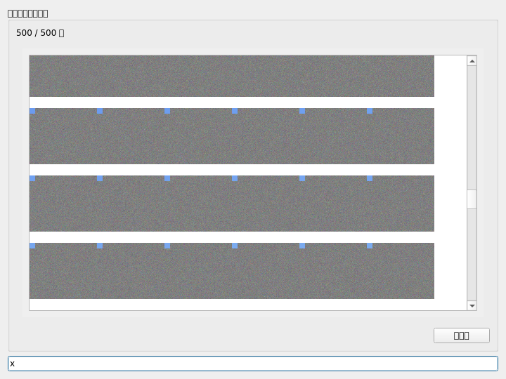

# Staging thumbnail performance

`test_staging_thumbnail_performance.py` measures the actual
`DatasetStateManager` selection → `StagingWidget.add_selected_images()` → displayed
thumbnail path. It creates 500 distinct deterministic 768 × 640 source files,
alternating JPEG and WEBP. Generation and checksum validation are outside the
measurement. There are no mocked image readers or thumbnail workers.

The scenarios are additions of 100 images until 500 are staged, a fresh 500-image
addition, a width change after completion, and queued keyboard input plus scroll
and resize while an addition is pending. Each result records the synchronous
call time, time until every displayed image is loaded, maximum 10 ms heartbeat
gap, and input latency. Width-change completion waits for actual grid reflow.
Completion verifies image IDs and paths in staging order
and checks that every displayed pixmap differs from the gray placeholders.

Run from each checkout with the same input directory. For worktrees, follow the
shared environment instructions in [AGENTS.md](../../AGENTS.md); use `uv run
--no-sync` and set `PYTHONPATH` to that worktree's `src` and local package `src`
directories if editable installs could point at another checkout.

```bash
STAGING_PERF_INPUT_DIR=/tmp/issue-1385-performance/images \
STAGING_PERF_OUTPUT_DIR=/tmp/issue-1385-performance \
STAGING_PERF_LABEL=baseline \
uv run --no-sync pytest tests/performance/test_staging_thumbnail_performance.py \
  --no-cov --timeout=240
```

Repeat with `STAGING_PERF_LABEL=fixed`. Matching `manifest_sha256` values in the
JSON results prove both runs used identical input bytes. Compare `call_ms`,
`complete_ms`, `max_gui_gap_ms`, and `queued_input.delay_ms` for each scenario.
`settled_ms` includes the trailing resize debounce and subsequent heartbeat.
Source file paths and hashes record which checkout implementation was measured.
`queued_input.completed_images` and the operation's `completed_images` describe
whether GUI activity happened before loading finished. PNG screenshots show the
completed state, including the staged count and processed keyboard input.

Timing varies with CPU load, filesystem cache, Qt, and image codecs. Keep other
heavy workloads idle during a comparison. Fresh widgets reset application
caches; the harness does not flush the operating system filesystem cache.
By default, both the synchronous baseline and asynchronous implementation pass
when final content, order, and GUI input are correct. Set
`STAGING_PERF_MAX_GUI_GAP_MS=100` to enforce a local responsiveness threshold and
`STAGING_PERF_REQUIRE_INPUT_DURING_LOAD=1` to require keyboard input to be
processed before each addition finishes, and scheduled scroll/resize operations
to run while the interaction scenario still has pending images.
These gates are optional so the same
harness can record the baseline. Both `slow` and `gui_show` markers exclude the
harness from the ordinary CI suites.

On Linux, the repository test configuration uses the Qt offscreen plugin. Those
results are a synthetic Linux comparison, not evidence of Windows production
performance. Run the harness separately on Windows for that evidence.


## Issue #1385 measurement (2026-10-10)

Linux/WSL2 offscreen, Python 3.13.15, Qt 6.11.2. The baseline is `4215b805`;
the fixed implementation is `af4ceede`. Both used the same 500 generated images
(manifest SHA256 `0b3937f528c3d2ed4c07f5a02881e21bb0a789df4bdf5303ec0df2e76390bd63`).
These are individual runs with filesystem/load variability, not Windows timings.

| Scenario | Baseline max GUI gap | Fixed max GUI gap |
| --- | ---: | ---: |
| Add 100 (total 100) | 1,680 ms | 22 ms |
| Add 100 (total 200) | 3,157 ms | 23 ms |
| Add 100 (total 300) | 4,978 ms | 23 ms |
| Add 100 (total 400) | 6,807 ms | 28 ms |
| Add 100 (total 500) | 7,917 ms | 47 ms |
| Initial 500 | 8,020 ms | 68 ms |
| Width change with 500 | 7,920 ms | 16 ms |
| Add 500 with input/scroll/resize | 8,189 ms | 40 ms |

The fixed run passed all three scenarios with the 100 ms gap gate and the
input-during-loading gate enabled. In the interaction scenario, queued input
ran after 34 ms and scroll/resize after 40 ms, before any thumbnail batch was
delivered. All 500 images eventually appeared in the correct order. Image
loading still takes time in the background; the measurement demonstrates
continued GUI event processing rather than instantaneous image loading.

The focused regression test additionally counted exactly 500 background
load/scale calls across five additions and retained existing item identities.
The width regression retained pixmap cache keys and changed only item positions,
scene dimensions, and recommended height.

[Raw measurements with source hashes](results/issue-1385.json)


